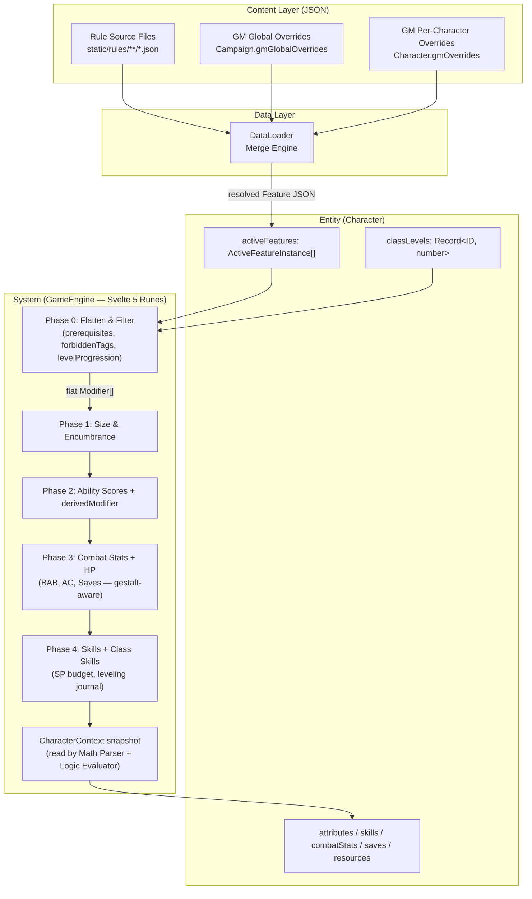
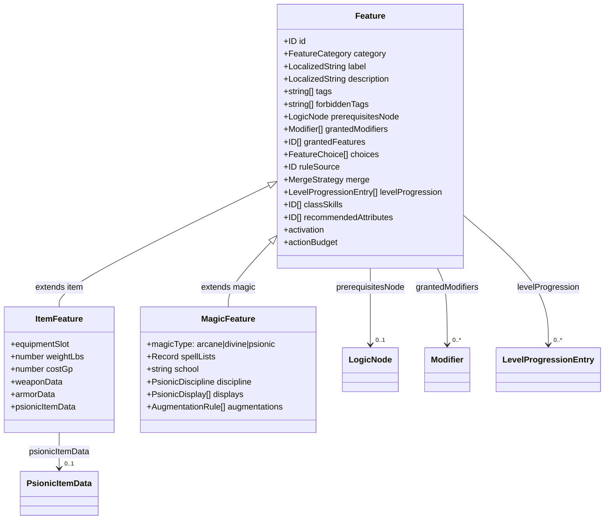
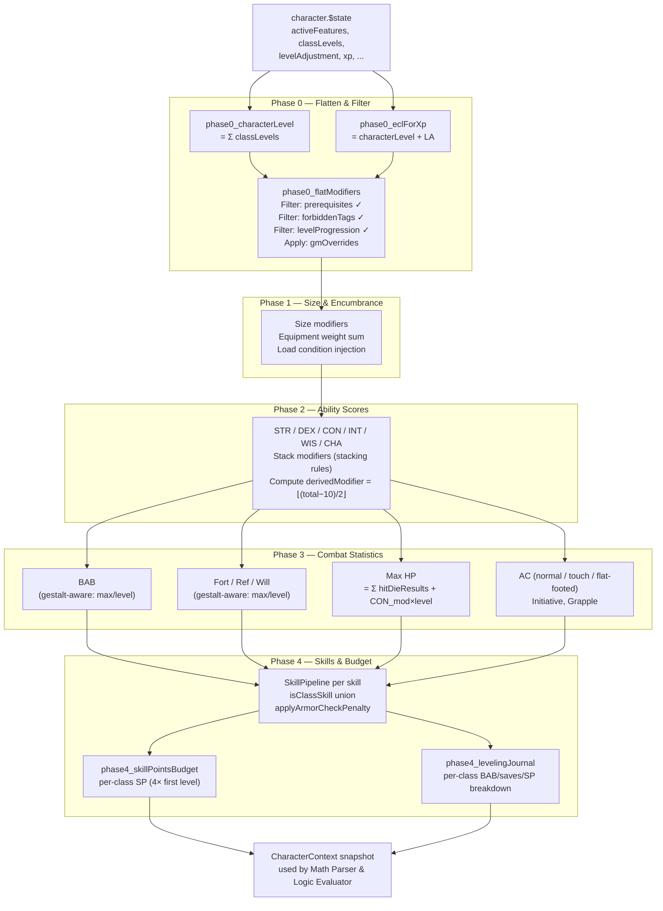
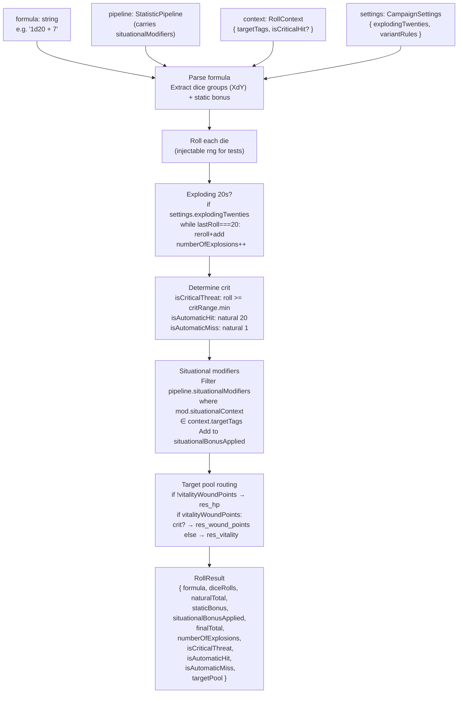
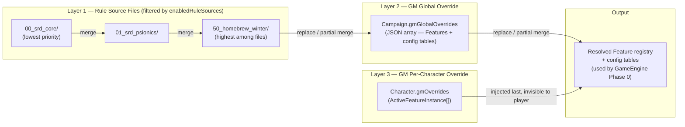

# Architecture Document: D&D 3.5 Data-Driven Engine (Svelte 5 + TypeScript)

## 1. Architecture Philosophy (Entity-Component-System)

This engine is designed to handle the extreme complexity of D&D 3.5 (SRD, Psionics, Homebrew). There are **zero hardcoded rules**.

- **Entities:** The Character, the Animal Companion, the Weapon. These are pure data aggregators.
- **Components:** `Features`. A race, a class, a buff, a weapon are all Features. They contain `Modifiers` and `Tags`.
- **System:** The `GameEngine` (a Svelte 5 reactive class). It listens to active Features, evaluates their prerequisites (logic trees), resolves mathematical formulas (placeholders), and updates `StatisticPipelines` (Strength, AC, Attack).
- **Open Content Ecosystem:** The architecture is designed for community-driven content creation. Rule source files are plain JSON that can be shared, versioned, and distributed independently. Characters can be exported as self-contained JSON blobs. No compilation or build step is required to add new content — drop a JSON file and update the manifest.



---

## 2. Primitives and Fundamental Types

_Suggested target file: `src/lib/types/primitives.ts`_

```typescript
export type ID = string; // kebab-case format (e.g.: "stat_str", "feat_power_attack")

// D&D 3.5 modifier types for stacking rules management
export type ModifierType = 
    | "base" | "multiplier" | "untyped" | "racial" | "enhancement" 
    | "morale" | "luck" | "insight" | "sacred" | "profane" 
    | "dodge" | "armor" | "shield" | "natural_armor" | "deflection" 
    | "competence" | "circumstance" | "synergy" | "size" | "setAbsolute"
    | "damage_reduction"  // Best-wins per bypass-tag group. See Modifier.drBypassTags + section 4.5.
    | "resistance"        // Resistance bonus to saves (non-stacking). See section 4 content guide.
    | "inherent"          // Permanent ability gains from tomes/wish/miracle. See section 4.10.
    | "max_dex_cap";      // Minimum-wins cap on DEX-to-AC (armor/encumbrance). See section 4.17.
    // "setAbsolute" forces the value (e.g.: Wild Shape); "base" defines the additive foundation.

// Operators for the logic engine
export type LogicOperator = "==" | ">=" | "<=" | "!=" | "includes" | "not_includes" | "has_tag" | "missing_tag";
```

---

## 3. The Logic Engine (Prerequisites and Conditions)

Handles complex decision trees (AND/OR/NOT) to validate whether an item can be equipped, a feat selected, or a buff applies (e.g.: "Active only against Orcs").

_Suggested target file: `src/lib/types/logic.ts`_

```typescript
export type LogicNode =
    | { logic: "AND"; nodes: LogicNode[] }
    | { logic: "OR";  nodes: LogicNode[] }
    | { logic: "NOT"; node: LogicNode }
    | { 
        logic: "CONDITION"; 
        targetPath: string; // E.g.: "@attributes.stat_str.totalValue" or "@activeTags"
        operator: LogicOperator; 
        value: any;         // E.g.: "large" or 13
        errorMessage?: string; // E.g.: "Requires Strength 13+"
      };
```

---

## 4. Mathematical Pipelines (Statistics, Skills, and Resources)

Everything that is calculated is a Pipeline. The base + the list of active modifiers = the total. To handle Exploration, Encumbrance, Skills, and **especially Contextual Bonuses**, we specialize the pipelines.

_Suggested target file: `src/lib/types/pipeline.ts`_

```typescript
import type { ID, ModifierType } from './primitives';
import type { LocalizedString } from './i18n';
import type { LogicNode } from './logic';

export interface Modifier {
    id: ID;
    sourceId: ID;           
    sourceName: LocalizedString;     
    targetId: ID;           
    value: number | string; 
    type: ModifierType;
    
    // Evaluated when the character sheet updates (e.g.: "Am I currently Raging?")
    conditionNode?: LogicNode; 
    
    // Evaluated at DICE ROLL time (e.g.: "vs_orcs", "vs_attacks_of_opportunity")
    // If this field is present, the modifier is NOT added to the static `totalBonus` on the sheet.
    situationalContext?: string;

    // Only used when type === "damage_reduction".
    // Tags that bypass this DR entry. Empty array = "DR X/—" (overcome by nothing).
    // Examples: ["magic"], ["silver"], ["good"], ["cold_iron"], ["magic","silver"] (AND).
    // Content authoring: use type "damage_reduction" for innate/racial DR (best-wins per group).
    // For class-progression DR that adds up (Barbarian DR/—): use type "base" instead.
    // @see ARCHITECTURE.md section 4.5 — full Damage Reduction reference
    drBypassTags?: string[];
}

// Generic pipeline (Strength, AC, Speed, Initiative)
export interface StatisticPipeline {
    id: ID;
    label: LocalizedString;
    baseValue: number;
    
    // Permanent modifiers or active buffs (affect the displayed total)
    activeModifiers: Modifier[]; 
    // Latent modifiers (e.g.: +2 vs Orcs). Kept here to be sent to the Dice Engine.
    situationalModifiers: Modifier[]; 
    
    totalBonus: number; // Calculated only from activeModifiers
    totalValue: number; // baseValue + totalBonus
    
    // Computed on the fly by the engine: floor((totalValue - 10) / 2)
    // Only meaningful for the 6 main ability scores (STR, DEX, CON, INT, WIS, CHA).
    // For other pipelines (AC, BAB, etc.), this field is 0 or ignored.
    derivedModifier: number;
}

// Specialized pipeline for Skills
export interface SkillPipeline extends StatisticPipeline {
    keyAbility: ID;         // E.g.: "stat_dex" (for Tumble)
    ranks: number;          // Invested ranks (replaces baseValue for calculation)
    isClassSkill: boolean;  
    appliesArmorCheckPenalty: boolean; 
    canBeUsedUntrained: boolean;
}

// Resources (HP, Psi Points, Charges)
export interface ResourcePool {
    id: ID;
    label: LocalizedString;
    maxPipelineId: ID;       // Pointer to the pipeline computing the Max (e.g.: "stat_max_hp")
    currentValue: number;
    temporaryValue: number;  // E.g.: Temporary HP (absorb damage first)

    // Full-reset: "long_rest" | "short_rest" | "encounter" | "never"
    // Incremental: "per_turn" (start of character's turn) | "per_round" (once per global round)
    // Calendar: "per_day" (resets at dawn, does NOT require sleep) | "per_week" (resets weekly at dawn)
    resetCondition: "short_rest" | "long_rest" | "encounter" | "never" | "per_turn" | "per_round" | "per_day" | "per_week";

    // Only used for "per_turn" / "per_round" incremental pools.
    // Amount to restore per tick (number or Math Parser formula string).
    // Capped at maxPipelineId totalValue. Ignored for full-reset conditions.
    rechargeAmount?: number | string;
}
```

### 4.1. Behavior of `derivedModifier`

The `derivedModifier` field is **automatically computed** by the `GameEngine` every time the pipeline updates. It is never stored in save JSONs. For the 6 main ability scores (Strength, Dexterity, Constitution, Intelligence, Wisdom, Charisma), the formula is:

```
derivedModifier = floor((totalValue - 10) / 2)
```

Examples:
- Strength 10 → `derivedModifier` = 0
- Strength 18 → `derivedModifier` = +4
- Strength 7 → `derivedModifier` = -2

For any other pipeline (AC, BAB, Initiative, etc.), `derivedModifier` is `0` and has no functional meaning. The engine initializes it to `0` by default.

### 4.2. Behavior of `setAbsolute`

A modifier of type `setAbsolute` **overrides the entire pipeline result**. When the engine encounters a `setAbsolute` modifier:

1. The `baseValue` and all other modifiers are **ignored**.
2. The `totalValue` is set to the `setAbsolute` value directly.
3. If multiple `setAbsolute` modifiers target the same pipeline, the **last one applied wins** (following the resolution chain order: rule sources → GM global → GM per-character).
4. The `derivedModifier` is still recalculated from the forced `totalValue`.

**Use cases:** Constitution set to 0 for Undead, Hit Die forced to d12, GM overriding a monster's HP to exactly 200.

### 4.3. Special Paths for the Math Parser

When the Math Parser encounters `@` prefixed paths in formula strings, it resolves them against the character's state. The following special paths are recognized:

| Path Pattern                       | Resolves To                                                                                 | Available                              |
| ---------------------------------- | ------------------------------------------------------------------------------------------- | -------------------------------------- |
| `@attributes.<id>.totalValue`      | The pipeline's computed total                                                               | Always                                 |
| `@attributes.<id>.derivedModifier` | `floor((totalValue - 10) / 2)` for ability scores                                           | Always                                 |
| `@attributes.<id>.baseValue`       | The pipeline's base value before modifiers                                                  | Always                                 |
| `@skills.<id>.ranks`               | The invested skill ranks                                                                    | Always                                 |
| `@combatStats.<id>.totalValue`     | The combat pipeline's computed total                                                        | Always                                 |
| `@saves.<id>.totalValue`           | The save pipeline's computed total                                                          | Always                                 |
| `@characterLevel`                  | `Object.values(character.classLevels).reduce((a, b) => a + b, 0)` — **excludes LA** — use for feats/ASI/HP/skills | Always |
| `@eclForXp`                        | `characterLevel + character.levelAdjustment` — **includes LA** — use for XP table lookups  | Always                                 |
| `@classLevels.<classId>`           | `character.classLevels[classId]` (e.g., `@classLevels.class_soulknife`)                     | Always                                 |
| `@activeTags`                      | Flat array of all tags from active Features (used with `has_tag` / `missing_tag` operators) | Always                                 |
| `@equippedWeaponTags`              | Tags of the currently equipped weapon                                                       | Always                                 |
| `@selection.<choiceId>`            | The selected value(s) from an `ActiveFeatureInstance.selections` record                     | Always                                 |
| `@targetTags`                      | The target creature's tags                                                                  | **Roll time only** (via `RollContext`) |
| `@master.classLevels.<classId>`    | The master character's class level (for `LinkedEntity` companion formulas)                  | LinkedEntity only                      |
| `@constant.<id>`                   | A named constant from a config table (e.g., `@constant.darkvision_range`)                   | Always                                 |

> **AI Implementation Note:** The Math Parser MUST handle nested paths by splitting on `.` and walking the object tree. For example, `@attributes.stat_str.derivedModifier` splits into `["attributes", "stat_str", "derivedModifier"]` and resolves by looking up `character.attributes["stat_str"].derivedModifier`. Paths that don't resolve should return `0` and log a warning, not crash.
>
> **Special path distinction — `@characterLevel` vs `@eclForXp`:** Always use `@characterLevel` for game-mechanical calculations (feats, HP, skill max ranks, caster level, class feature gating). Use `@eclForXp` ONLY when consulting the XP threshold table (`config_xp_table`) for level-up checks, starting wealth, and encounter budgeting. For standard PC races with `levelAdjustment = 0`, both paths return the same value.

### 4.3b. `Modifier.targetId` Normalisation and Canonical Pipeline IDs

The engine's `normaliseModifierTargetId()` function in `GameEngine.svelte.ts` accepts **two equivalent forms** for the same pipeline. Content authors may use either form freely:

| Namespaced form (readable) | Bare form (canonical map key) | Pipeline namespace |
|---|---|---|
| `"attributes.stat_str"` | `"stat_str"` | `Character.attributes` |
| `"skills.skill_climb"` | `"skill_climb"` | `Character.skills` |

All other namespaces (`"combatStats.*"`, `"saves.*"`, `"resources.*"`) are used verbatim as map keys — no normalisation needed.

**Rule for content authors:** Either form is correct. The engine resolves both identically.

#### Canonical `saves.*` Pipeline IDs

| Canonical ID | Ability | Do NOT use |
|---|---|---|
| `saves.fort` | Constitution | `saves.fortitude`, `saves.save_fort` |
| `saves.ref` | Dexterity | `saves.reflex`, `saves.save_ref` |
| `saves.will` | Wisdom | `saves.save_will` |
| `saves.all` | (broadcast) | — fans out to fort + ref + will in `#processModifierList` |

#### Canonical Caster/Manifester Level Pipeline IDs

| Canonical ID | Notes |
|---|---|
| `stat_caster_level` | Lives in `Character.attributes`; targeted by class level progression |
| `stat_manifester_level` | Psionic equivalent; lives in `Character.attributes` |

Do NOT use `combatStats.caster_level` or `attributes.caster_level` — neither is a valid pipeline path.

### 4.4. ResourcePool `resetCondition` — Full Reference

The `resetCondition` field governs exactly when and how a pool recovers. There are three conceptually distinct recovery modes:

#### Full-Reset Conditions (restore to maximum on event)

| Value | Trigger | Typical Uses |
|---|---|---|
| `"long_rest"` | `GameEngine.triggerLongRest()` | Spell slots, psi points, HP, Rage rounds, Turn Undead uses |
| `"short_rest"` | `GameEngine.triggerShortRest()` | Optional house-rule pools, d20 Modern variant resources |
| `"encounter"` | `GameEngine.triggerEncounterReset()` | Once-per-encounter class abilities, Ki points (if house-ruled) |
| `"never"` | Never automatic | Item charges, XP-spent powers, truly consumable resources |

`triggerLongRest()` resets BOTH `"long_rest"` AND `"short_rest"` pools (a long rest implies a short rest).

#### Calendar Reset Conditions (restore to maximum at a fixed real-world time boundary)

| Value | Trigger | Typical Uses |
|---|---|---|
| `"per_day"` | `GameEngine.triggerDawnReset()` | X/day ring abilities, wand-like class features, daily item charges |
| `"per_week"` | `GameEngine.triggerWeeklyReset()` | X/week ring abilities (Elemental Command chain lightning, etc.) |

**Key distinction from `"long_rest"`:** D&D 3.5 separates *calendar-day* limits (reset at dawn regardless of sleep) from *rest* limits (require 8 hours of sleep). A wounded party that skips sleep and stays awake all night still sees the dawn — items reset `"per_day"` at dawn, but spell slots (`"long_rest"`) only recover after actual sleep.

**`triggerDawnReset()`** resets ONLY `"per_day"` pools, NOT `"long_rest"` pools.
**`triggerWeeklyReset()`** resets ONLY `"per_week"` pools (called once per in-game week, usually a GM call).
**`triggerLongRest()`** resets `"long_rest"` AND `"short_rest"` pools. It does NOT reset `"per_day"` or `"per_week"` pools (those reset on their own calendar, not rest).

**Content authoring guide:**
- Use `"long_rest"` for class spell slots, psi points, Rage rounds, Turn Undead — anything that requires actual sleep to recover.
- Use `"per_day"` for X/day item charges (Ring of Djinni Calling 1/day, Ring of Spell Turning 3/day, etc.) and for class features stated as "X per day" that mechanically reset at dawn independently of rest.
- Use `"per_week"` for X/week item abilities (Elemental Command ring chain lightning 1/week, etc.).
- Use `"never"` for finite charges (Ring of the Ram 50 charges, Ring of Three Wishes 3 rubies) — these only decrease, never refill automatically.

#### Incremental Recharge Conditions (add `rechargeAmount` per tick, capped at max)

| Value | Trigger | `rechargeAmount` | Typical Uses |
|---|---|---|---|
| `"per_turn"` | `GameEngine.triggerTurnTick()` | Required | Fast Healing, Regeneration |
| `"per_round"` | `GameEngine.triggerRoundTick()` | Required | Environmental hazard pools, global aura charges |

**`rechargeAmount`** — the amount restored per tick. Accepts a number or a Math Parser formula string (enables level-scaled healing). The pool is capped at the `maxPipelineId` pipeline's `totalValue` — it can never exceed its maximum via ticking. `temporaryValue` (temporary HP) is never affected by tick recharges.

**`"per_turn"` vs `"per_round"` distinction:**
- `"per_turn"` fires at the **start of the specific character's turn** in initiative order. The combat tracker calls `engine.triggerTurnTick()` on the correct character's `GameEngine` instance.
- `"per_round"` fires **once per global round** at a fixed point (e.g., top of round), independent of initiative. Used for environmental or world-level effects.

#### Engine Contract — Stateless w.r.t. the combat clock

The `GameEngine` is a stateless character-sheet engine. It does NOT track rounds, turns, or a wall-clock date. **The UI / combat tracker / session manager is responsible for calling the reset methods at the correct times.** The engine guarantees:
- `triggerTurnTick()` applies exactly `rechargeAmount` to all `"per_turn"` pools, capped at max.
- `triggerRoundTick()` applies exactly `rechargeAmount` to all `"per_round"` pools, capped at max.
- `triggerEncounterReset()` fully restores all `"encounter"` pools.
- `triggerShortRest()` fully restores all `"short_rest"` pools.
- `triggerLongRest()` fully restores all `"long_rest"` and `"short_rest"` pools.
- `triggerDawnReset()` fully restores all `"per_day"` pools.
- `triggerWeeklyReset()` fully restores all `"per_week"` pools.

#### Fast Healing vs Regeneration (D&D 3.5 SRD)

Both **Fast Healing** and **Regeneration** use `resetCondition: "per_turn"` with `rechargeAmount: N`:

```json
// Fast Healing 3 — added via creature Feature's grantedFeatures or grantedModifiers
{
  "id": "resources.hp",
  "resetCondition": "per_turn",
  "rechargeAmount": 3
}
```

The mechanical difference between Fast Healing and Regeneration lies **not** in the `resetCondition` but in DR/bypass tags on the creature Feature:
- **Fast Healing**: does not convert lethal to nonlethal; stops at 0 HP without Regeneration.
- **Regeneration**: the creature Feature carries tags like `"regeneration_bypassed_by_fire"` or `"regeneration_bypassed_by_acid"`, and bypass damage is tracked via separate modifier logic. The tick itself (`rechargeAmount`) is identical.

The calling UI should skip `triggerTurnTick()` for Fast Healing only creatures when `currentValue ≤ 0`. For Regeneration creatures, the tick applies even at negative HP.

### 4.5. Damage Reduction (DR) — `drBypassTags` and Best-Wins Grouping

Damage Reduction (SRD "Special Abilities") is one of the most mechanically distinctive systems in D&D 3.5. It does **not** follow the normal stacking rules — it uses a **best-wins-per-bypass-group** model instead.

#### The DR Data Model

DR is expressed as a `Modifier` with two fields working together:

| Field | Type | Role |
|---|---|---|
| `value` | `number` | How much damage is reduced per hit |
| `type` | `"damage_reduction"` | Identifies this modifier for DR-specific grouping |
| `drBypassTags` | `string[]` | Materials/conditions that overcome the DR |

```json
// Examples showing the full DR modifier structure
{ "id": "dr_vampire",     "value": 10, "type": "damage_reduction", "drBypassTags": ["magic"] }
{ "id": "dr_lycanthrope", "value": 10, "type": "damage_reduction", "drBypassTags": ["silver"] }
{ "id": "dr_barbarian",   "value": 1,  "type": "damage_reduction", "drBypassTags": ["magic", "silver"] }
{ "id": "dr_barbarian_dr","value": 2,  "type": "base",             "targetId": "combatStats.damage_reduction" }
```

`drBypassTags` semantics:
- `[]` → DR X/— (nothing bypasses; e.g., Barbarian end-game DR)
- `["magic"]` → DR X/magic (any +1 or better magic weapon bypasses)
- `["silver"]` → DR X/silver (silver weapon bypasses)
- `["cold_iron"]` → DR X/cold iron
- `["good"]` → DR X/good (good-aligned weapon bypasses)
- `["epic"]` → DR X/epic (+6 or better weapon)
- `["magic", "silver"]` → DR X/magic AND silver (weapon must be BOTH — extremely rare)

#### The Two DR Authoring Modes

| Mode | `type` field | Stacking | Use For |
|---|---|---|---|
| **Additive class progression** | `"base"` | Always stacks (ALWAYS_STACKING_TYPES) | Barbarian DR/— increments (+1 at level 7, +2 at 10, +3 at 13, +4 at 16, +5 at 20) |
| **Innate/racial/template DR** | `"damage_reduction"` | Best-wins per bypass group | Vampire DR 10/magic, Troll (no DR), race/template DRs |

**Why two modes?**
- Barbarian DR is gained incrementally as the character levels. Each level adds +1 DR. These all target `combatStats.damage_reduction` with `type: "base"` so they SUM to the correct total (DR 1/— at 7th, DR 2/— at 10th, etc.).
- Racial or template DR from different sources uses `type: "damage_reduction"` and follows the best-wins rule: having both DR 5/magic and DR 10/silver from different racial features means the creature has BOTH, but it won't gain DR 10/magic if it only has DR 5/magic and DR 10/silver.

#### The Stacking Resolution Algorithm

`applyStackingRules()` in `stackingRules.ts` handles `"damage_reduction"` modifiers separately in Step 6 (after all regular modifier types):

1. Sort each modifier's `drBypassTags` array and JSON-serialize it as a group key.
   - `["silver", "magic"]` and `["magic", "silver"]` both serialize to `'["magic","silver"]'` (same group).
2. Group all DR modifiers by this key. Each unique key = one `DREntry` in `StackingResult.drEntries`.
3. Within each group: keep the modifier with the **highest `value`**. Suppress all others.
4. Return each winner as a `DREntry` with `{ amount, bypassTags, sourceModifier, suppressedModifiers }`.

**Result:** `StackingResult.drEntries` is an array of `DREntry` objects. Each one describes one "DR X/material" line independently.

#### Example: Vampire Fighter 3 (DR 10/magic from race + no DR from class)

```json
[
  { "value": 10, "type": "damage_reduction", "drBypassTags": ["magic"], "sourceId": "race_vampire" }
]
```
→ `drEntries = [{ amount: 10, bypassTags: ["magic"] }]`

#### Example: Half-Troll Barbarian 10 (DR 5/— from class + DR 5/fire from race)

```json
[
  { "value": 1, "type": "base",             "targetId": "combatStats.damage_reduction" },  // Level 7 increment
  { "value": 1, "type": "base",             "targetId": "combatStats.damage_reduction" },  // Level 10 increment
  { "value": 5, "type": "damage_reduction", "drBypassTags": [],      "sourceId": "race_half_troll" },
  { "value": 5, "type": "damage_reduction", "drBypassTags": ["fire"],"sourceId": "half_troll_fire_vuln" }
]
```
→ `totalBonus = 2` (from "base" additive increments)  
→ `drEntries = [{ amount: 5, bypassTags: [] }, { amount: 5, bypassTags: ["fire"] }]`  
→ The creature effectively has: DR 2/— (class) + DR 5/— (race) + DR 5/fire (race vuln)

> **Note:** The "base" DR and the `type: "damage_reduction"` DR entries are **independent**. The UI should display both: the `totalValue` pipeline (base additive DR) and each `drEntry` separately.

#### Example: Best-wins — Two DR/magic sources, different amounts

```json
[
  { "value": 5,  "type": "damage_reduction", "drBypassTags": ["magic"], "sourceId": "feature_a" },
  { "value": 10, "type": "damage_reduction", "drBypassTags": ["magic"], "sourceId": "feature_b" }
]
```
→ `drEntries = [{ amount: 10, bypassTags: ["magic"], suppressedModifiers: [feature_a mod] }]`  
→ feature_a is suppressed; only the best DR 10/magic applies.

#### Combat Resolution (Dice Engine)

At roll time, for each `DREntry` in the target's `combatStats.damage_reduction.drEntries`:
1. Check if the attacking weapon's tags include **any** tag from `DREntry.bypassTags`.
2. If **YES**: the DR is overcome; skip this entry (no damage reduction).
3. If **NO** (or `bypassTags` is empty): subtract `DREntry.amount` from the damage total.
4. **Minimum 0** per hit (damage cannot go negative from DR, per SRD).
5. Spells and most energy damage **ignore DR** entirely (unless the feat "Penetrating Strike" or similar applies).

---

### 4.6. `attacker.*` Modifier Target Namespace — Penalties on Incoming Attacks

#### The Problem — Modifiers That Apply to the *Attacker*, Not the Defender

All modifiers in the current system are **self-modifiers**: they adjust a pipeline on the character that owns the feature. The Elemental Command rings, however, create a situation where the *defender* imposes a penalty on the *attacker's* roll:

> "Creatures from the plane to which the ring is attuned who attack the wearer take a **−1 penalty** on their attack rolls."

This cannot be expressed as a `grantedModifier` targeting `combatStats.attack_bonus` — that would subtract 1 from the wearer's OWN attack bonus, which is wrong. The penalty must apply to the attacker's roll when they target the wearer.

#### Solution — The `attacker.` Target Prefix

Any `Modifier.targetId` beginning with `"attacker."` is an **attacker modifier**. It is NEVER included in the wearer's static pipeline totals. Instead:

1. The Dice Engine reads the **defender's** active modifiers at roll time.
2. It collects all modifiers whose `targetId` starts with `"attacker."`.
3. It strips the `"attacker."` prefix and resolves the remainder as a pipeline path on the **attacker's** roll context.
4. The modifier's value is applied to the matching attacker roll.

**Crucially, `situationalContext` still applies**: if the modifier has `situationalContext: "vs_air_elementals"`, the penalty only applies when the attacker has the `air_elemental` tag in their `targetTags`. This matches the SRD rule ("creatures FROM the associated plane").

#### The Roll-Time Pipeline — Never Static

Attacker modifiers are resolved **exclusively in the Dice Engine** during the incoming attack resolution. They have zero effect on:
- The defender's character sheet display.
- The `totalBonus` or `totalValue` of any pipeline.
- The stacking-rules resolution loop.

They are transient contributions applied at roll time, visible only in the `RollResult.attackerPenaltiesApplied` array (for transparency in the dice roll modal).

#### Authoring Example — Ring of Elemental Command (Air)

```json
{
  "id": "mod_air_elemental_attack_penalty",
  "sourceId": "item_ring_elemental_command_air",
  "sourceName": { "en": "Ring of Elemental Command (Air)", "fr": "Anneau de Commandement Élémentaire (Air)" },
  "targetId": "attacker.combatStats.attack_bonus",
  "value": -1,
  "type": "untyped",
  "situationalContext": "vs_air_elementals"
}
```

When an air elemental attacks the wearer of this ring, the Dice Engine:
1. Reads the wearer's active modifiers.
2. Finds this modifier (`targetId` starts with `"attacker."`).
3. Checks `situationalContext: "vs_air_elementals"` against the attacker's tags — matches.
4. Applies −1 to the incoming attack roll.

The wearer's attack bonus pipeline (`combatStats.attack_bonus`) is **unchanged** — it still shows the wearer's own attack total.

#### Engine Contract

| Phase | Responsibility |
|---|---|
| DAG Phase 0 | `attacker.*` modifiers are collected in `phase0_flatModifiers` but routed to a separate `attackerModifiers[]` list — they never enter pipeline stacking |
| Dice Engine `parseAndRoll()` | At incoming roll resolution, receives `defenderAttackerMods: Modifier[]` and the attacker's `targetTags`. Matches situational context and applies to attacker's roll |
| Stacking rules | Attacker modifiers follow standard non-stacking rules among themselves: two `"untyped"` modifiers DO stack, two `"morale"` modifiers DON'T |
| UI display | The Modifier Breakdown Modal shows attacker modifiers in a separate "Aura / Penalties on Attackers" section — never in the wearer's own pipeline totals |

> **AI Implementation Note (Phase 2.5 / Phase 4.2):** Extend `RollResult` with an optional `attackerPenaltiesApplied: Modifier[]` field. In `parseAndRoll()`, add a parameter `defenderAttackerMods?: Modifier[]`. When provided, apply them to the roll result (after resolving `situationalContext`). The static DAG pipelines remain completely unchanged.

---

### 4.7. Fortification — Critical Hit Negation

The **Fortification** armor special ability (D&D 3.5 SRD, Magic Armor section) gives the wearer a percentage chance to negate a confirmed critical hit or sneak attack. When negated, damage is instead rolled normally (no crit multiplier, no sneak attack dice).

#### Fortification Percentages

| Type | Negation Chance | Base Price Modifier |
|---|---|---|
| Light | 25% | +1 bonus |
| Moderate | 75% | +3 bonus |
| Heavy | 100% | +5 bonus |

#### Data Model — `combatStats.fortification`

Fortification is represented as a `StatisticPipeline` initialized at baseValue 0. Items grant fortification via `grantedModifiers`:

```json
{ "targetId": "combatStats.fortification", "value": 25, "type": "untyped" }
```

`type: "untyped"` is correct because multiple fortification sources would stack — although in practice a character cannot wear two suits of armor simultaneously (only one source is active at a time). The pipeline holds the current effective fortification percentage as `totalValue` (0–100).

#### Dice Engine Contract

`parseAndRoll()` accepts an optional **8th parameter**:

```typescript
parseAndRoll(
  formula, pipeline, context, settings, rng, critRange,
  defenderAttackerMods?,
  defenderFortificationPct: number = 0   // ← Enhancement E-6b
): RollResult
```

When `defenderFortificationPct > 0` AND a crit is confirmed (`isConfirmedCrit === true`):

1. Roll 1d100 using the same injectable RNG (for test determinism).
2. If `1d100 ≤ pct` → crit is negated; `RollResult.fortification.critNegated = true`.
3. If `1d100 > pct` → crit stands; `RollResult.fortification.critNegated = false`.
4. The `RollResult.fortification` block always records the raw roll and pct used.

**`RollResult.fortification` block:**
```typescript
fortification?: {
    roll: number;          // Raw 1d100 result (1–100)
    pct: number;           // Defender's fortification percentage (1–100)
    critNegated: boolean;  // true → crit negated (normal damage); false → crit stands
};
```

Present ONLY when `defenderFortificationPct > 0` AND `isConfirmedCrit === true`. Absent on all other rolls.

#### Vitality/Wound Points Interaction

When both Fortification and the Vitality/Wound Points variant rule are active:
- A **fortification-negated crit** is treated as a normal hit → damage routes to `res_vitality`.
- A **non-negated crit** still routes to `res_wound_points`.

The `targetPool` on `RollResult` already accounts for this: it checks `isEffectiveCrit = isConfirmedCrit && !(fortification?.critNegated)` before routing.

#### Caller Contract

The fortification pct comes from the **defender's** `combatStats.fortification.totalValue`. The combat system retrieves this from the defender's `GameEngine` instance and passes it as the 8th argument to `parseAndRoll()` when resolving an incoming attack:

```typescript
// In the combat UI / dice roll modal:
const fortPct = defenderEngine.phase3_combatStats['combatStats.fortification']?.totalValue ?? 0;
const result = parseAndRoll(damageFormula, attackPipeline, ctx, settings, rng, critRange, undefined, fortPct);
if (result.fortification?.critNegated) {
  // Re-roll damage without crit multiplier, or display "Crit negated by fortification"
}
```

> **Note:** The dice engine does NOT modify `finalTotal` when a crit is negated — it only sets `fortification.critNegated = true`. The calling system is responsible for applying non-critical damage. For most use cases, the combat tab will simply re-prompt for a normal damage roll when `critNegated === true`.

---

### 4.8. Arcane Spell Failure — `combatStats.arcane_spell_failure`

Arcane spellcasters wearing armor or carrying shields risk spell failure. When casting an arcane spell, the caster rolls 1d100; if the result is ≤ the armor's ASF percentage, the spell fails (spell slot or prepared spell is expended without effect).

#### Stacking Rule — Additive (SRD)

**ASF percentages ADD across all equipped armor and shield pieces.** This is modeled with `type: "untyped"` modifiers, which always stack in the engine:

```json
{ "targetId": "combatStats.arcane_spell_failure", "value": 20, "type": "untyped" }  // chain shirt
{ "targetId": "combatStats.arcane_spell_failure", "value": 15, "type": "untyped" }  // heavy shield
```
→ `combatStats.arcane_spell_failure.totalValue = 35%`

#### Data Model

`combatStats.arcane_spell_failure` is a `StatisticPipeline` initialized at baseValue 0. It accumulates contributions from all equipped armor/shield items. An unarmored character has 0% ASF.

Content authoring: every magic armor/shield with arcane spell failure includes a `grantedModifier` targeting this pipeline. The `armorData.arcaneSpellFailure` field on `ItemFeature` is the display-only shadow of this value (for the Inventory UI tooltip) — the pipeline is the mechanical source of truth.

#### Dice Engine Contract

ASF is **not** handled inside `parseAndRoll()` — it is a **pre-cast check** in the Spells & Powers UI (Phase 12.3). Before executing a spell cast action:

1. Read `engine.phase3_combatStats['combatStats.arcane_spell_failure']?.totalValue ?? 0`.
2. If > 0: roll 1d100.
3. If roll ≤ ASF%: spell fails (deduct spell slot, display failure message).
4. If roll > ASF%: proceed with casting normally.

This is entirely a UI / combat-tab concern; the DAG engine simply maintains the accumulated percentage.

> **Classes immune to ASF:** Bards, some prestige classes, and classes with "Light armor casting" features add a `grantedModifier` with `value: -N` (negative) to `combatStats.arcane_spell_failure` targeting the ACP pipeline. For example, a Bard at level 4 gains "Armored Casting (light)" which adds `{ value: -10, type: "untyped" }` — bringing chain shirt (20%) down to 10%. This is already handled correctly by the existing modifier accumulation logic.

---

### 4.9. On-Crit Burst Dice — `ItemFeature.weaponData.onCritDice`

The **Burst** weapon special abilities (Flaming Burst, Icy Burst, Shocking Burst, Thundering) deal additional elemental / sonic dice **only on a confirmed critical hit**, in addition to their base on-hit bonus damage (which comes from a `situationalContext:"on_hit"` modifier).

#### D&D 3.5 SRD Rule

> "Unlike other modifiers to damage, additional dice of damage are **not multiplied** when the attacker scores a critical hit."

This means the burst dice are NOT subject to the weapon's critMultiplier — they are a flat extra rolled once on a crit. However, the *count* of those bonus dice does scale with the weapon's critMultiplier:

| Crit Multiplier | Burst Dice (Flaming Burst) | Burst Dice (Thundering) |
|---|---|---|
| ×2 (most weapons) | +1d10 fire | +1d8 sonic |
| ×3 (battleaxe, greataxe) | +2d10 fire | +2d8 sonic |
| ×4 (scythe, lance) | +3d10 fire | +3d8 sonic |

#### Data Model — `ItemFeature.weaponData.onCritDice`

```typescript
onCritDice?: {
    baseDiceFormula: string;          // "1d10" for Flaming/Icy/Shocking Burst, "1d8" for Thundering
    damageType: string;               // "fire", "cold", "electricity", "sonic"
    scalesWithCritMultiplier: boolean; // true for all SRD burst weapons
};
```

This field lives on `weaponData` (not in `grantedModifiers`) because it is a **dice-roll side-effect at roll time**, not a static pipeline accumulation. The combat system reads it from the equipped weapon when calling `parseAndRoll()` for a damage roll on a confirmed crit.

#### Dice Engine Contract

`parseAndRoll()` accepts two additional parameters (9th and 10th) for burst dice:

```typescript
parseAndRoll(
  formula, pipeline, context, settings, rng, critRange,
  defenderAttackerMods?,   // E-5
  defenderFortificationPct?,  // E-6b
  weaponOnCritDice?: OnCritDiceSpec,   // ← E-7 (9th)
  critMultiplier: number = 2            // ← E-7 (10th)
): RollResult
```

**`OnCritDiceSpec`** (exported from `diceEngine.ts`):
```typescript
export interface OnCritDiceSpec {
    baseDiceFormula: string;
    damageType: string;
    scalesWithCritMultiplier: boolean;
}
```

**Algorithm (inside `parseAndRoll`, Step 6c):**

1. Guard: only when `isEffectiveCrit === true` (confirmed AND not negated by Fortification) AND `weaponOnCritDice` is provided.
2. Parse `baseDiceFormula` → extract `(baseDiceCount, diceFaces)`.
3. Compute actual dice count:
   - `scalesWithCritMultiplier === true`: `actualCount = baseDiceCount × (critMultiplier - 1)`
   - `scalesWithCritMultiplier === false`: `actualCount = baseDiceCount`
4. Roll `actualCount` dice of `diceFaces` using the same injectable RNG.
5. **Add the burst total to `finalTotal`** (burst IS part of the crit damage).
6. Store result in `RollResult.onCritDiceRolled`.

**Fortification Interaction:**
If `fortificationResult.critNegated === true`, no burst dice are rolled. Fortification negates ALL crit effects.

**`RollResult.onCritDiceRolled` block:**
```typescript
onCritDiceRolled?: {
    formula: string;      // Actual rolled formula (e.g., "2d10" for ×3 weapon)
    rolls: number[];      // Individual die results
    totalAdded: number;   // Sum — already included in finalTotal
    damageType: string;   // "fire", "cold", etc. (for UI display)
};
```

Present only when burst dice were actually rolled. Absent on non-crit hits, fort-negated crits, or weapons without `onCritDice`.

#### Content Authoring — Flaming Burst Longsword Example

A +1 Flaming Burst longsword is authored as:

```json
{
  "id": "item_weapon_flaming_burst_longsword_1",
  "category": "item",
  "tags": ["item", "weapon", "magic_item", "magic_weapon"],
  "weaponData": {
    "wieldCategory": "one_handed",
    "damageDice": "1d8",
    "damageType": ["slashing"],
    "critRange": "19-20",
    "critMultiplier": 2,
    "reachFt": 5,
    "onCritDice": {
      "baseDiceFormula": "1d10",
      "damageType": "fire",
      "scalesWithCritMultiplier": true
    }
  },
  "grantedModifiers": [
    { "targetId": "combatStats.attack_bonus", "value": 1, "type": "enhancement" },
    { "targetId": "combatStats.damage_bonus", "value": 1, "type": "enhancement" },
    { "targetId": "combatStats.damage_bonus", "value": "1d6",
      "type": "untyped", "situationalContext": "on_hit",
      "sourceName": { "en": "Flaming Burst (on hit)", "fr": "Explosion ardente (au toucher)" }
    }
  ]
}
```

The `situationalContext:"on_hit"` modifier handles the +1d6 fire on **every** hit. The `onCritDice` handles the **additional** +1d10 fire on **confirmed crits only**. Both are rolled separately; neither affects the other.

#### `Keen` — Crit Range Doubling (Content Authoring Only, No Engine Change)

The **Keen** special ability doubles the threat range of a slashing or piercing weapon. A Keen longsword (base 19–20) becomes 17–20.

This is encoded directly in `weaponData.critRange`. The Dice Engine already reads `critRange` as a string and parses the minimum from "MIN-MAX" notation. No engine change is needed — content authors simply set the correct `critRange` on the keened weapon's definition. A "+1 Keen Longsword" has `"critRange": "17-20"` baked into its JSON.

#### `Vicious` — Self-Damage on Hit (Tag + Description)

The **Vicious** special ability deals 2d6 to the target AND 1d6 to the wielder on every hit. The self-damage is modeled as a tag `"vicious"` on the weapon plus a note in the description. The combat UI is responsible for prompting the wielder to take 1d6 damage when they hit with a Vicious weapon. This follows the same pattern as real table-top play and avoids overengineering a `selfDamageOnHit` pipeline for a single rare effect.

---

### 4.10. Inherent Bonuses — `type: "inherent"` (Tomes, Manuals, Wish, Miracle)

**Inherent bonuses** are permanent ability score improvements granted by exceptional means: reading a Tome/Manual (Manual of Gainful Exercise, Tome of Clear Thought, etc.), or by Wish or Miracle spells. They are fundamentally different from other bonus types in two ways:

1. **Permanence**: An inherent bonus is never suppressed by dispel magic, antimagic field, or death. It becomes part of the character's base ability score for life.
2. **Stacking**: Inherent bonuses stack with all other bonus types (enhancement, luck, morale, etc.) but do NOT stack with each other — only the highest inherent bonus to a given score applies.

#### D&D 3.5 SRD Rules

- Maximum inherent bonus to any ability score: **+5** (from any source).
- If a character benefits from two inherent bonuses to the same score, only the higher applies.
- Reading a second tome of the same type only benefits the character if the new inherent bonus **exceeds** the existing one.

#### Data Model — `type: "inherent"` in `ModifierType`

Inherent bonuses use `type: "inherent"` in `Modifier`:

```json
{
  "id": "effect_manual_str_4",
  "sourceId": "item_manual_of_gainful_exercise_4",
  "sourceName": { "en": "Manual of Gainful Exercise (+4)", "fr": "Manuel d'exercice profitable (+4)" },
  "targetId": "attributes.stat_str",
  "value": 4,
  "type": "inherent"
}
```

#### Stacking Rules Engine Behavior

`"inherent"` is NOT in `ALWAYS_STACKING_TYPES`. The existing `applyStackingRules()` function uses "highest wins among bonuses of the same non-stacking type":
- Two `"inherent"` modifiers of +2 and +4 → +4 applies, +2 is suppressed.
- `"inherent"` +4 + `"enhancement"` +4 → both apply (different types) = +8 total.

No changes to `stackingRules.ts` were needed — the existing generic non-stacking logic is correct.

#### Content Authoring — Tomes and Manuals

Tomes and Manuals are modeled as `consumable: { isConsumable: true }` items. When consumed via `GameEngine.consumeItem()`, instead of creating a removable ephemeral effect, they create a **permanent non-ephemeral `ActiveFeatureInstance`** (no `ephemeral` block). This means the inherent bonus appears in the character sheet like a permanent feature and cannot be dismissed via the "Expire" button.

```json
{
  "id": "item_manual_of_gainful_exercise_4",
  "category": "item",
  "consumable": { "isConsumable": true },
  "grantedModifiers": [
    { "targetId": "attributes.stat_str", "value": 4, "type": "inherent" }
  ]
}
```

The item's `consumable.isConsumable: true` triggers the consumption flow; the absence of `ephemeral` on the created instance means the GM/player must deliberately remove the feature (not via "Expire") — which is correct, since permanent ability gains are not dismissible.

---

### 4.11. Metamagic Rods — `ItemFeature.metamagicEffect`

Metamagic rods allow a spellcaster to apply a metamagic feat to a spell **without occupying a higher spell slot** — the defining mechanic that sets them apart from possessing the feat itself. This requires a dedicated field on `ItemFeature` that the `CastingPanel` can read to present the metamagic option at cast time.

#### D&D 3.5 SRD Rules

> "Metamagic rods hold the essence of a metamagic feat but do not change the spell slot of the altered spell. A caster may only use one metamagic rod on any given spell."

- Each rod provides **3 uses per day** (tracked via `resourcePoolTemplates`).
- **Lesser** rods: spells up to **3rd level**.
- **Normal** rods: spells up to **6th level**.
- **Greater** rods: spells up to **9th level**.
- A sorcerer using a metamagic rod still takes a **full-round action** (same as using a metamagic feat).
- Only one metamagic rod may be used per spell, but it can be combined with metamagic feats the caster possesses (only the caster's feats adjust the spell slot).

#### Data Model — `ItemFeature.metamagicEffect`

```typescript
metamagicEffect?: {
    feat: 'feat_empower_spell'
          | 'feat_enlarge_spell'
          | 'feat_extend_spell'
          | 'feat_maximize_spell'
          | 'feat_quicken_spell'
          | 'feat_silent_spell';
    maxSpellLevel: 3 | 6 | 9;   // 3 = lesser, 6 = normal, 9 = greater
};
```

This field coexists with `resourcePoolTemplates` (which tracks the 3 uses/day pool independently):

```json
{
  "id": "item_rod_metamagic_empower_lesser",
  "category": "item",
  "equipmentSlot": "none",
  "metamagicEffect": {
    "feat": "feat_empower_spell",
    "maxSpellLevel": 3
  },
  "resourcePoolTemplates": [{
    "poolId": "metamagic_uses",
    "label": { "en": "Empower Uses (3/day)", "fr": "Utilisations d'amplification (3/jour)" },
    "maxPipelineId": "combatStats.metamagic_uses_max",
    "defaultCurrent": 3,
    "resetCondition": "per_day"
  }]
}
```

#### CastingPanel Contract

`CastingPanel.svelte` scans the character's equipped items for any `ItemFeature` with `metamagicEffect` set. For each such rod, the panel:

1. Lists it as an available metamagic option for the current spell cast.
2. Checks that `spell.level ≤ metamagicEffect.maxSpellLevel` before offering it.
3. Checks that the rod's `itemResourcePools['metamagic_uses']` is ≥ 1 (charge available).
4. If the player activates the rod: decrements the pool charge by 1 and applies the metamagic to the cast.
5. Displays the metamagic applied in the roll history for transparency.

**One rod per spell**: The UI enforces that only one rod can be selected per cast (matching the SRD restriction). Multiple metamagic feats from the character's own feat pool still stack normally.

#### The 6 SRD Metamagic Effects

| Rod feat ID | Effect |
|---|---|
| `feat_empower_spell` | All variable numeric effects × 1.5 |
| `feat_enlarge_spell` | Doubles spell range |
| `feat_extend_spell` | Doubles spell duration |
| `feat_maximize_spell` | All variable numeric effects maximized |
| `feat_quicken_spell` | Spell cast as a free action (once per round) |
| `feat_silent_spell` | No verbal component required |

> **AI Implementation Note (CastingPanel integration):** When building the metamagic rod picker in `CastingPanel.svelte`, read `metamagicEffect.feat` to determine the *effect to apply* and `metamagicEffect.maxSpellLevel` to *filter eligibility*. Decrement charges via `engine.spendItemPoolCharge(instanceId, 'metamagic_uses')`. The `feat` string can be used as a display key to look up the feat's label from the data loader for the UI label.

---

### 4.12. Staves — `ItemFeature.staffSpells`

Staves store **multiple spells at varying charge costs**. Unlike wands (single spell, 1 charge per use) or rings (single effect, no charges), a staff presents a *menu* of spells where the player chooses which to cast and the charge cost differs per choice. The `staffSpells` field provides the structured data the `CastingPanel` needs to display this menu correctly.

#### D&D 3.5 SRD Rules

> "A staff has 50 charges when created. … the wielder can use his caster level when activating the power of a staff if it's higher than the caster level of the staff."

Key distinctions from wands and rings:
- **Variable charge cost per spell**: 1–5 charges per activation (staffs only; wands always cost 1).
- **Wielder's caster level**: Staves use the wielder's own caster level (and ability modifier for DCs) if it exceeds the staff's default — making staffs more powerful in experienced hands.
- **Heightened spells**: The Staff of Power stores fireball, ray of enfeeblement, and lightning bolt at 5th level (heightened), not their base level.
- **Persistence after depletion**: Some staves (Staff of Woodlands, Staff of Power) retain weapon functionality or passive bonuses after all charges are spent — modelled via `weaponData` and `grantedModifiers`.

#### Data Model — `ItemFeature.staffSpells`

```typescript
staffSpells?: {
    spellId: ID;           // Feature ID of the stored spell
    chargeCost: 1 | 2 | 3 | 4 | 5;  // Charges consumed per cast
    spellLevel?: number;   // Effective level if heightened (only for Staff of Power)
}[];
```

Charge costs across all SRD staves:
| Cost | Examples |
|---|---|
| 1 | Charm person, Fireball, Heal, Magic missile, most 1-charge spells |
| 2 | Remove blindness/deafness, Wall of fire, Phase door, Greater teleport |
| 3 | Remove disease, Repulsion, Summon monster VI, Circle of death |
| 4 | Animate plants (Staff of Woodlands only) |
| 5 | Resurrection (Staff of Life only) |

#### Content Authoring Example — Staff of Healing

```json
{
  "id": "item_staff_healing",
  "category": "item",
  "staffSpells": [
    { "spellId": "spell_lesser_restoration",       "chargeCost": 1 },
    { "spellId": "spell_cure_serious_wounds",      "chargeCost": 1 },
    { "spellId": "spell_remove_blindness_deafness","chargeCost": 2 },
    { "spellId": "spell_remove_disease",           "chargeCost": 3 }
  ],
  "resourcePoolTemplates": [{
    "poolId": "charges",
    "label": { "en": "Staff Charges (50)", "fr": "Charges de bâton (50)" },
    "maxPipelineId": "combatStats.staff_charges_max",
    "defaultCurrent": 50,
    "resetCondition": "never"
  }]
}
```

#### Heightened Spells (Staff of Power)

The `spellLevel` field overrides the spell's base level for all level-dependent effects (DC, damage dice, dispel resistance). Only the Staff of Power uses this in the SRD:

```json
{ "spellId": "spell_fireball",        "chargeCost": 1, "spellLevel": 5 }
{ "spellId": "spell_lightning_bolt",  "chargeCost": 1, "spellLevel": 5 }
{ "spellId": "spell_ray_of_enfeeblement", "chargeCost": 1, "spellLevel": 5 }
```

#### CastingPanel Contract

When the player selects a staff spell in `CastingPanel.svelte`:

1. Read `staffSpells` on the equipped staff's `ItemFeature`.
2. Display each spell as a castable option with its `chargeCost` shown.
3. Filter options: only show spells the wielder can cast (i.e., the spell is on their class list — this matches the spell-trigger activation rule).
4. Validate `instance.itemResourcePools['charges'] >= entry.chargeCost` before allowing activation.
5. On activation: call `engine.spendItemPoolCharge(instanceId, 'charges', entry.chargeCost)`.
6. Apply the spell effect using the wielder's caster level and ability modifier.
7. If `entry.spellLevel` is set: use that as the effective spell level for DC, area, duration, and damage calculations.

**Variable charge deduction**: `spendItemPoolCharge(instanceId, poolId, amount)` already accepts a variable `amount` parameter — no engine computation change was needed.

#### Staff vs. Wand vs. Ring — Comparison

| Feature | Staff | Wand | Ring |
|---|---|---|---|
| Spells stored | 2–6 (at varying costs) | 1 | N/A (passive or 1 ability) |
| Charge cost | 1–5 per spell | Always 1 | N/A or custom |
| CL used | Wielder's if higher | Item's fixed CL | Item's fixed CL |
| Max charges | 50 (never resets) | 50 (never resets) | Varies |
| Spell level limit | Any | 4th max | N/A |
| Data field | `staffSpells` | `wandSpell` | resource pools |

> **AI Implementation Note:** When reading `staffSpells` in `CastingPanel.svelte`, look up each `spellId` via `dataLoader.getFeature(spellId)` to populate the spell name, school icon, and description. Use `entry.spellLevel ?? feature.level` as the effective level for all level-dependent calculations. The `chargeCost` should be displayed prominently next to each spell option so the player can manage their charge budget.

---

### 4.13. Wands — `ItemFeature.wandSpell`

Wands are the simplest spell-storing item in D&D 3.5:

> **"All wands are simply storage devices for spells and thus have no special descriptions."** — SRD

Every wand has exactly one mechanic: hold a single spell at a fixed caster level, with 50 charges that are never refilled. The `wandSpell` field provides the two pieces of data the CastingPanel needs that cannot be inferred from the price alone: **which spell** and **at what caster level**.

#### D&D 3.5 SRD Rules

- A wand holds **exactly one spell** (≤ 4th level).
- Each activation costs **exactly 1 charge** (never varies, unlike staves).
- Wands use the item's **own fixed caster level** — not the wielder's level. This is critically different from staves: the wielder's CL confers no benefit on a wand.
- Some wands store **heightened spells** (a 1st-level spell stored at a higher effective level to improve its DC).
- 50 charges; empty wand = useless stick.

#### Why CL Matters — The Magic Missile Example

| Wand | CL | Missiles | Price |
|---|---|---|---|
| Wand of Magic Missile (CL 1) | 1 | 1 missile | 750 gp |
| Wand of Magic Missile (CL 3) | 3 | 2 missiles | 2,250 gp |
| Wand of Magic Missile (CL 5) | 5 | 3 missiles | 3,750 gp |
| Wand of Magic Missile (CL 7) | 7 | 4 missiles | 5,250 gp |
| Wand of Magic Missile (CL 9) | 9 | 5 missiles | 6,750 gp |

Same spell — but the CL determines everything. A CastingPanel that doesn't know the wand's CL cannot compute the correct missile count (or fireball dice, range, duration, etc.).

#### Data Model — `ItemFeature.wandSpell`

```typescript
wandSpell?: {
    spellId: ID;         // The spell stored in the wand
    casterLevel: number; // The wand's fixed CL (used for all level-dependent effects)
    spellLevel?: number; // Only for heightened spells (see below)
};
```

Content authoring example — Wand of Fireball (CL 5):
```json
{
  "id": "item_wand_fireball_cl5",
  "wandSpell": {
    "spellId": "spell_fireball",
    "casterLevel": 5
  },
  "resourcePoolTemplates": [{
    "poolId": "charges",
    "label": { "en": "Wand Charges (50)", "fr": "Charges de baguette (50)" },
    "maxPipelineId": "combatStats.wand_charges_max",
    "defaultCurrent": 50,
    "resetCondition": "never"
  }]
}
```

#### Heightened Wands (`spellLevel`)

Four wands in the SRD table hold spells at a higher effective level to improve their save DCs:

| Wand | spellId | casterLevel | spellLevel | Price |
|---|---|---|---|---|
| Charm person (heightened 3rd) | `spell_charm_person` | 5 | **3** | 11,250 gp |
| Hold person (heightened 4th) | `spell_hold_person` | 7 | **4** | 21,000 gp |
| Ray of enfeeblement (heightened 4th) | `spell_ray_of_enfeeblement` | 7 | **4** | 21,000 gp |
| Suggestion (heightened 4th) | `spell_suggestion` | 7 | **4** | 21,000 gp |

When `spellLevel` is present: `saveDC = 10 + spellLevel + abilityModifier`. When absent: use the spell's base level from its Feature definition.

#### CastingPanel Contract

When the player activates a wand:
1. Read `wandSpell.spellId` to identify the spell.
2. Validate `instance.itemResourcePools['charges'] >= 1`.
3. Call `engine.spendItemPoolCharge(instanceId, 'charges', 1)`.
4. Apply the spell using `wandSpell.casterLevel` as the CL (overrides wielder's CL — wands are fixed).
5. Compute save DC: `10 + (wandSpell.spellLevel ?? spell.level) + abilityModifier`.
6. Compute all variable effects (damage dice, range, area, duration) from `wandSpell.casterLevel`.

> **AI Implementation Note:** For wands, ALWAYS use `wandSpell.casterLevel` — never the wielder's CL. This is the fundamental rule that distinguishes wands from staves (staves use the wielder's CL if higher). For heightened wands, use `wandSpell.spellLevel` only for DC calculation; the actual spell effect still uses `wandSpell.casterLevel` for number-of-dice scaling.

---

### 4.14. Scrolls — `ItemFeature.scrollSpells`

Scrolls are single-use spell-storing items with three unique mechanical properties compared to wands and staves:

1. **Spell type restriction** — arcane scrolls can only be used by arcane casters; divine only by divine casters.
2. **CL check requirement** — if the user's CL is lower than the scroll's CL, they need a CL check (DC = scroll CL + 1) or risk a mishap.
3. **Single-use, not charged** — a scroll spell is destroyed when cast (combined with `consumable.isConsumable: true`), with no charge pool at all.

#### Data Model — `ItemFeature.scrollSpells`

```typescript
scrollSpells?: {
    spellId: ID;                       // Spell Feature ID from DataLoader
    casterLevel: number;               // Scroll's fixed CL (item's, not wielder's)
    spellLevel: number;                // REQUIRED (not optional — needed for DC calculation)
    spellType: 'arcane' | 'divine';   // Hard class restriction
}[];
```

**Standard CL per Spell Level (SRD defaults — for min-CL scrolls):**

| Spell Level | Min CL | Price (SRD formula: CL × SL × 25 gp) |
|---|---|---|
| 0th | 1 | 12.5 gp (special) |
| 1st | 1 | 25 gp |
| 2nd | 3 | 150 gp |
| 3rd | 5 | 375 gp |
| 4th | 7 | 700 gp |
| 5th | 9 | 1,125 gp |
| 6th | 11 | 1,650 gp |
| 7th | 13 | 2,275 gp |
| 8th | 15 | 3,000 gp |
| 9th | 17 | 3,825 gp |

#### Content Authoring — Scroll of Fireball

```json
{
  "id": "item_scroll_arcane_fireball",
  "consumable": { "isConsumable": true },
  "scrollSpells": [{
    "spellId": "spell_fireball",
    "casterLevel": 5,
    "spellLevel": 3,
    "spellType": "arcane"
  }]
}
```

Note: **no `resourcePoolTemplates`** — scrolls are consumed once and gone, unlike wands/staves which have a 50-charge pool.

#### Caster Level Check

When the wielder's CL < scroll's CL:
- **CL check required**: `checkDC = entry.casterLevel + 1`
- **On failure**: DC 5 Wisdom save or scroll mishap occurs
- **On natural 1**: always fails regardless of modifiers

The CastingPanel computes: `checkRequired = wielder.casterLevel < entry.casterLevel`.

#### Arcane/Divine Restriction

`spellType` is a hard restriction enforced at activation time:
- Arcane scroll (`spellType: 'arcane'`) → only wizards, sorcerers, bards can use
- Divine scroll (`spellType: 'divine'`) → only clerics, druids, paladins, rangers can use

A character can attempt to use the wrong type via **Use Magic Device** (DC 20 + spell level) — this is a CastingPanel UI concern handled by the skill check, not modelled here.

#### Multi-Spell Scrolls

The market table lists single-spell scrolls (each row = one scroll). The `scrollSpells` field is an array to support multi-spell scrolls (minor: 1d3 spells, medium: 1d4, major: 1d6) authored as custom items. All standard SRD scroll items have `scrollSpells.length === 1`.

#### Comparison: Wands vs. Staves vs. Scrolls

| Feature | Wands | Staves | Scrolls |
|---|---|---|---|
| Data field | `wandSpell` (object) | `staffSpells` (array) | `scrollSpells` (array) |
| Single-use | ❌ 50 charges | ❌ 50 charges | **✅ consumed** |
| resourcePoolTemplates | ✅ required | ✅ required | **❌ not needed** |
| CL used | Item's fixed | Wielder's if higher | **Item's fixed** |
| `spellLevel` | optional (heightened) | optional (heightened) | **required** |
| `spellType` | ❌ | ❌ | **✅ required** |
| Multi-spell | ❌ | ✅ (charge costs vary) | ✅ (same CL for all) |
| CL check | ❌ | ❌ | **✅ if wielder CL < scroll CL** |

> **AI Implementation Note:** When reading `scrollSpells` in `CastingPanel.svelte`:
> 1. First check `spellType` against the wielder's class — reject if mismatch (or route to UMD).
> 2. Then check `entry.casterLevel` against `wielder.casterLevel` — if lower, trigger CL check `(DC = entry.casterLevel + 1)`.
> 3. On success (or if CL check not needed): call `engine.consumeItem(instanceId)` to destroy the scroll.
> 4. Apply spell with `entry.casterLevel` as the CL and `10 + entry.spellLevel + abilityMod` as the save DC.

---

### 4.15. Cursed Items — `ItemFeature.removalPrevention`

Cursed items in D&D 3.5 carry a defining mechanical rule: **they cannot be voluntarily removed**. The SRD states for most specific cursed items: *"The item can be removed only with a remove curse spell"* or *"can be gotten rid of only by limited wish, wish, or miracle."*

Without a prevention mechanism, `removeFeature()` would allow any item to be removed unconditionally, bypassing the entire curse mechanic. The `removalPrevention` field + guarded `removeFeature()` enforce the SRD rule.

#### Data Model — `ItemFeature.removalPrevention`

```typescript
removalPrevention?: {
    isCursed: true;                    // Discriminant — always true when present
    removableBy: (                     // Which magic can break the curse
      'remove_curse' | 'limited_wish' | 'wish' | 'miracle'
    )[];
    preventionNote?: string;           // Human-readable tooltip for the GM/player
};
```

Examples from SRD:
```json
// Ring of Clumsiness — remove curse works:
"removalPrevention": {
  "isCursed": true,
  "removableBy": ["remove_curse", "wish", "miracle"]
}

// Necklace of Strangulation — only stronger magic:
"removalPrevention": {
  "isCursed": true,
  "removableBy": ["limited_wish", "wish", "miracle"],
  "preventionNote": "Remains clasped even after death. Limited wish, wish, or miracle only."
}
```

#### Engine Contract — `removeFeature()` Guard

`GameEngine.removeFeature(instanceId)` was updated:
1. Looks up the feature from DataLoader.
2. If `removalPrevention.isCursed === true`: **refuses removal**, logs a warning, and returns without changing state.
3. If the item is not cursed (normal item): removes unconditionally (original behaviour).

```typescript
// removeFeature() now has this guard:
const rp = feature?.removalPrevention;
if (rp?.isCursed) {
  console.warn(`[Guard] Cursed item — use tryRemoveCursedItem() instead.`);
  return;  // Blocked
}
```

**Internal removal bypass**: The private `#removeFeatureUnchecked()` method bypasses the guard and is called by:
- `tryRemoveCursedItem()` after the magic check passes
- `consumeItem()` (potions are never cursed)
- `expireEffect()` (ephemeral buffs are never cursed)

#### Engine Contract — `tryRemoveCursedItem(instanceId, dispelMethod)`

The only legitimate way to remove a cursed item:

| Return | Meaning | State |
|---|---|---|
| `true` | Curse broken — item removed | Item gone from `activeFeatures` |
| `false` | Insufficient magic | Item stays |
| `null` | instanceId not found, or item not cursed | Use `removeFeature()` instead |

```typescript
// Cleric casts remove curse:
const result = engine.tryRemoveCursedItem(ringInstanceId, 'remove_curse');
if (result === true)  { ui.show("Curse broken!"); }
if (result === false) { ui.show("Insufficient magic for this curse."); }
```

#### UI Contract — `InventoryTab.svelte`

Items with `removalPrevention.isCursed === true`:
- Show a red **"Cursed"** badge next to the item name.
- Replace the Unequip/Remove button with a greyed-out button showing `preventionNote` as a tooltip.
- Show a "Which magic removes this?" hint listing `removableBy`.

> **AI Implementation Note:** Check `(feature as ItemFeature).removalPrevention?.isCursed` in the inventory row render. The `removableBy` array should be displayed as human-readable labels: `'remove_curse'` → "Remove Curse", `'limited_wish'` → "Limited Wish", `'wish'` → "Wish", `'miracle'` → "Miracle".

---

### 4.16. Intelligent Items — `ItemFeature.intelligentItemData`

Intelligent items are permanent magic items imbued with sentience — INT/WIS/CHA scores, personality, alignment, communication modes, senses, languages, and an Ego score that determines the item's will relative to its wielder.

#### Engine Contract

`intelligentItemData` is a **metadata block** — no DAG pipeline changes. All actual mechanical effects use existing primitives:

| Effect | Engine mechanism |
|---|---|
| Lesser powers (spells 3/day) | `resourcePoolTemplates per_day` |
| Greater powers (spells 1/day, at-will) | `activation` + `resourcePoolTemplates per_day` |
| Dedicated powers (purpose-conditional) | `conditionNode` + `resourcePoolTemplates` |
| Item skill ranks (10 in Intimidate) | `grantedModifiers type:"competence"` value 10 |
| Luck bonus (dedicated power) | `grantedModifiers type:"luck"` |
| Alignment penalty for misaligned wielder | `grantedModifiers` with `conditionNode` on alignment tag |

The `intelligentItemData` block is read by GM tools and the Item Detail modal to display the item's personality sheet.

#### Data Model — `ItemFeature.intelligentItemData`

```typescript
intelligentItemData?: {
    intelligenceScore: number;    // 10–19 per SRD distribution table
    wisdomScore: number;
    charismaScore: number;
    egoScore: number;             // Pre-computed; used as Will DC for dominance
    alignment: 'lawful_good' | 'lawful_neutral' | 'lawful_evil'
               | 'neutral_good' | 'true_neutral' | 'neutral_evil'
               | 'chaotic_good' | 'chaotic_neutral' | 'chaotic_evil';
    communication: 'empathy' | 'speech' | 'telepathy';
    senses: {
        visionFt: 0 | 30 | 60 | 120;      // Normal vision range
        darkvisionFt: 0 | 60 | 120;       // Darkvision range
        blindsense: boolean;               // Highest-tier items only
    };
    languages: string[];                  // Always starts with 'Common'
    lesserPowers: number;                 // 1–4
    greaterPowers: number;                // 0–3
    specialPurpose: string | null;        // e.g., "Defeat undead"
    dedicatedPower: string | null;        // Only when specialPurpose is non-null
};
```

#### Ego Score Formula

| Component | Ego contribution |
|---|---|
| Each +1 of item's enhancement bonus | +1 |
| Each lesser power | +1 |
| Each greater power | +2 |
| Special purpose + dedicated power | +4 |
| Telepathic communication | +1 |
| Read languages ability | +1 |
| Read magic ability | +1 |
| Each +1 of INT bonus | +1 |
| Each +1 of WIS bonus | +1 |
| Each +1 of CHA bonus | +1 |

Content authors compute Ego from the item's full profile and store it in `egoScore`. The engine does NOT recompute it dynamically.

#### Dominance and Ego (GM-Layer Rule)

**Will DC = egoScore.** When personality conflict occurs (misaligned wielder, or Ego ≥ 20 in any contest):
- SUCCESS: owner dominant for 1 day.
- FAILURE: item dominant — makes demands, may refuse to cooperate.

Negative levels for misaligned wielders:
| Ego range | Negative levels |
|---|---|
| 1–19 | 1 |
| 20–29 | 2 |
| 30+ | 3 |

These negative levels are modelled via `grantedModifiers` with a `conditionNode` comparing the character's alignment tags against `intelligentItemData.alignment`.

#### Communication Tiers (SRD Table)

| Communication | INT/WIS/CHA | Cost modifier |
|---|---|---|
| Empathy (urges, emotions) | Two at 12–13, one at 10 | +1,000–2,000 gp |
| Speech (Common + INT-bonus languages) | Two at 14–16, one at 10 | +4,000–6,000 gp |
| Speech + Telepathy | Two at 17–19, one at 10 | +9,000–15,000 gp |

> **AI Implementation Note:** When rendering the Item Detail modal for an intelligent item, check `intelligentItemData` and display a "Personality" tab with the item's ability scores, Ego score (formatted as "Will DC = egoScore for dominance"), alignment, communication mode, senses, and language list. The `specialPurpose` and `dedicatedPower` fields should be displayed prominently when non-null — they define the item's core motivation.

---

### 4.17. Max DEX Bonus to AC — `combatStats.max_dex_bonus` and `type: "max_dex_cap"`

D&D 3.5 SRD: *"If your armor has a maximum Dexterity bonus, this is the highest Dexterity modifier you can add to your Armor Class while wearing it."*

Armor, shields with a DEX restriction, and encumbrance conditions all cap how much of a character's Dexterity modifier applies to AC. Unlike a simple static number, this cap must be **dynamic** so that special materials (notably Mithral, which increases the cap by +2) can stack on top of it.

#### Data Model — `combatStats.max_dex_bonus`

`combatStats.max_dex_bonus` is a `StatisticPipeline` initialized at `baseValue = 99` (effectively "no cap" for an unarmored character).

**`armorData.maxDex` vs the pipeline:**  
`armorData.maxDex` on `ItemFeature` is a **display-only shadow** of this value (for the Inventory UI tooltip). The pipeline is the **mechanical source of truth** for all AC calculations — exactly like `armorData.arcaneSpellFailure` vs `combatStats.arcane_spell_failure`.

#### The Two-Layer Model

| Layer | Modifier type | Stacking behavior | Used by |
|---|---|---|---|
| **Cap** (armor/conditions) | `"max_dex_cap"` | **MINIMUM wins** — most restrictive cap applies | Chainmail (cap=2), Tower Shield (cap=2), Heavy Load (cap=1) |
| **Bonus** (special materials) | `"untyped"` | Always stacks (added AFTER the cap) | Mithral (+2), enhancement items |

A character wearing chain mail (cap=2) with mithral (+2 untyped) has `max_dex_bonus.totalValue = 4`.

#### New `ModifierType` — `"max_dex_cap"`

```typescript
// Imposed by armor, shields with DEX restriction, and encumbrance conditions.
// Multiple max_dex_cap sources → MINIMUM wins (see Phase 3 special handling).
// Only meaningful on `combatStats.max_dex_bonus`.
"max_dex_cap"
```

`"max_dex_cap"` is NOT in `ALWAYS_STACKING_TYPES`. It is **extracted from the modifier list before `applyStackingRules()`** is called — Phase 3 handles it specially so that additive bonuses (like Mithral's +2 untyped) can still stack on top.

#### Phase 3 Computation Algorithm

```
// Phase 3 special case for combatStats.max_dex_bonus:
capMods    = activeMods.filter(m => m.type === 'max_dex_cap')
otherMods  = activeMods.filter(m => m.type !== 'max_dex_cap')

effectiveBaseValue = capMods.length > 0
  ? Math.min(...capMods.map(m => m.value))   // most restrictive wins
  : 99                                         // no armor → no restriction

stacking = applyStackingRules(otherMods, effectiveBaseValue)
totalValue = stacking.totalValue
```

#### Examples

| Scenario | max_dex_cap mods | untyped mods | totalValue |
|---|---|---|---|
| Unarmored | — | — | 99 (no cap) |
| Chainmail (cap=2) | [2] | — | 2 |
| Mithral Chainmail | [2] | [+2] | 4 |
| Full Plate (cap=1) + Tower Shield (cap=2) | [1, 2] | — | 1 (min wins) |
| Heavy Load + Padded (cap=8) | [1, 8] | — | 1 (load wins) |
| Mithral Full Plate (cap=1 + mithral +2) | [1] | [+2] | 3 |

#### Content Authoring

```json
// Chainmail — restricts max DEX to +2
{
  "id": "armor_chainmail_max_dex",
  "sourceId": "item_armor_chainmail",
  "sourceName": { "en": "Chainmail", "fr": "Cotte de mailles" },
  "targetId": "combatStats.max_dex_bonus",
  "value": 2,
  "type": "max_dex_cap"
}

// Mithral special material — raises max DEX cap by +2
{
  "id": "special_material_mithral_max_dex",
  "sourceId": "special_material_mithral",
  "sourceName": { "en": "Mithral", "fr": "Mithral" },
  "targetId": "combatStats.max_dex_bonus",
  "value": 2,
  "type": "untyped"
}

// Heavy Load condition — caps max DEX at +1
{
  "id": "condition_heavy_load_max_dex",
  "sourceId": "condition_heavy_load",
  "sourceName": { "en": "Heavy Load", "fr": "Charge lourde" },
  "targetId": "combatStats.max_dex_bonus",
  "value": 1,
  "type": "max_dex_cap"
}
```

**Shields without DEX restriction** (e.g., heavy steel shield with maxDex=99): do NOT add any `max_dex_bonus` modifier — the pipeline remains at 99 by default. Only items that actually restrict DEX should add a `max_dex_cap` modifier.

#### UI Contract — ArmorClass Panel

The `ArmorClass.svelte` panel reads `combatStats.max_dex_bonus.totalValue` to determine the maximum DEX modifier applied to AC:
- If `totalValue ≥ DEX_modifier`: full DEX applies (cap not reached).
- If `totalValue < DEX_modifier`: cap the contribution at `totalValue`.
- If `totalValue === 99`: display "No restriction" or omit the cap entirely.

The `ModifierBreakdownModal` for `combatStats.max_dex_bonus` shows both the cap sources (armor/conditions) and any additive bonuses (mithral) separately for player transparency.

> **AI Implementation Note (Phase 10.2):** When displaying AC, compute:
> `effectiveDexToAC = Math.min(dexDerivedModifier, combatStats.max_dex_bonus.totalValue)`
> Use this capped value (not raw `dexDerivedModifier`) when summing AC components. Always guard against `totalValue === 99` as the "no cap" sentinel.

---

## 5. The Unified Feature Model and Its Sub-Types

The central data block. To handle equipment, magic (divine, arcane, psionic), and monsters, the base `Feature` interface is extended into specific sub-types.



_Suggested target file: `src/lib/types/feature.ts`_

```typescript
import type { ID, ModifierType } from './primitives';
import type { LocalizedString } from './i18n';
import type { LogicNode } from './logic';
import type { Modifier } from './pipeline';

export type FeatureCategory = "race" | "class" | "class_feature" | "feat" | "deity" | "domain" | "magic" | "item" | "condition" | "monster_type" | "environment";

// Merge strategy used by the DataLoader's Merge Engine.
// "replace" (default if absent): the entity completely replaces any existing entity with the same ID.
// "partial": the entity is merged with the existing one according to partial merge rules.
export type MergeStrategy = "replace" | "partial";

export interface FeatureChoice {
    choiceId: ID;
    label: LocalizedString;
    // Declarative query to find available options.
    // Format: "tag:<tag_name>" to filter Features having that tag.
    // Examples: "tag:domain" for cleric domains, "tag:weapon" for Weapon Focus.
    optionsQuery: string; 
    maxSelections: number;
}

// Class level progression table, indexed by class level.
// Each entry associates a level with the list of Features granted at that level.
export interface LevelProgressionEntry {
    level: number;
    grantedFeatures: ID[];    // E.g.: ["class_feature_bonus_feat_fighter"] at Fighter 2
    grantedModifiers: Modifier[]; // E.g.: BAB +1, Fort Save +1 for this level increment
}

// Base Interface (Common to everything)
export interface Feature {
    id: ID;
    category: FeatureCategory;
    label: LocalizedString; 
    description: LocalizedString;
    tags: string[]; 
    forbiddenTags?: string[]; 
    prerequisitesNode?: LogicNode;
    grantedModifiers: Modifier[];
    grantedFeatures: ID[]; 
    choices?: FeatureChoice[];
    
    // Identifier of the rule source this entity belongs to.
    // Example: "srd_core", "srd_psionics", "homebrew_darklands".
    // Used by the DataLoader to filter by enabledRuleSources.
    ruleSource: ID;
    
    // Merge strategy for the Data Override system.
    // If absent, defaults to "replace" (full overwrite).
    // If "partial", the Merge Engine merges this entity with the existing one.
    merge?: MergeStrategy;
    
    // Level progression table (used only for category: "class").
    // Allows the engine to only grant features corresponding to the character's
    // current level in this class.
    levelProgression?: LevelProgressionEntry[];
    
    // Recommended attributes for this class (used by the Point Buy UI).
    // Example: A Fighter recommends STR and CON, a Wizard recommends INT.
    recommendedAttributes?: ID[];
    
    // List of skill IDs that are class skills for this class.
    // Only used for category: "class". The DAG Phase 4 unions
    // these across all active classes to determine isClassSkill
    // for each skill in the character's skills record.
    // If a referenced skill ID does not exist in the skill definitions
    // config table, the engine logs a warning and ignores it.
    classSkills?: ID[];
    
    // For active abilities (Ex/Su/Sp)
    activation?: {
        actionType: "standard" | "move" | "swift" | "immediate" | "free" | "full_round" | "minutes" | "hours";
        resourceCost?: { targetId: ID; cost: number | string }; // E.g.: Consumes 2 Psi Points
    };

    // Action-economy budget imposed by this feature (conditions, slow spells, etc.)
    // Each key = max of that action type per round. 0 = prohibited. absent = unlimited.
    // Combat UI takes MIN across all active features' budgets per category.
    // @see ARCHITECTURE.md section 5.6 — actionBudget full reference and condition table
    actionBudget?: {
        standard?: number;   // Max standard actions (0 = blocked)
        move?: number;       // Max move actions
        swift?: number;      // Max swift actions
        immediate?: number;  // Max immediate actions
        free?: number;       // Max free actions
        full_round?: number; // Max full-round actions (0 = blocked)
    };
}

// --- SPECIALIZED SUB-TYPES ---

// 5.1 Items (Equipment, Magic Items, Treasure)

// Psionic item type discriminant (see section 5.1.1 for full reference)
export type PsionicItemType =
    "cognizance_crystal" | "dorje" | "power_stone" | "psicrown" | "psionic_tattoo";

// One imprinted power on a Power Stone (see section 5.1.1)
export interface PowerStoneEntry {
    powerId: ID;           // MagicFeature ID of the imprinted power
    manifesterLevel: number; // ML at which the power was imprinted (for Brainburn check)
    usedUp: boolean;       // True = power has been "flushed" (single-use)
}

export interface ItemFeature extends Feature {
    category: "item";
    equipmentSlot?: "head" | "eyes" | "neck" | "torso" | "body" | "waist" | "shoulders" 
                   | "arms" | "hands" | "ring" | "feet" 
                   | "main_hand" | "off_hand" | "two_hands" | "none";
    weightLbs: number; // Always stored in neutral unit (pounds)
    costGp: number;    // Stored in Gold Pieces
    hardness?: number; 
    hpMax?: number;

    // Consumable items (potions, oils, scrolls) — see section 5.1.2 for full reference.
    // When present, the item is destroyed on use and its modifiers become a temporary
    // ephemeral ActiveFeatureInstance. Absent = permanent item (ring, armour, weapon).
    consumable?: {
        isConsumable: true;       // Discriminant — always true when this block is present
        durationHint?: string;    // Human-readable duration: "3 min", "10 rounds", "1 hour"
        // Notes:
        //   • durationHint is COSMETIC ONLY — the engine does NOT auto-expire effects.
        //   • The player manually expires effects via the EphemeralEffectsPanel "Expire" button.
        //   • Charged items (Ring of the Ram, wands) use resourcePoolTemplates instead.
        //     They are NOT consumable — charges deplete but the item persists in inventory.
    };
    
    // Weapon-specific
    weaponData?: {
        wieldCategory: "light" | "one_handed" | "two_handed" | "double";
        // "double": two-ended weapon (quarterstaff, two-bladed sword, dire flail, etc.)
        // Primary end uses damageDice/damageType/critRange/critMultiplier.
        // Secondary end uses secondaryWeaponData (absent = identical to primary).
        damageDice: string;    // E.g.: "1d8"
        damageType: string[];  // E.g.: ["slashing", "magic"]
        critRange: string;     // E.g.: "19-20"
        critMultiplier: number;// E.g.: 2
        reachFt: number;       // E.g.: 5 (standard melee) or 10 (reach)
        rangeIncrementFt?: number; // E.g.: 30 for a bow
        // Secondary end data for double weapons. Absent = identical to primary end.
        secondaryWeaponData?: {
            damageDice: string;
            damageType: string[];
            critRange: string;
            critMultiplier: number;
        };
    };
    
    // Armor-specific
    armorData?: {
        armorBonus: number;
        maxDex: number;
        armorCheckPenalty: number;
        arcaneSpellFailure: number; // Percentage
    };

    // Psionic item-specific data — present only for psionic item types.
    // See section 5.1.1 for full per-type field documentation.
    psionicItemData?: {
        psionicItemType: PsionicItemType;
        // === COGNIZANCE CRYSTAL + PSICROWN ===
        storedPP?: number;      // Current PP available to draw on
        maxPP?: number;         // Maximum PP capacity (odd 1–17 for crystals; 50×ML for psicrowns)
        attuned?: boolean;      // Cognizance crystal only — needs 10 min to attune
        // === DORJE + PSIONIC TATTOO ===
        powerStored?: ID;       // The single power stored in this item
        charges?: number;       // Dorje only — remaining uses (created with 50)
        // === POWER STONE ===
        powersImprinted?: PowerStoneEntry[]; // Array of 1–6 imprinted powers
        // === PSICROWN ===
        powersKnown?: ID[];     // Fixed list of power IDs accessible via the crown's PP
        // === SHARED ===
        manifesterLevel?: number; // Dorje/tattoo/psicrown: creation ML (affects variable effects)
        // === PSIONIC TATTOO ===
         activated?: boolean;    // True = tattoo has been used and has faded
     };
}
```

### 5.1.1. Psionic Item Data — `psionicItemData` and the Five Item Types

The D&D 3.5 SRD (Expanded Psionics Handbook) defines five psionic item categories, each analogous to a mundane magic item type but with psionic-specific mechanics. All five are modelled as `ItemFeature` with a `psionicItemData` block — no separate interface is needed.

#### Overview Table

| Type | SRD Analogue | Key mechanic | Fields used |
|---|---|---|---|
| `"cognizance_crystal"` | Ring of Storing | External PP battery; rechargeable | `storedPP`, `maxPP`, `attuned` |
| `"dorje"` | Wand | 50 charges, single power, power-trigger | `powerStored`, `charges`, `manifesterLevel` |
| `"power_stone"` | Scroll | 1–6 powers, single-use each, Brainburn | `powersImprinted[]` |
| `"psicrown"` | Staff | PP pool + fixed power list, augmentable | `storedPP`, `maxPP`, `powersKnown[]`, `manifesterLevel` |
| `"psionic_tattoo"` | Potion | Body-worn single-use, 1st–3rd level only | `powerStored`, `manifesterLevel`, `activated` |

#### Cognizance Crystal (`"cognizance_crystal"`)

A PP-storing crystal worn or held by a psionic character. Acts as a supplemental PP battery.

- `storedPP` (mutable): current PP available. Decrements as powers are manifested.  
- `maxPP` (immutable after creation): always an **odd integer between 1–17**. Determines market price tier.  
- `attuned` (mutable): requires 10 minutes of contact to attune. Until `true`, stored PP cannot be accessed.  
- **Recharge rule**: owner may spend their own PP to refill (1 PP spent → 1 PP stored). Does NOT auto-recharge on rest.  
- **Restriction**: cannot draw from more than one PP source per power manifestation.

```json
{
  "id": "item_cognizance_crystal_5pp",
  "category": "item",
  "equipmentSlot": "none",
  "weightLbs": 1,
  "costGp": 9000,
  "psionicItemData": {
    "psionicItemType": "cognizance_crystal",
    "maxPP": 5,
    "storedPP": 5,
    "attuned": false
  }
}
```

#### Dorje (`"dorje"`)

A slender crystal wand containing a single psionic power. Uses the power-trigger activation method (standard action, no AoO).

- `powerStored`: ID of the `MagicFeature` (psionic power) this dorje manifests.  
- `charges` (mutable): starts at 50, decrements per use. At 0, the dorje is an inert crystal.  
- `manifesterLevel`: the ML at which the power was baked in (affects range/duration/damage). Cannot exceed `minimumML + 5`.  
- **Augmentation**: dorjes cannot be augmented at use time. A higher-ML dorje is pre-augmented at creation.  
- **Restriction**: user must have the power on their class list.

```json
{
  "id": "item_dorje_mind_thrust_750gp",
  "category": "item",
  "equipmentSlot": "main_hand",
  "weightLbs": 0.25,
  "costGp": 750,
  "psionicItemData": {
    "psionicItemType": "dorje",
    "powerStored": "power_mind_thrust",
    "charges": 50,
    "manifesterLevel": 1
  }
}
```

#### Power Stone (`"power_stone"`)

A crystal scroll analogue. Holds 1–6 independently usable powers, each with its own manifester level.

- `powersImprinted`: array of `PowerStoneEntry` objects (each: `powerId`, `manifesterLevel`, `usedUp`).  
- Each power is used independently — manifesting one does not affect the others.  
- When all `usedUp === true`, the stone is fully depleted.  
- **Brainburn**: if the user's ML is below an entry's `manifesterLevel`, they make a level check (DC = ML + 1). Failure triggers Brainburn: 1d6/stored power/round for 1d4 rounds.  
- **Addressing**: before use, the stone must be "addressed" (Psicraft DC 15 + power level) to know what it contains.

```json
{
  "id": "item_power_stone_minor_001",
  "category": "item",
  "equipmentSlot": "none",
  "weightLbs": 0.05,
  "costGp": 175,
  "psionicItemData": {
    "psionicItemType": "power_stone",
    "powersImprinted": [
      { "powerId": "power_mind_thrust", "manifesterLevel": 1, "usedUp": false },
      { "powerId": "power_psionic_minor_creation", "manifesterLevel": 3, "usedUp": false }
    ]
  }
}
```

#### Psicrown (`"psicrown"`)

A head-slot item containing a fixed set of psionic powers backed by a dedicated PP pool.

- `storedPP` (mutable): current PP in the crown. Created with `50 × manifesterLevel` PP.  
- `maxPP` (immutable): set to `50 × manifesterLevel` at creation.  
- `powersKnown[]`: IDs of powers accessible via the crown. Wearer can augment using crown PP.  
- `manifesterLevel`: affects PP pool size and per-power augmentation ceiling.  
- **Key restriction**: the user CANNOT supplement crown PP with personal PP.  
  They also cannot use personal PP to manifest the crown's powers independently.

```json
{
  "id": "item_psicrown_dominator",
  "category": "item",
  "equipmentSlot": "head",
  "weightLbs": 0.5,
  "costGp": 20250,
  "psionicItemData": {
    "psionicItemType": "psicrown",
    "manifesterLevel": 9,
    "maxPP": 450,
    "storedPP": 450,
    "powersKnown": [
      "power_charm_person_psionic",
      "power_dominate_person",
      "power_mass_conceal_thoughts"
    ]
  }
}
```

#### Psionic Tattoo (`"psionic_tattoo"`)

A single-use psionic power inscribed on the body. Only 1st–3rd level powers. Maximum 20 tattoos per body.

- `powerStored`: ID of the power this tattoo manifests when activated.  
- `manifesterLevel`: the minimum ML for the stored power.  
- `activated` (mutable): `false` = intact; `true` = tattoo has been used and faded.  
- **Body-slot limit**: the inventory manager (Phase 13.3) must count non-activated tattoos. At 21, ALL activate simultaneously (house narration).  
- **Equipment slot**: use `"body"` for tattoos (they cover body surface; unlike normal body-slot items, 20 can coexist).

```json
{
  "id": "item_psionic_tattoo_force_screen",
  "category": "item",
  "equipmentSlot": "body",
  "weightLbs": 0,
  "costGp": 50,
  "psionicItemData": {
    "psionicItemType": "psionic_tattoo",
    "powerStored": "power_force_screen",
    "manifesterLevel": 1,
    "activated": false
  }
}
```

#### Field-to-Type Matrix

| Field | cognizance_crystal | dorje | power_stone | psicrown | psionic_tattoo |
|---|:---:|:---:|:---:|:---:|:---:|
| `psionicItemType` | ✓ | ✓ | ✓ | ✓ | ✓ |
| `storedPP` | ✓ | — | — | ✓ | — |
| `maxPP` | ✓ | — | — | ✓ | — |
| `attuned` | ✓ | — | — | — | — |
| `powerStored` | — | ✓ | — | — | ✓ |
| `charges` | — | ✓ | — | — | — |
| `powersImprinted` | — | — | ✓ | — | — |
| `powersKnown` | — | — | — | ✓ | — |
| `manifesterLevel` | — | ✓ | — | ✓ | ✓ |
| `activated` | — | — | — | — | ✓ |

> **Mutable vs immutable**: `storedPP`, `charges`, `powersImprinted[].usedUp`, and `activated` change during play (deplete as the item is used). `maxPP`, `powerStored`, `powersImprinted[].powerId`, `powersImprinted[].manifesterLevel`, `powersKnown`, and `manifesterLevel` are immutable static configuration set at item creation time.

### 5.1.2. Consumable Items — `consumable` and the Ephemeral Effect Lifecycle

Potions, oils, and other one-shot items have a fundamentally different lifecycle from permanent equipment (rings, armour, weapons). When *used*, they are destroyed — but their magical effect persists on the character for a duration.

This is modelled as a **two-phase atomic operation** triggered by `GameEngine.consumeItem()`:

#### The `consumable` Field (on `ItemFeature`)

```typescript
consumable?: {
    isConsumable: true;          // Discriminant — always true when the block is present
    durationHint?: string;       // Cosmetic duration label: "3 min", "10 rounds", "1 hour"
};
```

- **Present** on potions, oils, single-shot scrolls — any item that is destroyed on use.
- **Absent** on rings, armour, weapons, and *charged items* (Ring of the Ram uses `resourcePoolTemplates` instead; charges deplete but the item persists).
- `durationHint` is **purely cosmetic**. The engine does not enforce duration; the player dismisses the effect manually via the "Expire" button. This matches table-top play: the GM tells the player "your Bull's Strength ends in 3 minutes" and the player removes it when appropriate.

#### The Two-Phase Consumption Algorithm

When the player clicks **"Drink"** / **"Apply"** / **"Use"** on a consumable item in the Inventory tab, `GameEngine.consumeItem(sourceInstanceId, currentRound)` executes atomically:

1. **Validate** — looks up the source `ActiveFeatureInstance` and its `ItemFeature`. Returns `null` (no-op) if the instance is missing, the feature is not found, or `consumable.isConsumable` is absent.
2. **Create ephemeral effect** — pushes a new `ActiveFeatureInstance` into `activeFeatures` with:
   - Same `featureId` as the consumed item → same `grantedModifiers` apply to the DAG immediately.
   - `isActive: true` — effect is live from the next DAG cycle.
   - `ephemeral.isEphemeral: true` — marks the instance for `EphemeralEffectsPanel`.
   - `ephemeral.appliedAtRound` — the current combat round (for display).
   - `ephemeral.durationHint` — copied from `consumable.durationHint`.
3. **Remove source item** — calls `removeFeature(sourceInstanceId)`. The potion bottle is now gone.

> **Order matters:** step 2 (push) executes *before* step 3 (splice). This ensures the DAG never sees a frame where *neither* the item *nor* the effect is present (a one-tick buff gap would briefly show incorrect stats).

#### Expiring Effects — `GameEngine.expireEffect(instanceId)`

When the player clicks **"Expire"** in `EphemeralEffectsPanel`:

1. Looks up the `ActiveFeatureInstance` by `instanceId`.
2. Checks `ephemeral.isEphemeral === true` — **refuses to remove non-ephemeral instances** (safety guard that prevents accidentally deleting races, feats, or equipped items).
3. Calls `removeFeature(instanceId)` — modifiers are removed from the DAG in the next reactive cycle.

#### Querying Active Effects — `GameEngine.getEphemeralEffects()`

Returns a filtered, sorted (newest-first by `appliedAtRound`) view of all ephemeral instances on the character. Used by `EphemeralEffectsPanel` to build the active effect list.

#### The `ephemeral` Block (on `ActiveFeatureInstance`)

```typescript
ephemeral?: {
    isEphemeral: true;                 // Discriminant — always true when the block is present
    appliedAtRound?: number;           // Combat round when the effect was applied (0 = out of combat)
    sourceItemInstanceId?: ID;         // Traceability: which item was consumed (now gone)
    durationHint?: string;             // Displayed in the effect card badge ("3 min", etc.)
};
```

> See section 6.5 for the complete `ActiveFeatureInstance.ephemeral` field reference.

#### Design — Why Not Auto-Expire?

The engine is a **stateless character-sheet engine** (section 4, Engine Contract). It does not track wall-clock time or combat rounds in persistent state. Auto-expiry would require:
- A global in-game clock (not modelled).
- The engine to call `triggerRoundTick()` at the right time (responsibility of the combat UI).

Keeping expiry manual trades automation for simplicity and avoids bugs caused by clock desynchronisation (e.g., paused combat, out-of-combat use). A future combat tracker could call `expireEffect()` automatically via a scheduled event — the engine contract is already compatible.

#### Consumable vs Charged Items — Comparison Table

| Aspect | `consumable.isConsumable: true` | `resourcePoolTemplates` (charged) |
|---|---|---|
| **Examples** | Potion of Bull's Strength, Oil of Magic Weapon | Ring of the Ram (50 charges), Wand of Lightning |
| **On use** | Item removed from inventory; ephemeral effect created | Item stays; pool decrements by 1+ |
| **Effect duration** | Until player expires it (cosmetic hint only) | Immediate (no persistent effect instance) |
| **Item persistence** | Item destroyed | Item persists until all charges depleted |
| **DAG contribution** | Via ephemeral `ActiveFeatureInstance` | Directly via the permanent `ActiveFeatureInstance` |
| **Reset** | N/A (one-shot) | `triggerDawnReset()` / `triggerWeeklyReset()` |

```typescript
// 5.2 Magic (Spells & Psionic Powers unified)
export interface AugmentationRule {
    costIncrement: number;         // Additional PP cost for this augmentation step

    // Human-readable description of the augmentation's effect (both languages).
    // REQUIRED when grantedModifiers is empty (qualitative augmentations — energy type
    // change, swift-action targeting, area-of-effect upgrade, etc.).
    // OPTIONAL when grantedModifiers[0].sourceName already describes the effect clearly.
    // CastingPanel: display this text in the augmentation picker; fall back to
    // grantedModifiers[0].sourceName if absent.
    // @see ARCHITECTURE.md section 5.2.2 — AugmentationRule fields
    effectDescription?: LocalizedString;

    grantedModifiers: Modifier[];  // Transient cast-time modifiers (NOT added to static DAG)
    isRepeatable: boolean;         // true = spend multiple increments; false = once per cast
}

export interface MagicFeature extends Feature {
    category: "magic";
    magicType: "arcane" | "divine" | "psionic";
    spellLists: Record<ID, number>; // E.g.: { "list_wizard": 3, "list_cleric": 3 }
    
    // For arcane/divine: the school of magic ("abjuration", "conjuration", etc.)
    // For psionic: legacy/display use only — use `discipline` field for engine queries.
    school: string;
    subSchool?: string;  
    descriptors: string[]; // E.g.: ["fire", "evil", "mind-affecting"]

    // === PSIONIC-ONLY FIELDS (undefined for arcane/divine spells) ===

    // Canonical psionic discipline. All engine queries use this, not `school`.
    // "clairsentience"|"metacreativity"|"psychokinesis"|"psychometabolism"|"psychoportation"|"telepathy"
    // @see PsionicDiscipline type and ARCHITECTURE.md section 5.2.1
    discipline?: "clairsentience" | "metacreativity" | "psychokinesis"
               | "psychometabolism" | "psychoportation" | "telepathy";

    // Sensory display effects. Can have multiple simultaneously.
    // "auditory"|"material"|"mental"|"olfactory"|"visual"
    // Suppressed with Concentration DC 15 + power level.
    // @see PsionicDisplay type and ARCHITECTURE.md section 5.2.1
    displays?: ("auditory" | "material" | "mental" | "olfactory" | "visual")[];

    // ======================================================
    
    resistanceType: "spell_resistance" | "power_resistance" | "none";
    components: string[]; // Magic (V, S, M) or Psionic (A, M, O, V)
    
    range: string;       // Formula (e.g.: "25 + floor(@attributes.stat_caster_level.totalValue / 2) * 5")
    targetArea: LocalizedString;
    duration: string;    
    savingThrow: "fort_half" | "ref_negates" | "will_disbelieves" | "none" | string;
    
     augmentations?: AugmentationRule[]; // Exclusive to Psionics (or custom rules)
}
```

### 5.2.1. Psionic Power Fields — `discipline` and `displays`

These two fields extend `MagicFeature` specifically for `magicType: "psionic"` powers. They have no meaning for arcane or divine spells and should be left `undefined` for those.

#### `discipline: PsionicDiscipline | undefined`

The psionic discipline is the canonical grouping of a power in the D&D 3.5 SRD (EPH). It is a **required field for all psionic powers**. Arcane/divine spells leave it `undefined`.

| Value | Specialist Class | Focus |
|---|---|---|
| `"clairsentience"` | Seer | Information, precognition, scrying |
| `"metacreativity"` | Shaper | Matter/creature creation from psionic energy |
| `"psychokinesis"` | Kineticist | Energy manipulation (fire, ice, electricity, force) |
| `"psychometabolism"` | Egoist | Body alteration, healing, self-transformation |
| `"psychoportation"` | Nomad | Movement, teleportation, time/plane travel |
| `"telepathy"` | Telepath | Mind-affecting, control, charm, compulsion |

**Why a separate `discipline` field instead of using `school`?**

The `school` field already exists and is a plain `string` — it was used in early psionic entries to store the discipline name (e.g., `"clairsentience"`). However, `school` is a generic string that carries no type safety or engine-queryable contract. The dedicated `discipline` field:
1. Is a **typed union** — the TypeScript compiler rejects invalid values.
2. Provides a **stable query key** for DataLoader queries (`"discipline:telepathy"`).
3. Enables **psicraft mechanics** (Psicraft DC +5 to identify powers outside specialist discipline).
4. Enables **UI grouping** in the Psionic Powers panel — powers organised by discipline tab.
5. Enables future **Psion specialist class restrictions** (Seer gets extra clairsentience powers).

`school` on psionic powers is kept for display/legacy compatibility but is NOT used by the engine for mechanical discipline queries.

**`discipline` in `optionsQuery`:**

The DataLoader supports a new query format for psionic filtering:

| Format | Example | Meaning |
|---|---|---|
| `discipline:<d>` | `"discipline:telepathy"` | All psionic powers in that discipline |
| `discipline:<d>+level:<n>` | `"discipline:clairsentience+level:3"` | Discipline + level filter |

#### `displays: PsionicDisplay[] | undefined`

An array of sensory display types observable when the power is manifested. For most psionic powers this has 0–3 entries; for spells it is `undefined` or `[]`.

| Value | SRD abbreviation | Sensory effect |
|---|---|---|
| `"auditory"` | `A` | Bass hum, like deep voices; heard up to 100 ft. |
| `"material"` | `Ma` | Translucent ectoplasmic coating on subject; evaporates in 1 round |
| `"mental"` | `Me` | Subtle chime in minds of creatures within 15 ft. |
| `"olfactory"` | `Ol` | Odd scent spreading 20 ft. from manifester; fades quickly |
| `"visual"` | `Vi` | Silver eye-fire on manifester; rainbow flash at 5 ft. |

Multiple displays can coexist: `["auditory", "visual"]` means both effects occur simultaneously.

**Suppressing displays (SRD rule):**
A manifester can suppress ALL of a power's displays by succeeding on a Concentration check (DC 15 + power level) as part of the manifestation action. This is a UI/Dice Engine concern, not an engine pipeline concern — `displays` is purely informational/display metadata.

**Authoring note:** SRD power descriptions use abbreviation letters (`A`, `Ma`, `Me`, `Ol`, `Vi`, `see text`). JSON data content should translate these to full `PsionicDisplay` values. Powers with `"see text"` should use the display type that best matches the described effect.

#### Complete psionic power example

```json
{
  "id": "power_mind_thrust",
  "category": "magic",
  "magicType": "psionic",
  "ruleSource": "srd_psionics",
  "label": { "en": "Mind Thrust", "fr": "Assaut mental" },
  "description": { "en": "You send a lance of mental energy at a target..." },
  "tags": ["magic", "psionic", "mind-affecting"],
  "school": "telepathy",
  "discipline": "telepathy",
  "subSchool": null,
  "descriptors": ["mind-affecting"],
  "spellLists": {
    "list_psion_wilder": 1,
    "list_psion_telepath": 1
  },
  "displays": ["auditory", "mental"],
  "resistanceType": "power_resistance",
  "components": ["Me"],
  "range": "close",
  "targetArea": { "en": "One creature", "fr": "Une créature" },
  "duration": "instantaneous",
  "savingThrow": "will_negates",
  "grantedModifiers": [],
  "grantedFeatures": [],
  "augmentations": [
    {
      "costIncrement": 2,
      "grantedModifiers": [
        {
          "id": "aug_mind_thrust_1d10",
          "sourceId": "power_mind_thrust",
          "sourceName": { "en": "Mind Thrust (augmented)" },
          "targetId": "damage",
          "value": "1d10",
          "type": "untyped"
        }
      ],
      "isRepeatable": true
    }
  ]
}
```

### 5.2.2. `AugmentationRule` — Fields and CastingPanel Contract

`AugmentationRule` describes one augmentation option on a psionic power. The `augmentations` array on `MagicFeature` holds 1–N of these.

#### Fields

| Field | Type | Required? | Purpose |
|---|---|---|---|
| `costIncrement` | `number` | Required | Additional PP added to the power's base cost for this augmentation |
| `effectDescription` | `LocalizedString` | Optional* | Human-readable description displayed in the augmentation picker UI |
| `grantedModifiers` | `Modifier[]` | Required | Transient mechanical modifiers applied **only at cast time** (NOT in static DAG) |
| `isRepeatable` | `boolean` | Required | `true` = player may apply multiple increments; `false` = once per cast |

*`effectDescription` is **effectively required** whenever `grantedModifiers` is empty (qualitative augmentations). When both are absent, the augmentation has no UI label.

#### Two Authoring Patterns

**Pattern 1 — Mechanical augmentation** (numeric effect with pipeline modifier):

```json
{
  "costIncrement": 2,
  "effectDescription": {
    "en": "For every 2 additional power points you spend, this power's damage increases by 1d10.",
    "fr": "Pour chaque 2 points de pouvoir supplémentaires dépensés, les dégâts augmentent de 1d10."
  },
  "grantedModifiers": [{
    "id": "aug_mind_thrust_damage",
    "sourceId": "power_mind_thrust",
    "sourceName": { "en": "Mind Thrust (augmented)", "fr": "Assaut mental (augmenté)" },
    "targetId": "combatStats.power_damage_bonus",
    "value": "1d10",
    "type": "untyped"
  }],
  "isRepeatable": true
}
```

**Pattern 2 — Qualitative augmentation** (no pipeline modifier; description-only):

```json
{
  "costIncrement": 4,
  "effectDescription": {
    "en": "If you spend 4 additional power points, you can manifest this power as a swift action.",
    "fr": "Si vous dépensez 4 points de pouvoir supplémentaires, vous pouvez manifester ce pouvoir par une action rapide."
  },
  "grantedModifiers": [],
  "isRepeatable": false
}
```

#### CastingPanel UI Contract

1. For each augmentation entry, display `effectDescription` (if present) as the augmentation's label. If absent, fall back to `grantedModifiers[0].sourceName`.
2. Show `costIncrement` as the PP cost badge next to each option.
3. If `isRepeatable: true`, show a stepper (0–N) capped to `floor((manifesterLevel - baseCost) / costIncrement)`.
4. If `isRepeatable: false`, show a checkbox (0 or 1).
5. Total cost = `baseCost + Σ(selected augmentations × timesApplied × costIncrement)`. Must not exceed manifester level.
6. When the player commits to cast, the CastingPanel reads `grantedModifiers` from selected augmentations and applies them transiently to the roll context. These modifiers do NOT enter the static DAG.

#### Key Design Note — Augmentations Are NOT Pipeline Modifiers

Augmentation `grantedModifiers` are applied **transiently at cast time only**. They are NOT added to `phase0_flatModifiers` by the GameEngine. The GameEngine has no awareness of which augmentations were chosen. This is entirely a CastingPanel / DiceEngine concern at roll time.

This means `targetId` values like `"combatStats.power_damage_bonus"` are **roll-context paths**, not static character-sheet pipelines, unless the same ID is also targeted by a static modifier from the character (in which case the values add up at roll time).

---

### 5.3. The `FeatureChoice.optionsQuery` Mechanism

The `optionsQuery` field uses a simple declarative format that the `DataLoader` knows how to interpret. Supported formats:

| Format | Example | Meaning |
|---|---|---|
| `tag:<tag_name>` | `"tag:domain"` | All Features having `"domain"` in their `tags` array. |
| `category:<cat>` | `"category:feat"` | All Features of this category. |
| `tag:<tag1>+tag:<tag2>` | `"tag:weapon+tag:martial"` | Intersection: Features having both tags. |

### 5.3.1. Choice-Derived Sub-Tags (`choiceGrantedTagPrefix`)

**The problem:** Parameterised feats like Weapon Focus, Skill Focus, and Spell Focus store the player's selection in `ActiveFeatureInstance.selections`, but those selections are NOT projected onto `@activeTags`. As a result, `has_tag "feat_weapon_focus"` passes for any weapon — a prerequisite like "requires Weapon Focus (longbow)" cannot be expressed precisely.

**The solution — `choiceGrantedTagPrefix`:** An optional field on `FeatureChoice`. When set, for every selected item ID the engine emits a derived active tag: `<choiceGrantedTagPrefix><selectedId>`.

**How it works (GameEngine Phase 0 — `#computeActiveTags()`):**

1. The engine iterates all active `ActiveFeatureInstance`s as usual.
2. For each instance with both `feature.choices` and `instance.selections`, it checks each choice for a `choiceGrantedTagPrefix`.
3. For each selected ID in `instance.selections[choice.choiceId]`, it emits `<prefix><selectedId>` into the active tag set.
4. These sub-tags are available to ALL `prerequisitesNode` and `conditionNode` evaluations just like static tags.

**Examples:**

| Feat | Choice grants prefix | Selection | Emitted tag |
|---|---|---|---|
| `feat_weapon_focus` | `"feat_weapon_focus_"` | `"item_longbow"` | `"feat_weapon_focus_item_longbow"` |
| `feat_skill_focus` | `"feat_skill_focus_"` | `"skill_spellcraft"` | `"feat_skill_focus_skill_spellcraft"` |
| `feat_spell_focus` | `"feat_spell_focus_"` | `"arcane_school_conjuration"` | `"feat_spell_focus_arcane_school_conjuration"` |

**SRD usage:**

- **Arcane Archer** prerequisite: `has_tag "feat_weapon_focus_item_longbow" OR has_tag "feat_weapon_focus_item_shortbow"` — exactly checks for longbow or shortbow Weapon Focus.
- **Archmage** prerequisite: `has_tag "feat_skill_focus_skill_spellcraft"` — exactly checks for Skill Focus (Spellcraft). The "two Spell Focus feats" condition still uses the `feat_spell_focus` + `feat_greater_spell_focus` proxy (no count operator exists in the current `LogicOperator` set).
- **Thaumaturgist** prerequisite: `has_tag "feat_spell_focus_arcane_school_conjuration"` — exactly checks for Spell Focus (Conjuration).

**Arcane School features:** Eight `arcane_school_*` features (one per school) are defined in `02_d20srd_core_class_features.json` with `tag: "arcane_school"` (not in `03_d20srd_core_feats.json` — they are Wizard class-specific features). They serve as the selection pool for `feat_spell_focus` and `feat_greater_spell_focus`. Since `optionsQuery: "tag:arcane_school"` searches **all** loaded rule files, the cross-file placement is functionally correct.

**Concrete example (Weapon Focus with sub-tag):**

```json
{
  "id": "feat_weapon_focus",
  "category": "feat",
  "ruleSource": "srd_core",
  "label": { "en": "Weapon Focus", "fr": "Arme de predilection" },
  "tags": ["feat", "general", "fighter_bonus_feat", "feat_weapon_focus"],
  "description": { "en": "Choose one type of weapon. You are especially good with that weapon.", "fr": "Choisissez un type d'arme. Vous etes particulierement doue avec cette arme." },
  "grantedFeatures": [],
  "choices": [
    {
      "choiceId": "weapon_choice",
      "label": { "en": "Choose a weapon", "fr": "Choisissez une arme" },
      "optionsQuery": "tag:weapon",
      "maxSelections": 1,
      "choiceGrantedTagPrefix": "feat_weapon_focus_"
    }
  ],
  "grantedModifiers": [
    {
      "id": "mod_weapon_focus",
      "sourceId": "feat_weapon_focus",
      "sourceName": { "en": "Weapon Focus", "fr": "Arme de predilection" },
      "targetId": "combatStats.attack_bonus",
      "value": 1,
      "type": "untyped",
      "conditionNode": {
        "logic": "CONDITION",
        "targetPath": "@equippedWeaponTags",
        "operator": "includes",
        "value": "@selection.weapon_choice"
      }
    }
  ]
}
```

The corresponding `ActiveFeatureInstance` stores the player's choice in `selections`:

```json
{
  "instanceId": "afi_weapon_focus_001",
  "featureId": "feat_weapon_focus",
  "isActive": true,
  "selections": {
    "weapon_choice": ["item_longsword"]
  }
}
```

### 5.4. Class Level Progression (`levelProgression`)

The `levelProgression` field is the central mechanism for handling **multiclassing** and **prestige classes**. Each class defines, for each level, the features and modifiers granted. The `GameEngine` only grants entries corresponding to the character's current level in that class (via `classLevels`).

**Note on base bonuses (BAB, Saves):** The `grantedModifiers` of type `"base"` in `levelProgression` represent **increments** per level, not cumulative totals. The engine sums all increments for levels ≤ `classLevels[classId]` to get the base total. This allows multiclassing to simply add the contributions from each class.

**Convention:** Save base values follow D&D 3.5 progressions:
- **Good:** +2 at level 1, then +1 every 2 levels
- **Poor:** +0 at level 1, then +1 every 3 levels

The increments in `levelProgression` represent the **difference** between the total at this level and the total at the previous level.

See **Annex A** (sections A.1 through A.2) for complete class examples including Barbarian (20 levels), Cleric (5 levels + Turn Undead), Monk (5 levels), Dragon Disciple (10 levels as prestige class), Druid (5 levels + Animal Companion), and Soulknife (6 levels, psionic). Fighter class increments are demonstrated in multiclass test fixtures (`src/tests/multiclass.test.ts`) and `static/rules/test_mock.json`.

### 5.5. Class Skills Declaration (`classSkills`)

Each class Feature declares which skills are class skills for characters of that class via the `classSkills` field. This is an array of skill IDs referencing the skill definitions config table (Annex B, B.13).

**Example (Barbarian):**
```json
{
 "id": "class_barbarian",
 "category": "class",
 "classSkills": [
   "skill_climb", "skill_craft", "skill_handle_animal",
   "skill_intimidate", "skill_jump", "skill_listen",
   "skill_ride", "skill_survival", "skill_swim"
 ]
}
```

**How the engine uses this:**
During DAG Phase 4 (Skills & Abilities), the engine collects `classSkills` from ALL active class Features (respecting `classLevels` — a class must have at least 1 level to contribute its class skills). The union of all these arrays determines which skills have `isClassSkill: true` in the character's `skills` record. This affects:
- **Rank cost:** Class skills cost 1 skill point per rank; cross-class skills cost 2.
- **Max ranks:** Class skills allow up to (character level + 3) ranks; cross-class skills allow half that.

**Handling missing references:** If a `classSkills` entry references a skill ID that doesn't exist in the `config_skill_definitions` table, the engine logs a warning and ignores it. This prevents crashes when a class file is loaded without its companion skill definitions file.

**Domain and Feature-granted class skills:** Some Features (like Cleric domains) can add class skills dynamically. For example, the Knowledge Domain adds all Knowledge skills as class skills. This is handled by adding a `classSkills` field on the domain Feature as well — the engine unions class skills from ALL active Features that have this field, not just classes.

```json
{
 "id": "domain_knowledge",
 "category": "domain",
 "classSkills": [
   "skill_knowledge_arcana", "skill_knowledge_architecture",
   "skill_knowledge_dungeoneering", "skill_knowledge_geography",
   "skill_knowledge_history", "skill_knowledge_local",
   "skill_knowledge_nature", "skill_knowledge_nobility",
   "skill_knowledge_planes", "skill_knowledge_religion"
 ]
}
```

> **AI Implementation Note:** The `classSkills` field is optional on ALL Feature categories, not just `"class"`. This allows domains, racial features, or even feats to grant class skills. The engine should scan all active Features (not just classes) for this field during Phase 4.

### 5.5b. Trigger-Based Activation (`"passive"` / `"reaction"` actionTypes)

Enhancement E-4 adds two new `actionType` values to `Feature.activation` to handle abilities that the character does not manually trigger.

#### `"passive"` — Always Active, No Action Required

A `"passive"` feature is always on when the item is equipped. The engine includes its `grantedModifiers` in every DAG cycle. The player never presses an "Activate" button.

**Examples:**
- Ring of Protection +2: deflection bonus without activation.
- Ring of Swimming: +5 competence Climb — always on.
- Ring of Feather Falling: triggers automatically (see `"reaction"` below).

For passive features, `activation.actionType = "passive"` is optional metadata for the UI (to indicate "this item has no use button"). Purely mechanical features without the `activation` field at all are also passive by omission.

#### `"reaction"` — Fires Automatically in Response to a Trigger Event

A `"reaction"` feature fires automatically when a specific in-world event occurs. The event is identified by the string `activation.triggerEvent`.

**Standard trigger events:**

| `triggerEvent` | Fires when... | D&D 3.5 Example |
|---|---|---|
| `"on_fall"` | Wearer falls > 5 feet | Ring of Feather Falling |
| `"on_spell_targeted"` | A spell is cast at the wearer | Ring of Counterspells, Ring of Spell Turning |
| `"on_damage_taken"` | Any damage is taken | Future: Ring of Regeneration tick |
| `"on_attack_received"` | An attack roll is made against the wearer | Future: Shield Other from Friend Shield ring |

Custom event strings are allowed for homebrew. The engine does not validate the event string — the combat event dispatcher is responsible for calling the trigger at the right time.

#### Engine Contract

The engine does NOT fire reactions automatically. The responsibility chain is:
1. **Content author** declares `actionType: "reaction"` and `triggerEvent: "on_fall"` on the feature.
2. **Combat tracker (Phase 10)** detects the fall event and queries: "which active features have `triggerEvent: 'on_fall'`?"
3. **Combat tracker** calls the appropriate handler (e.g., applies feather fall effect) without player input.

The `triggerEvent` is a filter key, not a method call hook. The game engine provides `getReactionFeaturesByTrigger(triggerEvent: string)` as a helper to collect all currently-active reaction features matching a given event.

#### JSON Examples

```json
// Ring of Feather Falling — fires automatically on fall, no action needed
{
  "id": "item_ring_feather_falling",
  "activation": {
    "actionType": "reaction",
    "triggerEvent": "on_fall"
  }
}

// Ring of Swimming — passive, always active
{
  "id": "item_ring_swimming",
  "activation": {
    "actionType": "passive"
  }
}
```

---

### 5.6. Action Budget (`actionBudget`) — Condition-Imposed Action Restrictions

D&D 3.5 has many conditions that limit a character's available actions per round. Without a machine-readable action budget, the engine can apply a condition's modifiers (attack penalties, DEX loss, etc.) but the Combat UI has no programmatic way to enforce action restrictions — a Staggered character shouldn't be allowed a full attack.

The `actionBudget` field on `Feature` solves this. When a condition Feature is active and has `actionBudget` set, the Combat Turn UI reads it to enforce the restriction automatically.

#### Field Structure

```typescript
actionBudget?: {
    standard?:   number;   // Max standard actions per round (0 = completely blocked)
    move?:       number;   // Max move actions per round
    swift?:      number;   // Max swift actions per round
    immediate?:  number;   // Max immediate actions per round
    free?:       number;   // Max free actions per round
    full_round?: number;   // Max full-round actions per round (0 = no full attack/run)
}
```

- Each key is **optional**. An **absent key** means "no restriction from this Feature for that action type" (effectively unlimited).
- A value of **`0`** means that action type is **completely blocked** while this Feature is active.
- A value of **`1`** means at most one of that action type per round.
- The field is optional on the `Feature` itself — `actionBudget: undefined` means no restrictions.

#### UI Resolution Rule — Minimum Wins

When multiple active condition Features each have an `actionBudget`, the Combat UI computes the effective budget per category as the **minimum** of all active values for that category. This means the most restrictive condition always wins:

```
effectiveStandard = min(all active feature.actionBudget.standard values)
                    (absent values = ∞, treated as no restriction)
```

Example: If `condition_staggered` gives `{ standard: 1 }` and `condition_nauseated` gives `{ standard: 0 }`, the effective standard action budget is `min(1, 0) = 0` — the character cannot take a standard action.

#### Complete D&D 3.5 SRD Condition Table

| Condition | `standard` | `move` | `full_round` | Notes |
|---|:---:|:---:|:---:|---|
| **Normal** | — | — | — | No `actionBudget` field (absent = unlimited) |
| **Staggered** | 1 | 1 | 0 | Either standard OR move, not both; "or" enforced by UI turn tracker |
| **Disabled** | 1 | 1 | 0 | Same as Staggered; standard action costs 1 HP (UI concern) |
| **Nauseated** | 0 | 1 | 0 | Only move action; no attack, cast, concentrate |
| **Stunned** | 0 | 0 | 0 | No actions at all; `free: 0` optional (drops held items — physical) |
| **Cowering** | 0 | 0 | 0 | Frozen in fear; no actions |
| **Dazed** | 0 | 0 | 0 | No actions; 1 round typical duration |
| **Fascinated** | 0 | 0 | 0 | Only pays attention; no other actions |
| **Paralyzed** | 0 | 0 | 0 | No physical actions; mental-only (no `free: 0` to allow speech) |
| **Dying** | 0 | 0 | 0 | Unconscious; no actions |
| **Unconscious** | 0 | 0 | 0 | Helpless; no actions |
| **Dead** | 0 | 0 | 0 | No actions |

> **Design Note — `swift` and `immediate` omitted from simple conditions:** Most basic conditions do not explicitly restrict swift/immediate actions in the SRD. Content authors should only add `swift: 0` or `immediate: 0` if the SRD text explicitly says "cannot take any actions whatsoever", and even then only for completeness. The standard conditions above focus on the explicitly named restrictions.

#### The "Standard OR Move, Not Both" Rule (Staggered / Disabled)

The D&D 3.5 SRD states: a Staggered character may take a single move action OR a standard action — but NOT both. This is a **soft mutual exclusion** that cannot be represented as a simple per-category cap alone, because both `standard: 1` and `move: 1` are individually valid.

**Solution — UI turn tracker**: The `actionBudget` declares the per-action cap. The Combat Turn UI tracks a `actionsSpentThisTurn: { standard: 0, move: 0, ... }` counter. When either a standard or a move action has been spent:
- The counter is updated.
- The UI checks: if the character is Staggered (has the XOR constraint) AND one action has been spent, disable the other.

This is a **UI logic concern**, not a data model concern. The `actionBudget` remains simple (`{ standard: 1, move: 1, full_round: 0 }`), and the UI adds the mutual exclusion logic when it detects the Staggered or Disabled condition tag.

**Suggested implementation tags for the XOR condition:**
```json
// On the condition_staggered Feature:
{
  "tags": ["condition", "condition_staggered", "action_budget_xor"],
  "actionBudget": { "standard": 1, "move": 1, "full_round": 0 }
}
```

The `"action_budget_xor"` tag signals the Combat UI that this condition applies a mutual exclusion between standard and move actions.

#### JSON Examples

```json
// Staggered condition (SRD: conditionSummary.html)
{
  "id": "condition_staggered",
  "category": "condition",
  "ruleSource": "srd_core",
  "tags": ["condition", "condition_staggered", "action_budget_xor"],
  "actionBudget": { "standard": 1, "move": 1, "full_round": 0 },
  "grantedModifiers": [],
  "grantedFeatures": []
}

// Nauseated condition
{
  "id": "condition_nauseated",
  "category": "condition",
  "ruleSource": "srd_core",
  "tags": ["condition", "condition_nauseated"],
  "actionBudget": { "standard": 0, "move": 1, "full_round": 0 },
  "grantedModifiers": [],
  "grantedFeatures": []
}

// Stunned condition
{
  "id": "condition_stunned",
  "category": "condition",
  "ruleSource": "srd_core",
  "tags": ["condition", "condition_stunned"],
  "actionBudget": { "standard": 0, "move": 0, "full_round": 0 },
  "grantedModifiers": [
    {
      "id": "mod_stunned_ac",
      "sourceId": "condition_stunned",
      "sourceName": { "en": "Stunned" },
      "targetId": "combatStats.ac_normal",
      "value": -2,
      "type": "untyped"
    }
  ],
  "grantedFeatures": []
}
```

#### `actionBudget` on Non-Condition Features

While primarily used on `category: "condition"` Features, `actionBudget` is defined on the base `Feature` interface and is therefore available to ALL Feature types:

- **Spell effects** — A *Slow* spell effect applied as an active Feature could carry `{ move: 1 }` (half speed, one action only).
- **Environmental conditions** — `environment_gale_force_winds` might restrict full-round actions for small creatures: `{ full_round: 0 }`.
- **Racial abilities** — A class feature that limits action economy mid-combat (unusual but possible in homebrew).

> **AI Implementation Note (Phase 10.1 — Combat Tab):**
> The Combat Turn UI must:
> 1. At the start of each turn, collect all active `ActiveFeatureInstance`s where `feature.actionBudget` is defined and the instance `isActive: true`.
> 2. Compute effective budget: for each category (`standard`, `move`, etc.), take `min(all defined values)`.
> 3. Render each action button with the budget applied: show a count indicator ("1/1") and disable the button when the turn budget is exhausted.
> 4. On the Staggered/Disabled XOR case: check for the `"action_budget_xor"` tag and apply mutual exclusion logic.
> 5. Display a tooltip on restricted buttons: "[Condition Name]: [original SRD text]".

---

### 5.7. Instance-Scoped Item Resource Pools (`itemResourcePools` + `resourcePoolTemplates`)

#### The Problem — Charges Belong to the Item, Not the Character

The standard `Character.resources` record is a flat dictionary keyed by pool ID. This works perfectly for class resources (Rage rounds, Turn Undead uses) because those are tied to the *character*. But it breaks for *charged items*:

- Ring of the Ram has 50 charges. If the player loots it from a slain enemy with 23 charges, those 23 charges belong to **this specific ring instance**, not to the character in general.
- If the player later drops the ring and someone else picks it up, the ring should carry its 23 remaining charges with it — not leave them behind in the original character's `resources` record.

The solution is to scope each item's charge pool to the **`ActiveFeatureInstance`** instead of the `Character`.

#### Field Locations

**On `Feature` (the static template):**
```typescript
resourcePoolTemplates?: ResourcePoolTemplate[];
```
Declares the pool(s) an item provides. This is the *schema* — the initial max and reset condition. Written by content authors once in JSON, never changes.

```typescript
interface ResourcePoolTemplate {
  poolId:           ID;               // Identifies the pool within this item instance
  label:            LocalizedString;  // Display label ("Charges", "Uses per Day", etc.)
  maxPipelineId:    ID;               // Pipeline that determines the maximum charge count
  defaultCurrent:   number;           // Starting currentValue when the item is first created
  resetCondition:   ResourcePool['resetCondition']; // "never" | "per_day" | "per_week" | etc.
  rechargeAmount?:  number | string;  // Optional formula for incremental pools
}
```

**On `ActiveFeatureInstance` (the runtime state):**
```typescript
itemResourcePools?: Record<ID, number>;
```
Stores the *current value* of each pool, keyed by `poolId`. This sparse record carries the charge count with the item instance when it is traded, stashed, or transferred.

#### Lifecycle

| Event | Action |
|---|---|
| Item first added to character | `GameEngine.initItemResourcePools(instance, feature)` — creates missing `poolId` entries from `resourcePoolTemplates` using `defaultCurrent` |
| Charge spent | `GameEngine.spendItemPoolCharge(instanceId, poolId, amount)` — atomically decrements, floors at 0 |
| Dawn resets | `triggerDawnReset()` iterates all active instances' `itemResourcePools`, finds pools with `"per_day"` template, restores to max |
| Weekly resets | `triggerWeeklyReset()` — same for `"per_week"` |
| Long rest | `triggerLongRest()` — same for `"long_rest"` item pools |
| Item transferred | Move the `ActiveFeatureInstance` (including its `itemResourcePools`) to the recipient's `activeFeatures` — charges migrate automatically |

#### JSON Example — Ring of the Ram (50 charges, `"never"` reset)

```json
{
  "id": "item_ring_ram",
  "category": "item",
  "resourcePoolTemplates": [
    {
      "poolId": "charges",
      "label": { "en": "Ram Charges", "fr": "Charges du bélier" },
      "maxPipelineId": "combatStats.ram_charges_max",
      "defaultCurrent": 50,
      "resetCondition": "never"
    }
  ]
}
```

At runtime, the `ActiveFeatureInstance` carries:
```json
{
  "instanceId": "afi_ring_ram_x7k2",
  "featureId": "item_ring_ram",
  "isActive": true,
  "itemResourcePools": { "charges": 23 }
}
```

#### JSON Example — Ring of Spell Turning (3/day, `"per_day"` reset)

```json
{
  "id": "item_ring_spell_turning",
  "resourcePoolTemplates": [
    {
      "poolId": "spell_turning_uses",
      "label": { "en": "Spell Turning (3/day)", "fr": "Renvoi des sorts (3/jour)" },
      "maxPipelineId": "combatStats.spell_turning_max",
      "defaultCurrent": 3,
      "resetCondition": "per_day"
    }
  ]
}
```

#### `getItemPoolValue(instanceId, poolId)` — Engine Query Helper

For UI display and prerequisite checks, the engine exposes:
```typescript
getItemPoolValue(instanceId: ID, poolId: ID): number
```
Returns the current charge count from `instance.itemResourcePools[poolId]`, or `defaultCurrent` from the template if not yet initialised.

#### Relationship to `Character.resources`

| Aspect | `Character.resources` | `ActiveFeatureInstance.itemResourcePools` |
|---|---|---|
| **Keyed by** | Pool ID (global) | Pool ID (local to instance) |
| **Travels with** | Character | Item instance |
| **Used for** | Class features, HP, psi points, spell slots | Item charges, per-day item uses |
| **Transfer** | Stays with character on item transfer | Moves with item |
| **Display** | Character sheet resources panel | Inventory item card |

> **AI Implementation Note:** `initItemResourcePools()` must be idempotent: calling it twice on the same instance must not reset an existing charge count. It only populates `poolId` entries that are absent from `itemResourcePools` (i.e., first-time equip).

---

## 6. The Character Entity (Global State)

This is the data structure saved to the database or `localStorage`.

_Suggested target file: `src/lib/types/character.ts`_

```typescript
import type { ID } from './primitives';
import type { StatisticPipeline, SkillPipeline, ResourcePool } from './pipeline';

export interface ActiveFeatureInstance {
    instanceId: ID;      // Unique UUID generated at equip time
    featureId: ID;       // Reference to the Feature JSON
    isActive: boolean;   // Allows "unequipping" or ending a buff
    customName?: string; // If the player renames the item
    isStashed?: boolean; // True = item is in remote storage (no weight, no modifiers)
    
    // Choices made by the player (e.g.: "weapon_focus" -> choiceId: "weapon_choice", selected: ["item_longsword"])
    selections?: Record<ID, string[]>;

    // Instance-scoped charge/use counts for charged items (rings, wands, staves).
    // See section 5.7 — charges travel with the item instance on transfer.
    // Key = poolId (from Feature.resourcePoolTemplates). Value = current charge count.
    itemResourcePools?: Record<string, number>;

    // Ephemeral data — present ONLY on instances created by GameEngine.consumeItem().
    // Marks the instance as a temporary effect from a consumed potion, oil, or one-shot item.
    // The EphemeralEffectsPanel reads this to show "Active Effects" with an Expire button.
    // See section 5.1.2 and section 6.5 for the full ephemeral effect lifecycle.
    ephemeral?: {
        isEphemeral: true;               // Discriminant — always true when this block is present
        appliedAtRound?: number;         // Combat round when the effect started (0 = out of combat)
        sourceItemInstanceId?: ID;       // Which item was consumed (for display traceability)
        durationHint?: string;           // Cosmetic hint: "3 min", "10 rounds", "1 hour"
    };
}

// Represents a linked entity (familiar, animal companion, mount, summoned creature).
// IMPORTANT: The relationship is UNIDIRECTIONAL. The master references their linked entities,
// but a linked entity does NOT have a back-reference to their master.
// This prevents infinite loops during JSON serialization.
export interface LinkedEntity {
    instanceId: ID;
    entityType: "companion" | "familiar" | "mount" | "summon";
    bondingFeatureId: ID; // The master's Feature that generated this link
    characterData: Character; // Recursive structure: The familiar has its own stats
    // NO "masterId" or "parentCharacter" field here. The back-link is forbidden.
}

export interface Character {
    id: ID;
    name: string;
    
    // --- UI & Campaign Metadata ---
    campaignId?: ID;          // Campaign this character belongs to
    ownerId?: ID;             // User who owns this character
    isNPC: boolean;           // True for NPCs and monsters managed by the GM
    posterUrl?: string;       // Character portrait image
    playerRealName?: string;  // Real name of the player (displayed on the character card)
    customSubtitle?: string;  // Custom subtitle (e.g.: "The Shadow Blade")
    
    // --- Multiclassing ---
    // Dictionary of levels per class. The sum of all values gives the Character Level.
    // Racial Hit Dice (e.g., "hd_gnoll") are also stored here as class-like entries.
    // Example: { "class_fighter": 5, "class_wizard": 3 } = Character Level 8
    // The engine uses this structure to resolve each class's levelProgression.
    classLevels: Record<ID, number>;

    // --- Effective Character Level (ECL) — Monster PCs and Level Adjustment variant ---
    //
    // Level Adjustment (LA): Offset added to classLevels sum when computing ECL.
    // Standard PC races have LA = 0; monster PCs may have LA = 1–5+.
    //
    // ECL formula:  eclForXp = sum(classLevels values) + levelAdjustment
    //
    // ECL governs XP thresholds (config_xp_table lookup key) and starting wealth.
    // Feat/ASI acquisition uses ONLY sum(classLevels) — levelAdjustment is excluded.
    //
    // Math Parser paths:
    //   @characterLevel  = sum(classLevels values)           ← feats, ASI, HP, skills
    //   @eclForXp        = sum(classLevels values) + LA      ← XP table lookups
    //
    // Mutability: LA can decrease via "Reducing Level Adjustments" variant rule
    // (after 3× LA class levels have been accumulated, pay XP to reduce LA by 1).
    //
    // Default: 0 for all standard player-character races.
    levelAdjustment: number;

    // Experience Points earned by this character.
    // Compared against config_xp_table[eclForXp] to determine next level threshold.
    // Updated by the GM or combat resolution UI. Default: 0.
    xp: number;

    // Pipeline containers (Generated on the fly, but base state is saved)
    attributes: Record<ID, StatisticPipeline>;
    skills: Record<ID, SkillPipeline>;
    combatStats: Record<ID, StatisticPipeline>;
    saves: Record<ID, StatisticPipeline>;
    resources: Record<ID, ResourcePool>;

    // THE SOURCE OF TRUTH: The entire character is derived from this array.
    activeFeatures: ActiveFeatureInstance[];

    linkedEntities: LinkedEntity[];
    
    // --- GM Secret Overrides ---
    // Array of ActiveFeatureInstance injected secretly by the GM.
    // These overrides use the "setAbsolute" type to force values,
    // or add/remove Features without the player knowing the source.
    // Applied LAST in the resolution chain, after all other layers.
    // The player never sees this field — they only see the final result.
    gmOverrides?: ActiveFeatureInstance[];
}
```

### 6.1. Example: Multiclassed Character

A Fighter 5 / Wizard 3 / Duelist 2 (character level 10):

```json
{
  "id": "char_aldric",
  "name": "Aldric",
  "classLevels": {
    "class_fighter": 5,
    "class_wizard": 3,
    "class_duelist": 2
  },
  "levelAdjustment": 0,
  "xp": 45000
}
```

- `@characterLevel` = 10 (5 + 3 + 2)
- BAB = 5 (Fighter full) + 1 (Wizard half) + 2 (Duelist full) = **+8**
- The engine sums BAB increments from each class's `levelProgression` up to `classLevels[classId]`.

### 6.2. Example: `ActiveFeatureInstance` with `selections`

A Cleric who has chosen the War domain and the deity Heironeous:

```json
{
  "instances": [
    {
      "instanceId": "afi_cleric_001",
      "featureId": "class_cleric",
      "isActive": true,
      "selections": {
        "domain_choice_1": ["domain_war"],
        "domain_choice_2": ["domain_strength"],
        "deity_choice": ["deity_heironeous"]
      }
    }
  ]
}
```

The `selections` record maps each `choiceId` (defined in the Feature's `choices` array) to the array of selected Feature IDs. The `GameEngine` reads this record during Phase 0 to activate the chosen sub-features (e.g., injecting `domain_war` and `domain_strength` into the active features list as if they were directly granted).

### 6.3. Example: GM Secret Override

The GM wants to secretly weaken a cursed player (-4 Strength) and give them darkvision without them knowing why:

```json
{
  "gmOverrides": [
    { "instanceId": "gm_curse_001", "featureId": "gm_custom_curse_weakness", "isActive": true },
    { "instanceId": "gm_gift_001", "featureId": "gm_custom_darkvision", "isActive": true }
  ]
}
```

The Features `gm_custom_curse_weakness` and `gm_custom_darkvision` are defined in the GM's JSON text area (global or per-character override). The player sees their Strength drop by 4 with the source "Mysterious Weakness", without knowing it's a GM override.

To force an absolute value (e.g., an NPC with exactly 200 HP), the GM uses a modifier of type `setAbsolute`:

```json
{
  "id": "gm_force_hp",
  "sourceId": "gm_override",
  "sourceName": { "en": "GM Override", "fr": "Override MJ" },
  "targetId": "resources.hp.maxValue",
  "value": 200,
  "type": "setAbsolute"
}
```

### 6.4. Level Adjustment and ECL — Monster PCs

**Context:** In D&D 3.5, monster races that are played as PCs (e.g., Gnolls, Drow, Half-Dragons) have a **Level Adjustment (LA)** value that increases their **Effective Character Level (ECL)** beyond their actual class level count. This reflects their innate racial power.

**Two distinct level values on the Character object:**

| Field | Formula | Used for |
|---|---|---|
| `character.classLevels` sum → `@characterLevel` | `Σ classLevels values` | Feat slots, ASI, HP, skill max ranks, class progression |
| `character.levelAdjustment` + above → `@eclForXp` | `@characterLevel + levelAdjustment` | XP threshold table lookups, starting wealth, encounter balance |

**Design details:**

- `levelAdjustment` is stored as a plain integer on `Character` (default `0` for all standard PC races). It is **mutable** in play (the "Reducing Level Adjustments" SRD variant allows a character to pay XP to lower their LA by 1 after accumulating 3× LA in class levels).
- `xp` stores total accumulated experience points.  The engine computes XP until next level as `config_xp_table[eclForXp + 1].xpRequired - character.xp`.
- Racial Hit Dice are stored in `classLevels` as a class-like entry (e.g., `"hd_gnoll": 2`), making them naturally contribute to `@characterLevel` (for feat purposes) while `levelAdjustment` handles the balance surcharge separately.

**Example — Drow Rogue 3 (LA +2):**

```json
{
  "classLevels": { "hd_elf_drow": 0, "class_rogue": 3 },
  "levelAdjustment": 2,
  "xp": 6000
}
```

- `@characterLevel` = 3 (Rogue levels only — used for feat acquisition, HP, max ranks)
- `@eclForXp` = 3 + 2 = 5 (XP threshold same as a 5th-level character)
- To gain Rogue level 4, she needs the XP required for ECL 6: `config_xp_table[6].xpRequired`

**Math Parser paths (section 4.3):**

- Use `@characterLevel` everywhere **except** XP calculations (feats, HP, skills, class features).
- Use `@eclForXp` only when looking up XP thresholds or initial wealth.

### 6.5. Ephemeral Effects — `ActiveFeatureInstance.ephemeral`

Ephemeral instances are temporary `ActiveFeatureInstance`s created by `GameEngine.consumeItem()` when a consumable item (potion, oil, one-shot scroll) is used. They carry the item's `grantedModifiers` into the DAG, making the buff active immediately, and are displayed in the `EphemeralEffectsPanel` where the player can dismiss them with the **"Expire"** button.

#### The `ephemeral` Block

```typescript
// Added to the existing ActiveFeatureInstance interface (section 6 typedef)
ephemeral?: {
    isEphemeral: true;                 // Discriminant — always true when the block is present
    appliedAtRound?: number;           // Combat round when the effect was applied (0 = out of combat)
    sourceItemInstanceId?: ID;         // Which consumed item generated this effect (for UI traceability)
    durationHint?: string;             // Cosmetic duration label copied from ItemFeature.consumable
};
```

**Field semantics:**

| Field | Mutable? | Purpose |
|---|---|---|
| `isEphemeral` | No | Identifies the instance as temporary. Guards in `expireEffect()` check this. |
| `appliedAtRound` | No | Recorded once at creation. Used by the panel to sort effects (newest first) and display "applied at round N". |
| `sourceItemInstanceId` | No | Traceability — the `instanceId` of the consumed item (which no longer exists). Displayed as "from Potion of Bull's Strength" in the panel. |
| `durationHint` | No | Cosmetic hint. Displayed as an amber badge in the panel ("3 min", "10 rounds"). Never enforced by the engine. |

#### Engine Contract

| Method | Description |
|---|---|
| `consumeItem(sourceInstanceId, currentRound?)` | Creates ephemeral instance + removes source; returns new `instanceId` or `null` on failure |
| `expireEffect(instanceId)` | Removes ONLY ephemeral instances; refuses non-ephemeral with a warning |
| `getEphemeralEffects()` | Returns sorted (newest-first) array of all ephemeral instances |

#### Ephemeral vs Permanent Instances — Identification

| Instance type | `ephemeral` field | Removable by `expireEffect()`? |
|---|---|---|
| Race feature | absent | No — warning logged |
| Class feature | absent | No — warning logged |
| Equipped item | absent | No — warning logged |
| Active condition (from DR Builder) | absent | No — use `removeFeature()` instead |
| **Consumed potion / oil effect** | `{ isEphemeral: true, ... }` | **Yes** |

#### Complete Runtime Example

A Fighter at round 4 drinks a **Potion of Bull's Strength** (+4 STR, "3 min"):

```json
// Character's activeFeatures AFTER consumeItem():
[
  { "instanceId": "afi_race_human", "featureId": "race_human", "isActive": true },
  { "instanceId": "afi_class_fighter_001", "featureId": "class_fighter", "isActive": true },
  { "instanceId": "afi_ring_prot_2", "featureId": "item_ring_protection_2", "isActive": true },
  {
    "instanceId": "eph_item_potion_bulls_strength_1711123456789",
    "featureId": "item_potion_bulls_strength",
    "isActive": true,
    "ephemeral": {
      "isEphemeral": true,
      "appliedAtRound": 4,
      "sourceItemInstanceId": "afi_potion_bulls_str_001",
      "durationHint": "3 min"
    }
  }
]
```

The source item `afi_potion_bulls_str_001` is no longer in `activeFeatures`. The ephemeral instance's `grantedModifiers` (the +4 STR enhancement from `item_potion_bulls_strength`) flow into the DAG and appear in `phase2_attributes.stat_str.activeModifiers`. When the player clicks "Expire" in `EphemeralEffectsPanel`, `expireEffect("eph_item_potion_bulls_strength_1711123456789")` removes the instance and the DAG recalculates without the bonus.

> **AI Implementation Note:** `expireEffect()` MUST check `ephemeral.isEphemeral === true` before removing. This is the ONLY mechanism preventing the "Expire" button from accidentally wiping a character's race, class, or equipped items if somehow misrouted. The guard is non-negotiable.

> **Content Authoring Note:** Only `ItemFeature` definitions with `consumable.isConsumable: true` can generate ephemeral instances. Do NOT add the `consumable` block to rings, armour, weapons, or any item that persists after use. For items with per-day or finite charges, use `resourcePoolTemplates` (section 5.7) — they are NOT consumable.

---

## 7. Campaign Data Model

_Suggested target file: `src/lib/types/campaign.ts`_

```typescript
import type { ID } from './primitives';
import type { LocalizedString } from './i18n';

export interface Chapter {
    id: ID;
    title: LocalizedString;
    description: LocalizedString;
    isCompleted: boolean;
}

export interface Campaign {
    id: ID;
    title: string;
    description: string;
    posterUrl?: string;
    bannerUrl?: string;
    ownerId: ID;
    chapters: Chapter[];
    
    // Ordered list of enabled rule source IDs (order matters: last wins for overrides)
    enabledRuleSources: ID[];
    
    // Raw JSON string for the GM's global override text area
    // Parsed as a JSON array of Feature-like objects
    gmGlobalOverrides: string;
    
    // Unix timestamp, updated whenever campaign settings or overrides change
    updatedAt: number;
}

// Represents the current scene/environment state.
// The GM can activate global Features that affect all characters.
export interface SceneState {
    activeGlobalFeatures: ID[]; // Feature IDs to inject into all characters
}
```

---

## 8. Global Campaign Settings

_Suggested target file: `src/lib/types/settings.ts`_

```typescript
import type { SupportedLanguage } from './i18n';
import type { ID } from './primitives';

export interface CampaignSettings {
    // 1. Localization
    language: SupportedLanguage;
    
    // 2. Character creation rules
    statGeneration: {
        method: "roll" | "point_buy" | "standard_array";
        rerollOnes: boolean;    // If true, 1s are rerolled during stat rolls (4d6 drop lowest)
        pointBuyBudget: number; // Customizable budget (Default: 25. High Fantasy: 32)
    };
    
    // 3. Dice rules (House Rules)
    diceRules: {
        explodingTwenties: boolean; // If true, a natural 20 on a d20 is rerolled and added
    };

    // 4. Variant rules — flags that change core engine behaviour (default all false)
    variantRules: {
        // Vitality/Wound Points (UA): crit damage routes to res_wound_points.
        // RollResult.targetPool = "res_vitality" | "res_wound_points" | "res_hp"
        // @see ARCHITECTURE.md section 8.3 — Vitality/Wound Points variant
        // @see DamageTargetPool in diceEngine.ts — the routing enum
        vitalityWoundPoints: boolean;
        // Gestalt Characters (UA): BAB/saves use max-per-level instead of sum.
        // @see ARCHITECTURE.md section 8.2 — Gestalt variant documentation
        // @see src/lib/utils/gestaltRules.ts — computeGestaltBase() implementation
        gestalt: boolean;
    };
    
    // 5. Enabled rule sources (ORDERED)
    // Ordered array of JSON rule source IDs enabled for this campaign.
    // ORDER IS CRUCIAL: sources listed last have the highest priority.
    // The DataLoader loads and merges Features in this order.
    // Example: ["srd_core", "srd_psionics", "unearthed_arcana", "homebrew_darklands"]
    enabledRuleSources: ID[];
}
```

### 8.1. `variantRules` Block — Engine-Level Variant Flags

The `variantRules` block in `CampaignSettings` collects flags that require **engine-level code branches** — they change how the DAG computes character statistics, not just what data is loaded. This is distinct from `enabledRuleSources`, which controls content filtering.

**Principle:** Every variant rule flag gates exactly ONE code path in the engine. No variant rules are checked outside of `settings.variantRules.*`.

| Flag | Default | Engine Effect |
|---|:---:|---|
| `vitalityWoundPoints` | `false` | Dice Engine: `RollResult.targetPool` set to `"res_vitality"`/`"res_wound_points"` based on crit |
| `gestalt` | `false` | Phase 3: BAB/saves use max-per-level instead of additive sum |

### 8.2. Gestalt Characters Variant (`variantRules.gestalt`)

**Source:** Unearthed Arcana "Gestalt Characters" (SRD variant rules).

A Gestalt character advances in **two classes simultaneously** at each level. The character gains the best features of each class, but BAB and saving throw progressions use the **maximum contribution per level** rather than the additive sum that standard multiclassing uses.

#### Standard vs Gestalt BAB Comparison

| Level | Fighter BAB | Wizard BAB | Standard BAB | Gestalt BAB |
|:---:|:---:|:---:|:---:|:---:|
| 1 | +1 | 0 | 1 | 1 |
| 2 | +1 | +1 |3 | 2 |
| 3 | +1 | 0 | 4 | 3 |
| 4 | +1 | +1 | 6 | 4 |
| 5 | +1 | 0 | 7 | 5 |
| **Total** | **5** | **2** | **7** | **5** |

Standard multiclassing gives BAB +7 (Fighter 5 + Wizard 5 increments summed). Gestalt gives BAB +5 (Fighter's full BAB wins at every level).

#### Gestalt Save Comparison

For Fortitude (Fighter = Good save, Wizard = Poor save):

| Level | Fighter Fort | Wizard Fort | Standard | Gestalt |
|:---:|:---:|:---:|:---:|:---:|
| 1 | +2 | 0 | 2 | 2 |
| 2 | 0 | 0 | 2 | 2 |
| 3 | +1 | +1 | 4 | 3 |
| 4 | 0 | 0 | 4 | 3 |
| 5 | +1 | 0 | 5 | 4 |
| **Total** | **4** | **1** | **5** | **4** |

Fighter's Good Fortitude dominates, giving the same total as Fighter alone.

#### Algorithm — `computeGestaltBase()` (`src/lib/utils/gestaltRules.ts`)

```
For pipeline P (BAB, Fort, Ref, or Will):
  For each character level N = 1 to characterLevel:
    perLevelMax[N] = max(class1.base_increment_at_N, class2.base_increment_at_N, ..., 0)
  gestaltTotal = sum(perLevelMax[1..N])
```

Implemented in `src/lib/utils/gestaltRules.ts` as a pure function `computeGestaltBase(mods, classLevels, characterLevel)`.

#### Affected vs Unaffected Pipelines

| Pipeline | Affected? | Notes |
|---|:---:|---|
| `combatStats.bab` | ✅ | Max per level |
| `saves.fort` | ✅ | Max per level |
| `saves.ref` | ✅ | Max per level |
| `saves.will` | ✅ | Max per level |
| `combatStats.max_hp` | ❌ | HP stacks: both classes' hit dice contribute fully |
| All non-`"base"` types | ❌ | Enhancement/racial/luck etc. always use standard stacking |
| Class features/spells | ❌ | Gestalt characters get ALL features of BOTH classes |

#### DAG Integration (Phase 3.7)

When `settings.variantRules.gestalt === true`, Phase 3 of the GameEngine splits the active modifiers for each affected pipeline:
1. Separates `"base"` type modifiers from non-`"base"` modifiers.
2. Calls `computeGestaltBase(baseMods, classLevels, characterLevel)` → gestalt base value.
3. Injects the gestalt base as `effectiveBaseValue` into `applyStackingRules()` with only the non-`"base"` modifiers.
4. Non-`"base"` modifiers (enhancement, luck, morale, etc.) pass through standard stacking unchanged.

When `gestalt === false` (default), both pipelines use the standard path: all modifiers go to `applyStackingRules()` which sums them (because `"base"` is in `ALWAYS_STACKING_TYPES`).

> **AI Implementation Note (Phase 3.7):** The gestalt flag is checked once at the top of `phase3_combatStats` (read from `this.settings.variantRules?.gestalt ?? false`). For each pipeline, `isGestaltAffectedPipeline(pipelineId)` determines if the gestalt path applies. Only `"base"` type modifiers are separated; all other modifier types go through standard stacking in both modes.

### 8.3. Vitality and Wound Points Variant (`variantRules.vitalityWoundPoints`)

**Source:** Unearthed Arcana "Vitality and Wound Points" (SRD variant rules, `aventuring/vitalityAndWoundPoints.html`).

This variant replaces the standard hit point system with TWO separate resource pools. It creates a more cinematic combat experience: characters are hard to kill outright on normal hits, but a lucky critical strike can bring down even a powerful character in one blow.

#### The Two Resource Pools

| Pool | Standard analogue | Refilled by | Reduced by |
|---|---|---|---|
| **Vitality Points** (`res_vitality`) | Hit Points | Long rest (like VP die roll at level-up) | Normal hits, most damage |
| **Wound Points** (`res_wound_points`) | (none) | Healing only | Critical hits; overflow when VP = 0 |

- **Vitality Points (VP)**: Gained per level using the class vitality die (d4–d12, same as the class hit die). Equal to class die + CON modifier at each level. Can be recovered with an 8-hour rest. Represents the ability to turn a hit into a glancing blow.
- **Wound Points (WP)**: Equal to the character's **current Constitution score** (not modifier — the score itself). Represents actual physical damage. Very slow to recover.

#### Critical Hit Damage Routing — The Key Rule

In standard D&D 3.5: critical hits multiply damage (`×2`, `×3`, `×4`) and route it to HP.

In V/WP mode:
- **Critical hits route the SAME (non-multiplied) damage** directly to **Wound Points**, bypassing Vitality Points. There is NO critical multiplier.
- This is why crits are so dangerous: even a Fighter with 50 VP can be one-shot by a crit if their WP (= CON score) is low.

| Scenario | Standard HP | V/WP Vitality | V/WP Wound |
|---|---|---|---|
| Normal hit, 8 damage | −8 HP | −8 VP | 0 WP |
| Critical (×2), 8 damage | −16 HP | 0 VP | −8 WP |
| Critical (×3), 8 damage | −24 HP | 0 VP | −8 WP |
| Overflow (VP = 0), 8 damage | −8 HP | 0 (already 0) | −8 WP |

#### `DamageTargetPool` — The Routing Enum

```typescript
type DamageTargetPool =
  | "res_hp"           // Standard mode: all damage here
  | "res_vitality"     // V/WP mode: normal hit → vitality points
  | "res_wound_points" // V/WP mode: critical hit → wound points
```

#### Algorithm in `parseAndRoll()` (Phase 2.5b)

When `settings.variantRules.vitalityWoundPoints === true`:

1. `isVWPMode = true`
2. Check `context.isCriticalHit` (caller explicitly signals this is a confirmed-crit damage roll) OR fall back to `isCriticalThreat` (combined attack+damage rolls).
3. If confirmed crit: `targetPool = "res_wound_points"`
4. Otherwise: `targetPool = "res_vitality"`

When `vitalityWoundPoints === false` (default): `targetPool = "res_hp"` always.

#### Overflow Handling (Combat UI Responsibility)

When `res_vitality.currentValue === 0`, the Combat UI redirects ALL subsequent damage — even normal hits — to `res_wound_points`. The dice engine only determines the **initial routing** based on crit status. This overflow check is a Combat Tab (Phase 10.1) concern.

#### `RollContext.isCriticalHit` — Two-Roll Combat Flow

In standard D&D 3.5 combat, attack and damage are separate rolls:
1. **Attack roll** → determines `isCriticalThreat` (and crit confirmation, if applicable).
2. **Damage roll** → caller passes `context.isCriticalHit: true` if the attack was a confirmed crit.

The `isCriticalHit` field on `RollContext` is optional (`boolean | undefined`). When present and `true`, it overrides `isCriticalThreat` (which is always `false` on a damage roll) for pool routing.

#### Required Content (JSON data)

For V/WP mode to work, each character needs these ResourcePools in their character data:

```json
// Vitality Points pool — replaces res_hp for normal damage
{
  "id": "resources.vitality_points",
  "label": { "en": "Vitality Points" },
  "maxPipelineId": "combatStats.max_vitality",
  "currentValue": 0,
  "temporaryValue": 0,
  "resetCondition": "long_rest"
}
// Wound Points pool — equals current Constitution score
{
  "id": "resources.wound_points",
  "label": { "en": "Wound Points" },
  "maxPipelineId": "attributes.stat_con.totalValue",
  "currentValue": 0,
  "temporaryValue": 0,
  "resetCondition": "never"
}
```

> **AI Implementation Note (Combat Tab Phase 10.1):** When `settings.variantRules.vitalityWoundPoints` is `true`, the Combat Tab must: (1) display BOTH `resources.vitality_points` AND `resources.wound_points` bars. (2) After applying any damage: if `vitality_points.currentValue` dropped to 0 and there is remaining damage, apply the rest to `wound_points`. (3) Read `RollResult.targetPool` on damage rolls to route to the initial pool. (4) Apply the Wound damage consequences (Fatigued on first wound, Fortitude save DC 5+WP_lost or Stunned).

---

## 9. The Svelte 5 Engine (The Brain and Resolution Order)

The reactive store architecture. It uses Svelte 5 Runes (`$state`, `$derived`). To avoid cyclic dependencies (infinite loops), the engine evaluates characteristics according to a **strict sequential Directed Acyclic Graph (DAG)**.

_Suggested target file: `src/lib/engine/GameEngine.svelte.ts`_



**Responsibilities and Resolution Order (Cascading `$derived` Phases):**

1. **Phase 0 (Extraction & Flattening):**
   A `$derived` loops over `character.activeFeatures` **and** `character.gmOverrides`, loads each Feature's JSON via the `DataLoader` (which has already resolved the complete Data Override chain), validates `prerequisitesNode`, ignores `forbiddenTags`, and applies filtering by `levelProgression` (using `classLevels[featureId]` to only retain entries ≤ the current level in that class). The result is a flat list of all valid `Modifiers`.

2. **Phase 1 (Base & Equipment):**
   A `$derived` computes Size modifiers and Encumbrance (sum of equipment weights).

3. **Phase 2 (Main Attributes):**
   A `$derived` computes STR, DEX, CON, INT, WIS, CHA by applying Phase 0 modifiers, stacking rules, and `derivedModifier` via `floor((totalValue - 10) / 2)`. _(Constitution total is now frozen)._

 4. **Phase 3 (Combat Statistics):**
    A `$derived` computes AC, Initiative, BAB (sum of contributions from all classes via `levelProgression`), Saves, and **Max HP**. It uses the frozen results from Phase 2 (e.g.: Constitution modifier for HP). Character Level is derived here as `Object.values(character.classLevels).reduce((a, b) => a + b, 0)`.
    **HP Calculation:** Max HP = sum of `hitDieResults[level]` (stored in the character's resources) + (`stat_con.derivedModifier` × character level). Hit die values per level are stored in the character state (rolled once during level-up or set to a fixed value based on campaign rules). When CON changes (e.g., from a Belt of Constitution), the HP maximum automatically recalculates because it reads the frozen CON modifier from Phase 2.
    **Phase 3.7 — Gestalt Mode:** When `settings.variantRules.gestalt === true`, Phase 3 replaces the standard "sum all base modifiers" path for BAB and saves with `computeGestaltBase()` (max per level across classes, then sum). See section 8.2 and `src/lib/utils/gestaltRules.ts`.

5. **Phase 4 (Skills & Abilities):**
   A `$derived` computes skills (which depend on Phase 2 Attributes and Phase 3 Armor Check Penalty). Determines which skills are "class skills" by combining the tags of all active classes. Also derives the full skill point budget and the leveling journal. See **section 9.6** for the complete specification.

   **Phase 4.5 — Skill Point Budget (`phase4_skillPointsBudget`):**
   A dedicated `$derived` computes the per-class skill point budget using the SRD RAW formula (section 9.6). Exported as `SkillPointsBudget`.

   **Phase 4.6 — Leveling Journal (`phase4_levelingJournal`):**
   A dedicated `$derived` produces per-class breakdowns of BAB, saves, SP, class skills, and granted features. Exported as `LevelingJournal`. Consumed by `LevelingJournalModal.svelte`.

6. **Context Sorting:**
   During injection into Pipelines, the engine separates modifiers that have a `situationalContext`. They are not summed into `totalBonus`, but stored in `situationalModifiers` for the UI and the Dice Engine.

### 9.1. Infinite Loop Detection

The sequential DAG naturally prevents most cyclic dependencies since each phase only reads results from previous phases. However, malicious or poorly designed Features could attempt to create loops (e.g.: a Feature that increases CON based on Max HP, while Max HP depends on CON).

**Protection strategy:**
- The engine maintains a resolution depth counter.
- If a pipeline is re-evaluated more than **3 times** in a single resolution cycle, the engine cuts the evaluation, logs a warning ("Circular dependency detected on pipeline: stat_con"), and preserves the last stable value.
- This mechanism is tested in Phase 17.5.

### 9.2. Phase 0 Detail — Character Level and ECL Derivation

Two intermediate `$derived` values are computed in Phase 0 before the main resolution phases:

**Phase 0c — `phase0_characterLevel`:**
```typescript
phase0_characterLevel = Object.values(character.classLevels).reduce((a, b) => a + b, 0);
```
This is the sum of all class levels. It explicitly **excludes** `levelAdjustment`. Used for: feat slot calculation, max skill ranks, HP formula, class feature gating.

**Phase 0c2 — `phase0_eclForXp`:**
```typescript
phase0_eclForXp = phase0_characterLevel + (character.levelAdjustment ?? 0);
```
Combined ECL used only for XP threshold lookups. Exposed in `CharacterContext` as `@eclForXp` for the Math Parser.

Both values are computed before the modifier flattening phase so that `levelProgression` filtering and formula resolution (`@characterLevel`, `@eclForXp`) are available throughout all subsequent phases.

### 9.3. Phase 0 Detail — Feature Activation and `levelProgression` Filtering

The flattening phase (Phase 0) applies three layers of filtering for each `ActiveFeatureInstance`:

1. **Feature existence check:** The Feature JSON is fetched from `DataLoader`. If the Feature ID is unknown (not in any loaded rule source), the instance is silently skipped with a console warning.
2. **`prerequisitesNode` evaluation:** The `logicEvaluator` is called with `phase0_context`. If the node returns `false`, all modifiers from this instance are excluded for this resolution cycle.
3. **`forbiddenTags` check:** If the character has any tag from the Feature's `forbiddenTags` array in their current `@activeTags`, the Feature is deactivated.
4. **`levelProgression` filtering:** For class Features, only `levelProgression` entries where `entry.level <= classLevels[featureId]` contribute their modifiers. This implements the "you only get bonuses for levels you've attained" rule.

The output of Phase 0 is `phase0_flatModifiers`: a flat `Modifier[]` array ready for pipeline injection.

### 9.4. Context Snapshot (`CharacterContext`)

The `CharacterContext` is a read-only snapshot of the character's current state, passed to the Math Parser and Logic Evaluator. It is rebuilt at the start of each resolution cycle to avoid stale reads.

```typescript
interface CharacterContext {
    attributes:     Record<ID, StatisticPipeline>;
    skills:         Record<ID, SkillPipeline>;
    combatStats:    Record<ID, StatisticPipeline>;
    saves:          Record<ID, StatisticPipeline>;
    resources:      Record<ID, ResourcePool>;
    activeTags:     string[];         // @activeTags
    classLevels:    Record<ID, number>; // @classLevels.<classId>
    characterLevel: number;           // @characterLevel
    eclForXp:       number;           // @eclForXp
    selections:     Record<ID, string[]>; // @selection.<choiceId>
}
```

The `activeTags` array is the union of all `tags` from active Features (instances with `isActive: true`). It is used heavily by `conditionNode` logic trees.

### 9.5. Phase 1 Detail — Size and Encumbrance

Phase 1 computes two foundational pipeline groups before ability scores:

**Size modifiers:** The Size pipeline (`attributes.size_category`) is set by the race Feature. The engine uses it to apply standard D&D 3.5 size modifiers to attack rolls, AC, Hide checks, grapple checks, and carrying capacity. Size is one of the first things resolved because it affects combat statistics computed in Phase 3.

**Encumbrance:** The `GameEngine` sums `weightLbs` across all `isActive: true` `ItemFeature` instances. It then looks up the character's Strength score (from a previous-cycle snapshot to avoid circular dependency) in the carrying capacity config table (`config_carrying_capacity`). If the total weight exceeds the Medium or Heavy load threshold, it automatically activates the `condition_medium_load` or `condition_heavy_load` feature respectively, injecting encumbrance penalties into Phase 3 without any hardcoded logic.

### 9.6. Leveling Progression & Skill Point Budget

This section formalises the D&D 3.5 SRD leveling rules as implemented by the engine. It covers skill point calculation, minimum rank enforcement, multiclass class skill tracking, and the Leveling Journal UI.

#### 9.6.1 Skill Points Per Level — The Correct Multiclass Formula

**SRD rule (Skills chapter):** At each character level, the character gains skill points equal to the base SP/level of the *class gained at that level* plus their current INT modifier (minimum 1).

This means skill points must be computed **per class independently**, never as a unified average:

| Class | Formula | Example (INT 14, +2 mod) |
|-------|---------|--------------------------|
| Fighter 3 | max(1, 2+2) × 3 = **12 SP** | 4/level × 3 levels |
| Rogue 3   | max(1, 8+2) × 3 = **30 SP** | 10/level × 3 levels |
| **Combined** | 12 + 30 = **42 SP** | _correct_ |
| **Broken unified formula** | max(1, (2+8)+2) × 6 = 72 SP | _wrong — averages SP/level_ |

**How SP/level modifiers are attributed:** Class Features declare a modifier to `attributes.skill_points_per_level` with `sourceId` = the class Feature ID. The engine reads `modifier.sourceId` to match it against `character.classLevels[sourceId]` and compute the per-class contribution independently.

**Racial/feat bonus SP:** Sources that target `attributes.bonus_skill_points_per_level` (e.g. Human "+1 SP/level") apply uniformly per **total character level** (not per class level). They are tracked separately in `SkillPointsBudget.bonusSpPerLevel`.

**INT modifier retroactivity:** D&D 3.5 makes INT bonuses retroactive. The engine uses the **current** INT modifier for all levels (the most common practitioner interpretation). This is configurable in a future campaign setting flag if strict retroactivity is needed.

#### 9.6.2 First-Level 4× Skill Point Bonus

**SRD rule:** "At 1st level, you get **four times** the number of skill points you normally get for a level in that class." This is a one-time bonus for the class taken at **character level 1 only**.

**Engine implementation:** `phase4_skillPointsBudget` identifies the first class via `Object.keys(character.classLevels)[0]` — JavaScript ES2015+ preserves insertion order for string keys, so the first key is the class the player added first in the UI. The bonus is: `firstLevelBonus = 3 × max(1, spPerLevel + intMod)`.

```
Fighter first at char level 1 (INT 14, +2 mod):
  Base levels 1-3:   max(1, 2+2) × 3 = 12 SP
  First-level bonus: 3 × max(1, 2+2) = 12 SP  (3 extra multiples → 4× total for level 1)
  Fighter total: 24 SP
```

The `ClassSkillPointsEntry` type tracks `firstLevelBonus` separately for transparency in the Leveling Journal display.

#### 9.6.3 Skill Point Budget Types

```typescript
// Exported from GameEngine.svelte.ts

interface ClassSkillPointsEntry {
  classId: ID;
  classLabel: LocalizedString;
  spPerLevel: number;       // base SP/level (before INT)
  classLevel: number;       // character's level in this class
  intModifier: number;      // INT modifier used in computation
  pointsPerLevel: number;   // max(1, spPerLevel + intMod)
  firstLevelBonus: number;  // 3 × pointsPerLevel if this is the first class; else 0
  totalPoints: number;      // (pointsPerLevel × classLevel) + firstLevelBonus
}

interface SkillPointsBudget {
  perClassBreakdown: ClassSkillPointsEntry[];  // one entry per active class
  bonusSpPerLevel: number;     // from racial/feat sources (human +1, etc.)
  totalBonusPoints: number;    // bonusSpPerLevel × totalCharacterLevel
  totalClassPoints: number;    // sum of all ClassSkillPointsEntry.totalPoints
  totalAvailable: number;      // totalClassPoints + totalBonusPoints
  intModifier: number;         // current INT derivedModifier
}
```

#### 9.6.4 Minimum Skill Rank Enforcement

**SRD rule:** Skill points spent at a given level are **permanently allocated**. A player cannot lower a skill's ranks to reclaim points after a level-up is committed.

**Engine implementation:**

- `Character.minimumSkillRanks?: Record<ID, number>` — per-skill rank floor stored in the character save. Absent for new characters (all zeros = free allocation during creation).
- `GameEngine.lockSkillRanksMin(skillId)` — sets the floor for one skill to `max(existingFloor, currentRanks)`.
- `GameEngine.lockAllSkillRanks()` — locks all skills at once (call at level-up commit).
- `GameEngine.setSkillRanks(skillId, ranks)` — clamps the requested value to `max(minimumFloor, 0)`. Cannot go below the floor.

**Character creation mode:** While `minimumSkillRanks` is absent or empty, all rank floors are 0. Players can freely reassign ranks to experiment with builds. After calling `lockAllSkillRanks()`, the current ranks become the irreducible minimum.

#### 9.6.5 Maximum Skill Ranks

| Skill type | Maximum ranks |
|------------|---------------|
| Class skill | `characterLevel + 3` |
| Cross-class skill | `floor((characterLevel + 3) / 2)` |

Enforced by `SkillsMatrix.svelte` input clamping and read from `phase0_characterLevel`.

#### 9.6.6 Class Skills — Multiclass Union

The character's effective set of class skills is the **union** of `classSkills` arrays from ALL active Features (not just class features). A skill that is a class skill for **any one** of the character's active classes costs 1 SP/rank for that character.

Computed by `phase4_classSkillSet: ReadonlySet<ID>` in `GameEngine`. This derived is consumed by:
- `phase4_skills` — to set `SkillPipeline.isClassSkill`
- `SkillsMatrix.svelte` — to display class/cross-class indicator and cost per rank
- `phase4_levelingJournal` — to list class skills per class in the Journal

#### 9.6.7 Leveling Journal

The Leveling Journal provides complete transparency about where every mechanical bonus comes from. It is surfaced via `LevelingJournalModal.svelte` (opened from the Skills Matrix).

```typescript
interface LevelingJournalClassEntry {
  classId: ID;
  classLabel: LocalizedString;
  classLevel: number;
  totalBab: number;         // sum of "base" BAB increments up to classLevel
  totalFort: number;        // sum of "base" Fort save increments
  totalRef: number;         // sum of "base" Ref save increments
  totalWill: number;        // sum of "base" Will save increments
  spPerLevel: number;       // base SP/level
  spPointsPerLevel: number; // max(1, spPerLevel + intMod)
  firstLevelBonus: number;  // 3 × spPointsPerLevel if this was the first class
  totalSp: number;          // total SP including first-level bonus
  classSkills: ID[];
  classSkillLabels: Array<{ id: ID; label: LocalizedString }>;
  grantedFeatureIds: string[];  // features from levelProgression entries ≤ classLevel
}

interface LevelingJournal {
  perClassBreakdown: LevelingJournalClassEntry[];
  totalBab: number;
  totalFort: number;
  totalRef: number;
  totalWill: number;
  totalSp: number;       // includes all class SP + bonus SP (racial etc.)
  characterLevel: number;
}
```

**BAB/save attribution:** Each increment's `modifier.sourceId` identifies which class contributed it. The journal filters `phase0_flatModifiers` by `sourceId` to build per-class totals.

**Multiclass XP penalty detection:** The Journal modal shows a warning when any class is 2+ levels below the highest class level (applying the 20%/class SRD XP penalty rule). The favored class (racial or player-designated) is excluded from this check.

#### 9.6.8 Hit Points and Hit Dice

**HP Formula (SRD):**
```
Max HP = sum(hitDieResults[1..characterLevel]) + (CON_derivedModifier × characterLevel)
```

`character.hitDieResults: Record<number, number>` — keyed by character level (1-indexed). Values are die results rolled (or fixed) at each level-up. The standard "half+1" convention for levels 2+:
- Level 1: max die value (e.g. 10 for d10)
- Level 2+: `floor(maxDie / 2) + 1` (e.g. 6 for d10)

HP recalculates automatically when CON changes (reactive DAG dependency on `phase2_attributes['stat_con'].derivedModifier`).

**Hit die type per level:** The die type used at each character level is determined by the class taken at that level. Since the engine does not track level-up order (only final `classLevels`), the hit die type per character level is derived from `hitDieResults` directly — the player enters the die result; the engine sums them. For Level Up UX, the UI reads `combatStats.hit_die_type` from the most recently added class Feature.

---

## 10. Implementation Details and Examples (For the Logic Engine)

This section provides strict use cases to guide the implementation of the Math Parser, the Logic Resolver (`LogicNode`), and the Stacking Manager.

### Example A: Logic Tree (LogicNode) — Simple Prerequisite

**Scenario:** The Cleave feat requires: Strength 13+ **AND** the Power Attack feat.

```json
"prerequisitesNode": {
  "logic": "AND",
  "nodes": [
    {
      "logic": "CONDITION",
      "targetPath": "@attributes.stat_str.totalValue",
      "operator": ">=",
      "value": 13,
      "errorMessage": "Requires Strength 13+"
    },
    {
      "logic": "CONDITION",
      "targetPath": "@activeTags",
      "operator": "has_tag",
      "value": "feat_power_attack",
      "errorMessage": "Requires Power Attack feat"
    }
  ]
}
```

### Example B: Logic Tree — Complex Prerequisite (OR + NOT)

**Scenario:** A mystic Feature requires: (be Human **OR** Half-Elf) **AND** **NOT** wearing heavy armor **AND** (5 ranks in Knowledge (Arcana) **OR** have the "spellcaster" tag).

```json
"prerequisitesNode": {
  "logic": "AND",
  "nodes": [
    {
      "logic": "OR",
      "nodes": [
        { "logic": "CONDITION", "targetPath": "@activeTags", "operator": "has_tag", "value": "race_human", "errorMessage": "Must be Human" },
        { "logic": "CONDITION", "targetPath": "@activeTags", "operator": "has_tag", "value": "race_half_elf", "errorMessage": "Must be Half-Elf" }
      ]
    },
    {
      "logic": "NOT",
      "node": { "logic": "CONDITION", "targetPath": "@activeTags", "operator": "has_tag", "value": "heavy_armor", "errorMessage": "Cannot wear heavy armor" }
    },
    {
      "logic": "OR",
      "nodes": [
        { "logic": "CONDITION", "targetPath": "@skills.skill_knowledge_arcana.ranks", "operator": ">=", "value": 5, "errorMessage": "5 ranks in Knowledge (Arcana)" },
        { "logic": "CONDITION", "targetPath": "@activeTags", "operator": "has_tag", "value": "spellcaster", "errorMessage": "Must be a spellcaster" }
      ]
    }
  ]
}
```

### Example C: Formulas and Placeholders (Math Parser)

The engine must extract variables with the `@` prefix, navigate the Character object to find the value, replace the variable, then evaluate the final mathematical expression.

- **Raw expression:** `"floor(@attributes.classLevel_soulknife.totalValue / 4)d8"` → With level 9: `"2d8"`
- **Two-handed damage:** `"1d12 + floor(@attributes.stat_str.derivedModifier * 1.5)"` → With STR mod 3: `"1d12 + 4"`
- **i18n pipe:** `"@attributes.speed_land.totalValue|distance"` → 40 feet → `"12 m"` (French) or `"40 ft."` (English)

### Example D: Stacking Rules

The golden rule of D&D 3.5: **Bonuses of the same type do not stack; only the highest applies.** (Exceptions: `dodge`, `circumstance`, `synergy`, and `untyped`).

**Scenario:** Ring of Protection +2 (deflection) + Shield of Faith +3 (deflection) + Dodge feat +1 (dodge) + Haste +1 (dodge).

- deflection group: Math.max(2, 3) = **3**
- dodge group (stackable): 1 + 1 = **2**
- **TotalBonus** = **5** (not 7).

### Example E: Locking via "forbiddenTags"

A Druid wearing Plate Armor (tag: `metal_armor`) triggers a conflict. The engine sets the armor's `isActive` to `false`, instantly removing all its modifiers.

### Example F: Contextual Bonus (Situational Modifier)

A Ranger's Favored Enemy: Orcs gives +2 attack and damage vs Orcs. These modifiers go into `situationalModifiers`, NOT `activeModifiers`. The `totalBonus` on the sheet does NOT include this +2. When the player clicks "Attack" with `targetTags: ["orc"]`, the Dice Engine adds these +2 to `situationalBonusApplied`.

### Example G: Multiclassing — BAB and Save Resolution

For a Fighter 5 / Wizard 3:
- Fighter 5: BAB 1+1+1+1+1 = **5**, Fort 2+1+0+1+0 = **4**, Ref 0+0+1+0+0 = **1**, Will 0+0+1+0+0 = **1**
- Wizard 3: BAB 0+1+0 = **1**, Fort 0+0+1 = **1**, Ref 0+0+1 = **1**, Will 2+1+0 = **3**
- Combined: BAB **6** (+6/+1 attacks), Fort **5**, Ref **2**, Will **4**, Character Level **8**

### Example H: Formula-as-Value and Multi-Pipeline Conditional Modifier (Monk AC)

**Scenario:** The Monk's AC Bonus class feature adds the character's Wisdom modifier to both normal AC and touch AC, but only when the Monk is not wearing armor, carrying a shield, or encumbered.

This demonstrates two advanced engine mechanics simultaneously:

1. **Formula as value:** The modifier's `value` field is a string `"@attributes.stat_wis.derivedModifier"` instead of a number. The Math Parser must resolve this at runtime against the character's current Wisdom score. When Wisdom changes (e.g., from an Owl's Wisdom spell), the AC automatically updates without any hardcoded logic.    
2. **Same condition, multiple pipelines:** The same `conditionNode` is applied to modifiers targeting both `combatStats.ac_normal` and `combatStats.ac_touch`. The engine evaluates the condition once per modifier instance. Note that `ac_flat_footed` does NOT receive this bonus (by design — you lose WIS to AC when flat-footed), demonstrating how omitting a pipeline is itself a design decision.

```json
{
  "id": "monk_wis_to_ac",
  "sourceId": "class_feature_monk_ac_bonus",
  "sourceName": { "en": "Monk Wisdom AC", "fr": "CA Sagesse Moine" },
  "targetId": "combatStats.ac_normal",
  "value": "@attributes.stat_wis.derivedModifier",
  "type": "untyped",
  "conditionNode": {
    "logic": "AND",
    "nodes": [
      { "logic": "NOT", "node": { "logic": "CONDITION", "targetPath": "@activeTags", "operator": "has_tag", "value": "wearing_armor" } },
      { "logic": "NOT", "node": { "logic": "CONDITION", "targetPath": "@activeTags", "operator": "has_tag", "value": "carrying_shield" } },
      { "logic": "NOT", "node": { "logic": "CONDITION", "targetPath": "@activeTags", "operator": "has_tag", "value": "heavy_load" } },
      { "logic": "NOT", "node": { "logic": "CONDITION", "targetPath": "@activeTags", "operator": "has_tag", "value": "medium_load" } }
    ]
  }
}
```

See **Annex A, section A.1.3** for the complete Monk AC Bonus Feature with both the `ac_normal` and `ac_touch` modifiers.

---

## 11. Internationalization (i18n) and Unit Conversion

The engine operates on a **Single Source of Truth** principle. Rule files (JSON) are never duplicated by language. The engine calculates everything in reference units (SRD imperial system) and translates/converts only at the display layer.

### 11.1. Localized Data Structure

_Suggested target file: `src/lib/types/i18n.ts`_

```typescript
export type LocalizedString = Record<string, string>; 
// Example: { "en": "Fireball", "fr": "Boule de feu" }

export type SupportedLanguage = "en" | "fr";

export interface LocalizationConfig {
    distanceMultiplier: number;
    distanceUnit: string;
    weightMultiplier: number;
    weightUnit: string;
}

export const I18N_CONFIG: Record<SupportedLanguage, LocalizationConfig> = {
    "en": { distanceMultiplier: 1,   distanceUnit: "ft.", weightMultiplier: 1,   weightUnit: "lb." },
    "fr": { distanceMultiplier: 0.3, distanceUnit: "m",   weightMultiplier: 0.5, weightUnit: "kg" }
};
```

### 11.2. Integration in the Svelte Engine (GameEngine)

```typescript
export class GameEngine {
    currentLang = $state<SupportedLanguage>("en");

    t(textObj: LocalizedString | string): string {
        if (typeof textObj === "string") return textObj;
        return textObj[this.currentLang] || textObj["en"] || "Missing text";
    }

    formatDistance(feetValue: number): string {
        const config = I18N_CONFIG[this.currentLang];
        const converted = feetValue * config.distanceMultiplier;
        const rounded = Math.round(converted * 10) / 10;
        return `${rounded} ${config.distanceUnit}`;
    }

    formatWeight(lbsValue: number): string {
        const config = I18N_CONFIG[this.currentLang];
        const converted = lbsValue * config.weightMultiplier;
        return `${converted} ${config.weightUnit}`;
    }
}
```

### 11.3. Placeholder Pipes

In JSON descriptions, "Pipes" (like in Angular or Vue) indicate that a variable should be converted before display.

```json
"description": {
  "en": "Your speed increases to {@attributes.speed_land.totalValue|distance}.",
  "fr": "Votre vitesse passe a {@attributes.speed_land.totalValue|distance}."
}
```

The engine reads the value (40 feet), sees the `|distance` pipe, calls `formatDistance(40)`, and outputs `"12 m"` (French) or `"40 ft."` (English).

---

## 12. Bestiary, Monsters, and Templates

In D&D 3.5, a monster is built exactly like a PC. It has Hit Dice (acting like class levels), a Type (Aberration, Undead), and sometimes Sub-Types (Fire, Goblinoid).

- **Creature Type (e.g.: Undead):** A `Feature` of category `monster_type`. Its `grantedModifiers` grant immunity to mind-affecting effects, remove Constitution (set to 0 via `setAbsolute`), and fix Hit Dice to d12.
- **Template (e.g.: Half-Dragon):** A `Feature` added on top. It adds Strength modifiers, grants a Breath Weapon (added in `grantedFeatures`), and adds the "Dragon" Sub-Type.
- **Monster Advancement:** A Dire Wolf with 6 HD simply has the Feature "hd_animal" at rank 6 (acting exactly like 6 levels in a class for BAB and Save calculations via `classLevels` and `levelProgression`).

See **Annex A** (section A.10) for the complete Orc Warrior 1 example combining race + NPC class + equipment.

---

## 13. Environment, Planes, and Global Conditions

The SRD manages weather, traps, and planes (e.g.: Elemental Plane of Fire). The Svelte engine handles this via a "**Global Aura**" (or Environment) concept.

- **The Scene (SceneState):** The application has a global state containing an `activeGlobalFeatures: ID[]` array.
- **Usage:** If the GM activates `environment_extreme_heat`, this Feature is virtually injected into the `activeFeatures` of _all_ characters in the scene.
- **Resolution:** The Feature applies modifiers (non-lethal damage or save penalties). If the character has the Endure Elements spell, their own `conditionNode` tree will block the global Feature's modifiers.
- **Encumbrance:** Computed natively by a derived Pipeline. The engine evaluates Strength, consults the encumbrance table (loaded from a configuration JSON), generates thresholds (Light, Medium, Heavy) and compares with the sum of equipped `ItemFeature` weights. If weight exceeds Medium, the engine automatically injects `condition_medium_load`.

See **Annex A** (sections A.11) for complete Extreme Heat and Underwater environment examples.

---

## 14. Epic Rules Integration (Levels 21+ and Modular Magic)

The Epic system doesn't add new characteristics — it modifies caps and changes how base bonuses accumulate. The engine handles this via global conditions and Feature combinations.

- **Epic Progression:** Class `levelProgression` tables stop at level 20. Above that, a global Feature `rule_epic_progression` (with prerequisite `@characterLevel >= 21`) injects dynamic modifiers with formulas.
- **Epic Feats:** Simple Features with very high prerequisite values.
- **Epic Spells (Seed System):** Seeds and Factors are simple Features. The UI creates Custom Features on the fly by combining them. The Spellcraft DC is a temporary pipeline.
- **Epic Items/Monsters:** No engine change needed — just larger numbers in JSON.

---

## 15. Psionic Systems and Divine Rules

### 15.1. Divine Ranks and Global Rule Alteration

Divine Rank is a `StatisticPipeline` that feeds other characteristics. For divine abilities that alter game resolution itself, we use **System Tags** (`sys_` prefix).

Examples:
- `sys_immune_mind_affecting`: Blocks any Feature with the `mind-affecting` tag.
- `sys_roll_maximize_damage`: The math parser replaces all `XdY` with `X * Y`.
- `sys_roll_maximize_hp`: Same, applied only for Hit Dice calculation.
- `sys_ignore_dr`: Attacks ignore all Damage Reduction.

### 15.2. Magic-Psionic Transparency (Default SRD Rule)

SR and PR pipelines point to the same final value via a cross-modifier. Disabling transparency is as simple as removing `srd_psionic_transparency` from `enabledRuleSources`.

---

## 16. Alternative Rules Engine (Variants & Homebrew)

### 16.1. Data Overrides

If a custom JSON loads an item with `"id": "item_chainmail"`, it silently overwrites the base SRD version. Loading order is determined by `enabledRuleSources` order (last wins).

### 16.2. Custom Pipelines

The engine has no strict list of statistics. If a JSON declares a modifier targeting `stat_sanity`, the engine automatically initializes this new Pipeline. Homebrew content creators can freely invent new characteristics.

### 16.3. Global Variant System Tags

For rules that modify game resolution itself (e.g.: psionic transparency, divine immunity), the engine uses `sys_` prefixed tags on Features loaded via `enabledRuleSources`. Examples:

- `sys_immune_mind_affecting` — blocks Features tagged `mind-affecting`
- `sys_roll_maximize_damage` — Math Parser replaces all `XdY` expressions with `X × Y`
- `sys_ignore_dr` — attack rolls bypass all Damage Reduction entries

**Important:** The Vitality/Wound Points variant is handled via `CampaignSettings.variantRules.vitalityWoundPoints` (a boolean engine flag), NOT via `sys_` tags. This is because V/WP changes the Dice Engine's damage routing algorithm, which requires a direct engine code branch rather than a tag check. See **section 8.3** for the complete V/WP specification.

---

## 17. The Dice Engine (RNG & Action Resolver)

_Suggested target file: `src/lib/utils/diceEngine.ts`_



```typescript
export interface RollContext {
    targetTags: string[]; // E.g.: ["orc", "evil", "living"]
    isAttackOfOpportunity: boolean;
    // Optional: set to true on damage rolls for a confirmed crit (for V/WP pool routing)
    isCriticalHit?: boolean;
}

// Damage routing for Vitality/Wound Points variant. Default: "res_hp".
// "res_vitality": normal hit in V/WP mode. "res_wound_points": crit or VP overflow.
export type DamageTargetPool = "res_hp" | "res_vitality" | "res_wound_points";

export interface RollResult {
    formula: string;
    diceRolls: number[];
    naturalTotal: number;
    staticBonus: number;
    situationalBonusApplied: number;
    finalTotal: number;
    numberOfExplosions: number;
    isCriticalThreat: boolean;
    isAutomaticHit: boolean;
    isAutomaticMiss: boolean;
    // Which ResourcePool receives the damage. "res_hp" in standard mode.
    // "res_vitality" / "res_wound_points" when variantRules.vitalityWoundPoints = true.
    // @see ARCHITECTURE.md section 8.3 — Vitality/Wound Points variant
    targetPool: DamageTargetPool;
}

/**
 * Parses a compiled dice expression, rolls the dice, and applies contextual bonuses.
 *
 * @param formula - The dice expression already resolved by the Math Parser (e.g.: "1d20 + 7").
 * @param pipeline - The relevant StatisticPipeline, providing situationalModifiers to evaluate.
 * @param context - The roll context (target tags, action type, optional isCriticalHit flag).
 * @param settings - The campaign configuration (Exploding 20s, Reroll 1s, variantRules, etc.).
 * @param rng - (Optional) Injectable random generation function for unit tests.
 *             Default: () => Math.floor(Math.random() * faces) + 1
 * @param critRange - (Optional) The weapon's critical threat range as a string.
 *                   Format: "X-20" or "20". Default: "20" (natural 20 only).
 *                   Examples: "19-20" (keen longsword), "18-20" (improved crit rapier).
 *                   Parsed to determine `isCriticalThreat` on the RollResult.
 * @returns A structured RollResult including `targetPool` for damage routing.
 */
export function parseAndRoll(
    formula: string,
    pipeline: StatisticPipeline,
    context: RollContext,
    settings: CampaignSettings,
    rng?: (faces: number) => number,
    critRange?: string  // E.g.: "19-20" or "18-20". Default: "20".
): RollResult;
```

**Contextual Evaluation:** Before finalizing the result, the Dice Engine reads `situationalModifiers` from the provided pipeline. It compares each `situationalContext` with the `targetTags` in the `RollContext`. If there's a match (e.g.: `"vs_orc"` matches `"orc"` in the tags), it adds the bonus to `situationalBonusApplied`.

**Exploding 20s:** If `settings.diceRules.explodingTwenties` is active, the function implements a `while (lastRoll === 20)` loop for d20s. Each new 20 is added to `naturalTotal` and increments `numberOfExplosions`.

**Vitality/Wound Points Routing:** If `settings.variantRules.vitalityWoundPoints` is active, `parseAndRoll()` sets `RollResult.targetPool` based on crit status. See section 8.3.

---

## 18. The Rule Source Management System (Data Override Engine)

### 18.1. JSON Rule File Architecture

#### File Discovery and Loading Order

All JSON rule files are stored under `static/rules/` and its subdirectories. The DataLoader (and the PHP backend for serving them) scans this directory **recursively** and loads all `.json` files in **alphabetical order** (by full relative path, case-insensitive).

**Why alphabetical order matters:** The loading order determines override priority — files loaded later override files loaded earlier (for entities with the same `id`). By using numeric prefixes in filenames, content creators have deterministic control over the resolution chain.

**Naming convention:**
```
static/rules/
 00_srd_core/
   00_srd_core_races.json
   01_srd_core_classes.json
   02_srd_core_feats.json
   03_srd_core_spells.json
   04_srd_core_items.json
   05_srd_core_skills.json
   09_srd_core_config.json
 01_srd_psionics/
   00_srd_psionics_classes.json
   01_srd_psionics_powers.json
   02_srd_psionics_feats.json
   03_srd_psionics_races.json
   04_srd_psionics_skills.json
 50_homebrew_winter_circle/
   00_winter_circle_druid.json
 90_campaign_reign_of_winter/
   00_reign_custom_rules.json
```

**Resolution example:** `00_srd_core/01_srd_core_classes.json` is loaded before `50_homebrew_winter_circle/00_winter_circle_druid.json`, so the homebrew Druid variant (with `merge: "partial"`) correctly extends the base Druid from the core rules.

**Filtering by `enabledRuleSources`:** After all files are discovered and sorted, the DataLoader filters them: only entities whose `ruleSource` field matches one of the IDs in `CampaignSettings.enabledRuleSources` are retained. Files containing no entities matching any enabled source are effectively ignored. The `enabledRuleSources` array itself does NOT control loading order — alphabetical file order always wins. The `enabledRuleSources` array is purely a filter (include/exclude).

**AI Implementation Note:** The PHP backend serves a `GET /api/rules/list` endpoint that returns the sorted list of available rule source files and their metadata (extracted from the first entity's `ruleSource` field, or from a top-level `_meta` object if present). The SvelteKit frontend in dev mode reads directly from `static/rules/` via filesystem. In production, the PHP backend reads the directory and returns the file contents.

#### File Content Structure

Each JSON rule file is an **array of mixed-type entities**. A single file can contain races, classes, feats, spells, items, and configuration tables. Each entity is identified by its `category` and `id` (for Features) or by its `tableId` (for configuration tables).

**Configuration Tables vs. Feature Files:** The JSON configuration data tables described in Annex B (XP thresholds, carrying capacity, point buy costs, size categories, skill synergies, skill definitions, etc.) are stored in the same `static/rules/` directory as Feature files. They use a different structure (`tableId` + `data` instead of an array of Feature objects) and are accessed via `DataLoader.getConfigTable(tableId)`. Configuration tables do not use the `merge` field — they are **always replaced entirely** (a table with the same `tableId` from a later file completely overwrites the earlier version).

**Loading and priority for config tables:** Configuration tables follow the same alphabetical file loading order as Features. If multiple files provide a table with the same `tableId`, only the last one loaded is kept. This allows a campaign-specific file (e.g., `90_campaign_reign_of_winter/00_reign_custom_rules.json`) to override the default XP table from `00_srd_core/09_srd_core_config.json`.

**GM Global Overrides for config tables:** The GM's global override text area (section 18.6) can also contain configuration table objects alongside Feature objects. The DataLoader distinguishes them by checking for the presence of `tableId` (config table) vs `id` + `category` (Feature). Config tables in the GM override layer replace any previously loaded table with the same `tableId`. This allows the GM to customize the XP progression or point buy costs for a specific campaign without creating a separate rule source file.

**Per-character overrides:** Configuration tables are **campaign-wide** and cannot be overridden per-character. The `Character.gmOverrides` field only accepts `ActiveFeatureInstance` entries, not config tables.

### 18.2. The `merge` Field and Merge Strategy

| `merge` value | Behavior |
|---|---|
| Absent or `"replace"` | **Full overwrite.** The entity completely replaces any existing entity with the same ID. |
| `"partial"` | **Additive merge.** The entity is merged with the existing one according to partial merge rules. |

### 18.3. Partial Merge Rules (`merge: "partial"`)

| Field type | Behavior | Example |
|---|---|---|
| **Arrays** (`tags`, `grantedFeatures`, `grantedModifiers`, `forbiddenTags`, `components`, `descriptors`) | **Append**: new elements are added. Elements prefixed with `-` are **removed** from the existing array. | `"tags": ["circle_winter", "-wild_shape"]` → Adds `circle_winter`, removes `wild_shape`. |
| **`levelProgression`** | **Merge by level**: if the partial defines an entry for an existing level, it **replaces** that entry. Undefined levels remain intact. New levels are added. | A partial defining `level: 4` replaces the level 4 entry. |
| **`choices`** | **Merge by `choiceId`**: same-ID choice is replaced. New choices are added. `-` prefixed choices are removed. | `{ "choiceId": "-domain_choice_2" }` removes that choice. |
| **Strings / Scalars** (`label`, `description`, `school`, `range`, etc.) | **Override**: if defined in the partial, replaces the existing value. If not defined, existing value is preserved. | |
| **`prerequisitesNode`** | **Full override**: too complex to merge automatically. If defined in the partial, fully replaces. | |
| **`id`, `category`** | **Not modifiable.** The `id` must match the target entity. `category` cannot change. | |

### 18.4. Deletion Convention (`-prefix`)

To remove an element from an array during partial merge, prefix the element with a dash `-`.

**Example — The Winter Circle homebrew Druid variant:**

The Winter Circle splat restricts the Druid to a different animal companion type and removes Wild Shape, but adds elemental ice traits.

```json
{
  "id": "class_druid",
  "category": "class",
  "ruleSource": "homebrew_winter_circle",
  "merge": "partial",
  "tags": ["circle_winter"],
  "grantedFeatures": [
    "-class_feature_druid_wild_shape",
    "class_feature_winter_circle_ice_form"
  ]
}
```

**Result after merge:**
- `grantedFeatures` from the base Druid: `[..., "class_feature_druid_wild_shape", ...]`
- After applying the Winter Circle partial: `wild_shape` removed, `ice_form` added.
- All other base Druid fields (`levelProgression`, `classSkills`, `choices`, etc.) are preserved.

**Rules:**
- The `-` prefix applies element-by-element to any array field: `tags`, `grantedFeatures`, `grantedModifiers`, `forbiddenTags`, `descriptors`, `components`.
- A `-choiceId` entry in `choices` removes that choice entirely.
- Attempting to remove an element that doesn't exist is a **no-op** (no crash).
- The `-` prefix applies only to string elements (IDs). Object-keyed entries (`levelProgression`, `choices`) use ID/level matching instead.

### 18.5. Complete Resolution Chain

```
┌──────────────────────────────────────────────────────┐
│ Layer 1: JSON Rule Source Files                      │
│   Loaded in enabledRuleSources order.                │
│   ["srd_core", "srd_psionics", "homebrew_winter"]    │
│   → srd_core loaded first (lowest priority)          │
│   → homebrew_winter loaded last (highest priority)   │
│   Each entity respects its "merge" field.            │
├──────────────────────────────────────────────────────┤
│ Layer 2: GM Global Override (Campaign)               │
│   Stored in Campaign.gmGlobalOverrides.              │
│   Raw JSON text containing an array of entities.     │
│   Applied AFTER all files.                           │
│   Uses the same merge rules.                         │
├──────────────────────────────────────────────────────┤
│ Layer 3: GM Per-Character Override                   │
│   Stored in Character.gmOverrides.                   │
│   Array of ActiveFeatureInstance injected secretly.  │
│   Applied LAST.                                      │
│   Referenced Features can be defined in any previous │
│   layer, or be custom Features from Layer 2.         │
└──────────────────────────────────────────────────────┘
```



**Important:** Layers 2 and 3 are only visible to the GM. The player never sees the raw content of these overrides — they only see the final result after complete chain resolution.

### 18.6. GM Text Area Format (Layers 2 and 3)

The GM's JSON text area (global campaign override) accepts a **JSON array** containing a mix of:

1. **Feature-like objects** — identified by having both an `id` and a `category` field. These are processed by the merge engine using the same rules as any JSON source file (default: replace, optional: partial merge via the `merge` field).
2. **Configuration table objects** — identified by having a `tableId` field. These completely replace any previously loaded config table with the same `tableId`. No partial merge is supported for config tables.

**Example of a GM global override containing both types:**

```json
[
  {
    "id": "gm_custom_curse_weakness",
    "category": "condition",
    "ruleSource": "gm_override",
    "label": { "en": "Mysterious Weakness", "fr": "Faiblesse mysterieuse" },
    "tags": ["curse", "gm_secret"],
    "grantedModifiers": [
      {
        "id": "gm_curse_str",
        "sourceId": "gm_custom_curse_weakness",
        "sourceName": { "en": "Mysterious Weakness", "fr": "Faiblesse mysterieuse" },
        "targetId": "attributes.stat_str",
        "value": -4,
        "type": "untyped"
      }
    ],
    "grantedFeatures": []
  },
  {
    "tableId": "config_xp_thresholds",
    "ruleSource": "gm_override",
    "description": "Custom fast-progression XP table for this campaign.",
    "data": [
      { "level": 1,  "xpRequired": 0 },
      { "level": 2,  "xpRequired": 500 },
      { "level": 3,  "xpRequired": 1500 },
      { "level": 4,  "xpRequired": 3000 },
      { "level": 5,  "xpRequired": 5000 }
    ]
  }
]
```

In this example, the GM creates a custom curse Feature AND overrides the XP table with a faster progression, all in the same text area.

### 18.7. Client-Side JSON Validation

1. **Syntactic validation:** Must be valid JSON. On error, highlight the offending line in red.
2. **Structural validation:** Each entry in the array must have either (`id` + `category`) for a Feature, or `tableId` for a configuration table. A non-blocking warning is displayed if expected fields are missing (e.g., `label` or `grantedModifiers` for Features, `data` for config tables).
3. **Preview:** Optionally display a summary of changes ("2 Features added, 1 Feature modified (partial), 1 modifier removed").

---

## 19. Client-Server Synchronization (Polling)

### 19.1. Timestamp Mechanism

Each modifiable entity has an `updated_at` (Unix timestamp) in the database:
- `campaigns.updated_at`: Updated when campaign settings, chapters, rule sources, or GM global overrides change.
- `characters.updated_at`: Updated when the character is modified (by the player OR by the GM via overrides).

### 19.2. Sync Endpoint

```
GET /api/campaigns/{id}/sync-status
```

Returns a minimal payload:

```json
{
  "campaignUpdatedAt": 1710754823,
  "characterTimestamps": {
    "char_001": 1710754800,
    "char_002": 1710754810
  }
}
```

The client stores its last known timestamps locally. On each poll, it compares and re-fetches only changed data.

### 19.3. Polling Intervals

- **Recommended interval:** 5 to 10 seconds.
- **Estimated load:** For 10 simultaneous tables of 10 players (100 players + 10 GMs): 11-22 requests/second. Lightweight for shared PHP hosting.
- **Polling payload size:** ~100-500 bytes per `sync-status` request.
- **Full re-fetch size:** ~50 KB (campaign) + ~200 KB (average character). Images are cached via HTTP cache headers and are not re-downloaded.

### 19.4. Client-Side Cache

The client uses `localStorage` or `IndexedDB` to store data between sessions. On reconnect, it only fetches data that has changed. Images are cached by the browser via standard HTTP headers (`Cache-Control`, `ETag`).

---

## 20. Application Navigation Plan (Routes)

```
/                                        → Redirect to /campaigns
/campaigns                               → Campaign list (Phase 6.3)
/campaigns/[id]                          → Campaign details + Chapters (Phase 6.4)
/campaigns/[id]/vault                    → Character vault for this campaign (Phase 7.3)
/campaigns/[id]/settings                 → Rule source management (Phase 15.1, GM only)
/campaigns/[id]/gm-dashboard             → GM dashboard with overrides (Phase 15.3, GM only)
/character/[id]                          → Character sheet — Default tab: Core (Phase 8.1)
/character/[id]?tab=core                 → Core tab (Phase 8)
/character/[id]?tab=abilities            → Abilities & Skills tab (Phase 9)
/character/[id]?tab=combat               → Combat tab (Phase 10)
/character/[id]?tab=feats                → Feats tab (Phase 11)
/character/[id]?tab=magic                → Spells & Powers tab (Phase 12)
/character/[id]?tab=inventory            → Inventory tab (Phase 13)
```

**Notes:**
- Character sheet tabs use a query parameter `?tab=` rather than sub-routes, to keep the same parent layout and avoid reloading the `GameEngine` on tab change.
- The `/character/[id]` route loads the character from the `StorageManager` (localStorage in Phase 4, PHP API in Phase 14) and injects it into the `GameEngine`.
- The redirect `/` → `/campaigns` is done via a `+page.server.ts` or a SvelteKit navigation hook.
- Routes `/campaigns/[id]/settings` and `/campaigns/[id]/gm-dashboard` are only accessible if `SessionContext.isGameMaster` is `true`. A navigation guard redirects non-GMs.
