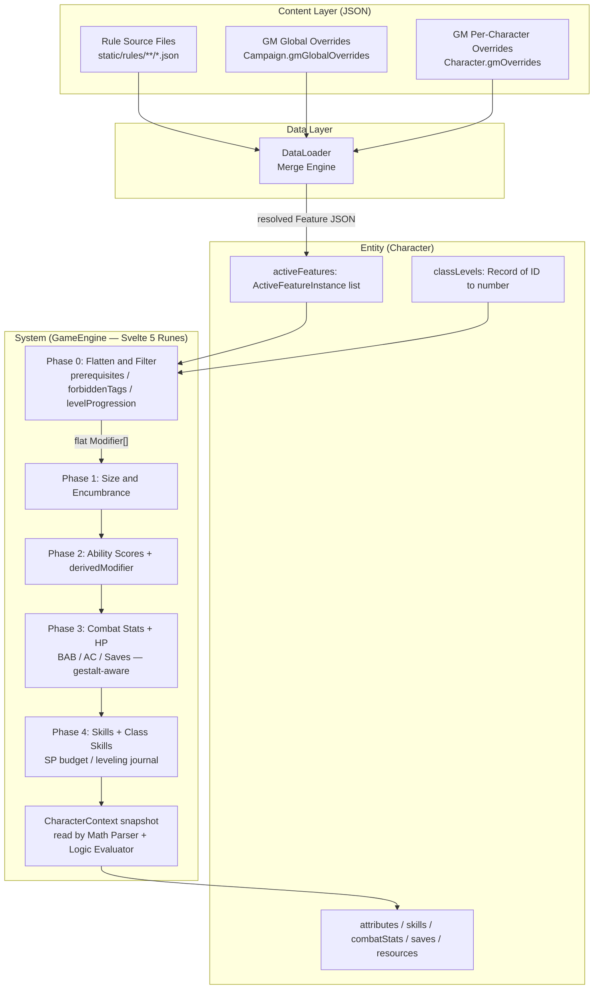
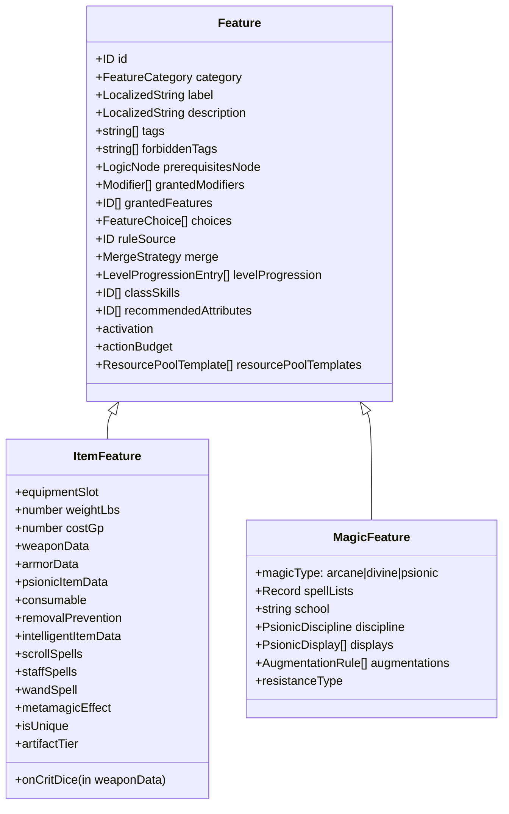
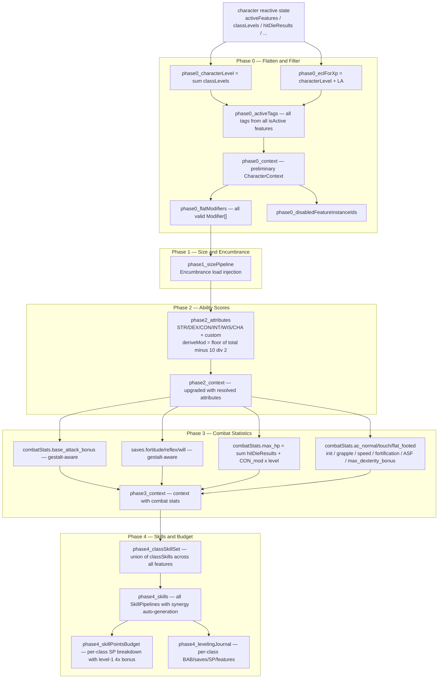
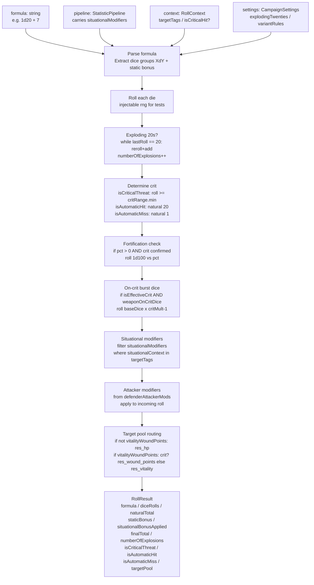
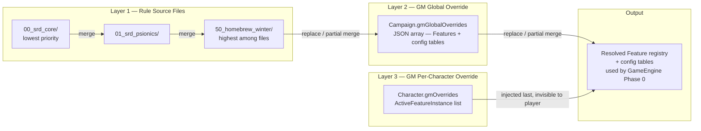

# Architecture Document: D&D 3.5 Data-Driven Engine (Svelte 5 + TypeScript)

## 1. Architecture Philosophy (Entity-Component-System)

This engine handles the full complexity of D&D 3.5 (SRD, Psionics, Homebrew). There are **zero hardcoded rules**: every game mechanic — saves, attack progressions, critical hit ranges, speed, DR — derives from data.

- **Entities:** Character, Animal Companion, Weapon. Pure data aggregators with no embedded logic.
- **Components:** `Features`. A race, a class, a buff, a weapon, a condition are all Features. Each carries `Modifiers` and `Tags`.
- **System:** The `GameEngine` (a Svelte 5 reactive class). It listens to active Features, evaluates prerequisites (logic trees), resolves mathematical formulas, and updates `StatisticPipelines` (Strength, AC, Attack, etc.).
- **Open Content Ecosystem:** JSON rule files can be shared, versioned, and extended without code changes. Characters export as self-contained JSON blobs. Dropping a new JSON file and updating the manifest is all that is needed to introduce new content.



---

## 2. Primitives and Fundamental Types

_Suggested target file: `src/lib/types/primitives.ts`_

```typescript
export type ID = string; // kebab-case (e.g., "stat_strength", "feat_power_attack")

export type ModifierType =
    | "base"             // Foundational additive value; ALWAYS STACKS. Used for BAB/save level increments.
    | "multiplier"       // Applied after all additive bonuses (e.g., ×1.5 STR for two-handed)
    | "untyped"          // Always stacks; no declared type
    | "racial"           // Racial trait bonus; non-stacking with other racial bonuses
    | "enhancement"      // Magic enhancement; non-stacking
    | "morale"           // Morale bonus; non-stacking
    | "luck"             // Luck bonus; non-stacking
    | "insight"          // Insight bonus; non-stacking
    | "sacred"           // Holy/sacred bonus; non-stacking
    | "profane"          // Unholy/profane bonus; non-stacking
    | "dodge"            // ALWAYS STACKS (explicit SRD exception)
    | "armor"            // Armour bonus; non-stacking
    | "shield"           // Shield bonus; non-stacking
    | "natural_armor"    // Natural armour bonus; non-stacking
    | "deflection"       // Deflection bonus (Ring of Protection, etc.); non-stacking
    | "competence"       // Competence bonus (skills); non-stacking
    | "circumstance"     // ALWAYS STACKS (explicit SRD exception)
    | "synergy"          // Skill-synergy bonus; ALWAYS STACKS (explicit SRD exception)
    | "size"             // Size bonus/penalty to attack and AC; non-stacking
    | "inherent"         // Permanent gains (tomes, wish, miracle); highest-wins within type
    | "setAbsolute"      // Forces pipeline to exact value (Wild Shape, Undead CON=0); last wins
    | "damage_reduction" // Best-wins per bypass-tag group; see section 4.5
    | "resistance"       // Resistance bonus to saves (Cloak of Resistance); non-stacking
    | "max_dex_cap";     // Minimum-wins cap on DEX-to-AC; see section 4.17

export type LogicOperator = "==" | ">=" | "<=" | "!=" | "includes" | "not_includes" | "has_tag" | "missing_tag";
```

**Always-stacking types:** `"base"`, `"untyped"`, `"dodge"`, `"circumstance"`, `"synergy"`.
All others: only the highest value among modifiers of the same type on the same pipeline applies (the others are **suppressed**).

---

## 3. The Logic Engine (Prerequisites and Conditions)

Handles AND/OR/NOT decision trees to determine whether a feature is eligible (prerequisite), whether a modifier applies (condition), or whether a situational bonus fires (roll-time context).

_Suggested target file: `src/lib/types/logic.ts`_

```typescript
export type LogicNode =
    | { logic: "AND"; nodes: LogicNode[] }
    | { logic: "OR";  nodes: LogicNode[] }
    | { logic: "NOT"; node: LogicNode }
    | {
        logic: "CONDITION";
        targetPath: string;   // e.g., "@attributes.stat_strength.totalValue" or "@activeTags"
        operator: LogicOperator;
        value: any;           // e.g., 13 or "feat_power_attack"
        errorMessage?: string; // e.g., "Requires Strength 13+"
      };
```

`conditionNode` on a Modifier is evaluated at **sheet-computation time** (every DAG cycle). `situationalContext` on a Modifier is evaluated at **dice-roll time** against `RollContext.targetTags`. Both can coexist on the same modifier (see Barbarian Indomitable Will in section 10).

---

## 4. Mathematical Pipelines (Statistics, Skills, and Resources)

Everything that is computed is a Pipeline: `baseValue` + resolved active modifiers = `totalValue`.

_Suggested target file: `src/lib/types/pipeline.ts`_

```typescript
export interface Modifier {
    id: ID;
    sourceId: ID;
    sourceName: LocalizedString;
    targetId: ID;           // Pipeline to modify; see section 4.3b for conventions
    value: number | string; // Number or Math Parser formula (see section 4.3)
    type: ModifierType;
    conditionNode?: LogicNode;    // Sheet-time gate
    situationalContext?: string;  // Roll-time gate; modifier goes to situationalModifiers if present
    drBypassTags?: string[];      // Only when type === "damage_reduction"; see section 4.5
}

export interface StatisticPipeline {
    id: ID;
    label: LocalizedString;
    baseValue: number;
    activeModifiers: Modifier[];       // Contribute to totalBonus (sheet display)
    situationalModifiers: Modifier[];  // Roll-time only; never in totalBonus
    totalBonus: number;   // Computed from activeModifiers after stacking rules
    totalValue: number;   // baseValue + totalBonus (or setAbsolute value)
    derivedModifier: number; // floor((totalValue − 10) / 2); meaningful only for ability scores
}

export interface SkillPipeline extends StatisticPipeline {
    keyAbility: ID;               // e.g., "stat_dexterity" for Tumble
    ranks: number;                // Invested skill points
    isClassSkill: boolean;
    appliesArmorCheckPenalty: boolean;
    canBeUsedUntrained: boolean;
}

export interface ResourcePool {
    id: ID;
    label: LocalizedString;
    maxPipelineId: ID;       // Pipeline computing the maximum (e.g., "combatStats.max_hp")
    currentValue: number;
    temporaryValue: number;  // e.g., temporary HP (absorbs first)
    resetCondition: "short_rest" | "long_rest" | "encounter" | "never"
                  | "per_turn" | "per_round" | "per_day" | "per_week";
    rechargeAmount?: number | string; // For "per_turn"/"per_round" incremental recharge
}
```

### 4.1. `derivedModifier` Behavior

Computed automatically: `floor((totalValue − 10) / 2)`. Never stored in save files. For the 6 main ability scores only; all other pipelines return `0`. Examples:
- STR 10 → `0`; STR 18 → `+4`; STR 7 → `−2`

### 4.2. `setAbsolute` Behavior

When a `setAbsolute` modifier is active, `baseValue` and all other modifiers are ignored; `totalValue` is forced to the `setAbsolute` value. If multiple `setAbsolute` modifiers target the same pipeline, the last one in the resolution chain wins (rule sources → GM global → GM per-character). `derivedModifier` is still recomputed from the forced value.

**Use cases:** Wild Shape (forces STR/DEX to animal form values), Undead (CON forced to 0), GM NPC HP override.

### 4.3. Special Paths for the Math Parser

`@`-prefixed paths in formula strings are resolved against `CharacterContext`. The parser splits on `.` and walks the context object.

| Path Pattern | Resolves To | Available |
|---|---|---|
| `@attributes.<id>.totalValue` | Pipeline total for ability score | Always |
| `@attributes.<id>.derivedModifier` | `floor((totalValue−10)/2)` | Always |
| `@attributes.<id>.baseValue` | Base value before modifiers | Always |
| `@skills.<id>.ranks` | Invested skill ranks | Always |
| `@skills.<id>.totalValue` | Skill total | Always |
| `@combatStats.<id>.totalValue` | Combat stat total | Always |
| `@saves.<id>.totalValue` | Saving throw total | Always |
| `@characterLevel` | `Σ classLevels` — excludes LA — use for feats/HP/skills | Always |
| `@eclForXp` | `@characterLevel + levelAdjustment` — use for XP table lookups only | Always |
| `@classLevels.<classId>` | Level in a specific class | Always |
| `@activeTags` | Flat array of all tags from all active Features | Always |
| `@equippedWeaponTags` | Tags of the currently equipped weapon | Always |
| `@selection.<choiceId>` | Player's selections from `ActiveFeatureInstance.selections` | Always |
| `@constant.<id>` | Named constant from config tables | Always |
| `@targetTags` | Target creature's tags | **Roll time only** |
| `@master.classLevels.<classId>` | Master character's class level (LinkedEntity only) | LinkedEntity only |

> **AI Implementation Note:** The Math Parser resolves `@attributes.stat_strength.derivedModifier` by splitting into `["attributes", "stat_strength", "derivedModifier"]` and walking the CharacterContext object. Missing paths return `0` with a console warning.
>
> **Context key conventions:** `@combatStats.base_attack_bonus.totalValue` resolves by splitting into `["combatStats", "base_attack_bonus", "totalValue"]`, so `context.combatStats["base_attack_bonus"]` must exist. The `CharacterContext` context builders in `GameEngine.svelte.ts` strip the namespace prefix when building the snapshot: `"combatStats.base_attack_bonus"` → stored as `"base_attack_bonus"` in `context.combatStats`; `"saves.fortitude"` → stored as `"fortitude"` in `context.saves`. Content authors write `@combatStats.base_attack_bonus.totalValue` — this is correct and works as documented.

> **Path distinction — `@characterLevel` vs `@eclForXp`:** Always use `@characterLevel` for game-mechanical calculations (feats, HP, skill ranks, class features). Use `@eclForXp` ONLY when consulting `config_xp_table` for level-up checks and starting wealth. For standard PC races (`levelAdjustment = 0`), both paths return the same value.

### 4.3b. `Modifier.targetId` Normalisation and Canonical Pipeline IDs

`normaliseModifierTargetId()` in `GameEngine.svelte.ts` accepts two equivalent forms for attribute and skill pipelines:

| Namespaced form (readable) | Bare form (canonical map key) | Pipeline namespace |
|---|---|---|
| `"attributes.stat_strength"` | `"stat_strength"` | `Character.attributes` |
| `"attributes.stat_dexterity"` | `"stat_dexterity"` | `Character.attributes` |
| `"skills.skill_climb"` | `"skill_climb"` | `Character.skills` |

The normaliser strips the `"attributes."` and `"skills."` prefixes so both forms are equivalent. Content authors may use either form for attributes and skills.

**Other namespaces are NOT normalised** — they are used verbatim as pipeline map keys:
- `"combatStats.base_attack_bonus"`, `"combatStats.ac_normal"`, `"combatStats.speed_land"` → used exactly as written
- `"saves.fortitude"`, `"saves.reflex"`, `"saves.will"` → used exactly as written
- `"resources.hp"` → used exactly as written

A special normalisation exists for resource max-value targeting: `"resources.X.maxValue"` → `"combatStats.X_max"`.

#### Speed Pipeline Conventions

Speed pipelines live in `Character.combatStats`, keyed as:
- `"combatStats.speed_land"` (base 30 ft)
- `"combatStats.speed_fly"` (base 0)
- `"combatStats.speed_burrow"` (base 0)
- `"combatStats.speed_climb"` (base 0)
- `"combatStats.speed_swim"` (base 0)

Content authors may also write `"attributes.speed_land"` which the normaliser strips to the bare form `"speed_land"`. **The normaliser does not redirect bare `"speed_land"` to `"combatStats.speed_land"`.** For speed modifiers to correctly reach the `combatStats.speed_land` pipeline, use the full namespace: `"combatStats.speed_land"`.

Similarly, descriptions and formula values that reference speed should use: `@combatStats.speed_land.totalValue` (not `@attributes.speed_land.totalValue`).

#### Canonical `saves.*` Pipeline IDs

| Canonical ID | Ability | Do NOT use |
|---|---|---|
| `saves.fortitude` | Constitution | `saves.fortitude`, `saves.save_fort` |
| `saves.reflex` | Dexterity | `saves.reflex`, `saves.save_ref` |
| `saves.will` | Wisdom | `saves.save_will` |
| `saves.all` | (broadcast) | — fans out to fort + ref + will in `#processModifierList` |

#### Canonical Caster/Manifester Level Pipeline IDs

| Canonical ID | Notes |
|---|---|
| `stat_caster_level` | Lives in `Character.attributes`; targeted by class level progression |
| `stat_manifester_level` | Psionic equivalent; lives in `Character.attributes` |

Target these as `"attributes.stat_caster_level"` or bare `"stat_caster_level"`. In formula paths: `@attributes.stat_caster_level.totalValue`. Do NOT use `"caster_level"` (missing `stat_` prefix) or `"combatStats.caster_level"` (wrong namespace).

### 4.4. `ResourcePool.resetCondition` — Full Reference

| Value | Trigger | Typical Uses |
|---|---|---|
| `"long_rest"` | `triggerLongRest()` | Spell slots, psi points, Rage rounds, Turn Undead |
| `"short_rest"` | `triggerShortRest()` | House-rule variant pools |
| `"encounter"` | `triggerEncounterReset()` | Once-per-encounter class abilities |
| `"never"` | Never automatic | Finite charges (Ring of the Ram, wands, Three Wishes) |
| `"per_day"` | `triggerDawnReset()` | X/day ring abilities, dawn-reset item charges |
| `"per_week"` | `triggerWeeklyReset()` | X/week ring abilities (Elemental Command chain lightning) |
| `"per_turn"` | `triggerTurnTick()` | Fast Healing, Regeneration |
| `"per_round"` | `triggerRoundTick()` | Area effects, global aura accumulation |

**Key distinction:** `"long_rest"` resets on 8 hours of sleep; `"per_day"` resets at dawn regardless of sleep. A party that stays awake all night still sees their X/day ring charges reset at dawn, but their spell slots do not recover.

`triggerLongRest()` resets both `"long_rest"` AND `"short_rest"` pools. It does NOT reset `"per_day"` or `"per_week"` pools.

**Incremental recharge:** `"per_turn"` ticks at the start of the specific character's initiative turn (`triggerTurnTick()` is called per character). `"per_round"` ticks once per global round at a fixed point (`triggerRoundTick()` is called globally). The `rechargeAmount` field (number or formula string) controls how much is restored per tick; the pool is capped at its computed maximum and never exceeds it via ticking.

**Fast Healing vs Regeneration:** Both use `"per_turn"` + `rechargeAmount: N`. The difference lies in the DR/bypass tags: Regeneration creatures have tags like `"regeneration_bypassed_by_fire"` that the combat UI checks to decide whether to apply lethal or nonlethal damage.

```json
// Fast Healing 3 — on a creature Feature
{ "id": "resources.hp", "resetCondition": "per_turn", "rechargeAmount": 3 }
```

### 4.5. Damage Reduction — `drBypassTags` and Best-Wins Grouping

DR does not follow normal stacking rules. It uses a **best-wins-per-bypass-group** model.

| Field | Type | Role |
|---|---|---|
| `value` | `number` | How much damage is reduced per hit |
| `type` | `"damage_reduction"` | Triggers best-wins grouping |
| `drBypassTags` | `string[]` | Materials that bypass this DR entry |

`drBypassTags` semantics:
- `[]` → DR X/— (nothing bypasses)
- `["magic"]` → DR X/magic
- `["silver"]` → DR X/silver
- `["cold_iron"]` → DR X/cold iron
- `["good"]` → DR X/good
- `["epic"]` → DR X/epic
- `["magic", "silver"]` → DR X/magic AND silver (weapon must be BOTH — extremely rare)

#### Two DR Authoring Modes

| Mode | `type` | Stacking | Use For |
|---|---|---|---|
| **Additive class progression** | `"base"` | Always stacks | Barbarian DR/— increments (+1 at level 7, +2 at 10, etc.) |
| **Innate/racial/template DR** | `"damage_reduction"` | Best-wins per bypass group | Vampire DR 10/magic, lycanthrope DR 10/silver |

**`StackingResult` interface** (returned by `applyStackingRules()`):

```typescript
interface StackingResult {
  totalBonus:          number;       // Sum of all applied additive bonuses
  totalValue:          number;       // floor((baseValue + totalBonus) * multiplierFactor), or setAbsoluteValue
  multiplierFactor:    number;       // The largest multiplier (default 1.0; applied after additive sum)
  setAbsoluteValue?:   number;       // Present only if a setAbsolute modifier fired
  appliedModifiers:    Modifier[];   // Modifiers that contributed to totalBonus
  suppressedModifiers: Modifier[];   // Modifiers blocked by stacking rules
  drEntries?:          DREntry[];    // Only for combatStats.damage_reduction pipeline
}
```

**Multiplier behavior:** `multiplierFactor` uses the single most impactful multiplier (the one farthest from 1.0). Multiple multipliers don't compound — the highest-impact one wins. Applied as: `totalValue = floor((baseValue + totalBonus) * multiplierFactor)`.

**Stacking algorithm (`applyStackingRules()` Step 6):**
1. Sort and JSON-serialize each modifier's `drBypassTags` as a group key.
2. Group all DR modifiers by this key.
3. Within each group: keep the **highest value** (suppress the rest).
4. Return each winner as a `DREntry { amount, bypassTags, sourceModifier, suppressedModifiers }` in `StackingResult.drEntries`.

```json
// Vampire Fighter 3 — DR 10/magic from race
{ "value": 10, "type": "damage_reduction", "drBypassTags": ["magic"], "sourceId": "race_vampire" }

// Barbarian DR — additive increments via "base" type on combatStats.damage_reduction
{ "value": 1, "type": "base", "targetId": "combatStats.damage_reduction" }  // Level 7 increment
{ "value": 1, "type": "base", "targetId": "combatStats.damage_reduction" }  // Level 10 increment
```

**Combat resolution:** For each `DREntry` on the target, check if the weapon's tags include ANY tag from `DREntry.bypassTags`. If yes: DR is bypassed. If no (or `bypassTags` is empty): subtract `DREntry.amount` from damage (minimum 0 per hit). Spells and energy damage ignore DR unless a special feat applies.

### 4.6. `attacker.*` Modifier Target Namespace — Penalties on Incoming Attacks

Modifiers whose `targetId` begins with `"attacker."` impose penalties on the **attacker's** roll rather than on the item owner's pipelines. They are never included in static sheet totals.

At roll time, the Dice Engine reads the **defender's** active modifiers, collects those with `"attacker."` prefix, strips the prefix, and applies the remainder as a pipeline path on the attacker's roll context. `situationalContext` still applies.

**Example — Ring of Elemental Command (Air):**
```json
{
  "id": "mod_air_elemental_attack_penalty",
  "sourceId": "item_ring_elemental_command_air",
  "sourceName": { "en": "Ring of Elemental Command (Air)", "fr": "Anneau de Commandement Élémentaire (Air)" },
  "targetId": "attacker.combatStats.attack_bonus",
  "value": -1,
  "type": "untyped",
  "situationalContext": "vs_air_elementals"
}
```
When an air elemental attacks the ring-wearer, the Dice Engine applies −1 to the incoming attack roll. The wearer's own attack bonus is unchanged. The result is recorded in `RollResult.attackerPenaltiesApplied[]` for transparency.

**Engine contract:**

| Concern | Responsibility |
|---|---|
| **DAG Phase 0** | `attacker.*` modifiers pass through Phase 0 and end up in `phase0_flatModifiers` like any other modifier — there is NO separate routing. They ARE included in the pipeline's `activeModifiers` / `situationalModifiers` just as authored. |
| **Combat UI (caller)** | The Combat UI extracts modifiers with `targetId.startsWith("attacker.")` from the DEFENDER's active modifiers at roll time and passes them as `defenderAttackerMods` to `parseAndRoll()`. This is an application-level concern, not engine-level. |
| **Dice Engine `parseAndRoll()`** | Receives `defenderAttackerMods: Modifier[]`. Strips `"attacker."` prefix, matches `situationalContext` against the attacker's `targetTags`, and applies matching penalties/bonuses to the roll. Result is in `RollResult.attackerPenaltiesApplied`. |
| **Stacking rules** | Attacker modifiers follow standard non-stacking rules among themselves: two `"untyped"` modifiers DO stack, two `"morale"` modifiers DON'T. |
| **Sheet display** | `attacker.*` modifiers should be shown in a separate "Aura / Penalties on incoming Attackers" breakdown section — never in the wearer's own pipeline totals. The wearer's own pipelines are completely unaffected. |

> **AI Implementation Note:** IMPORTANT — Phase 0 does NOT filter out `attacker.*` modifiers from pipeline stacking. This means `attacker.combatStats.attack_bonus` modifiers WILL appear in `combatStats.attack_bonus.activeModifiers` unless the UI separately filters them. The correct implementation is:
> 1. Include `attacker.*` modifiers in the pipeline normally (they're authored with the wearer's feature).
> 2. When the Combat UI prepares a `parseAndRoll()` call, scan the DEFENDER's `phase0_flatModifiers` (or `phase3_combatStats` activeModifiers) for `targetId.startsWith("attacker.")` entries and pass them as `defenderAttackerMods`.
> 3. The Dice Engine resolves them against the attacker's `targetTags`.

### 4.7. Fortification — Critical Hit Negation

`combatStats.fortification` is a `StatisticPipeline` initialized at `baseValue 0`. Items grant fortification via:
```json
{ "targetId": "combatStats.fortification", "value": 25, "type": "untyped" }
```

Percentages per SRD tier: Light = 25%, Moderate = 75%, Heavy = 100%.

When `defenderFortificationPct > 0` AND a confirmed crit is rolled, `parseAndRoll()` rolls 1d100. If `roll ≤ pct`: crit negated, damage is rolled normally — `RollResult.fortification.critNegated = true`. Fortification negates all crit effects including on-crit burst dice.

```typescript
// RollResult.fortification block (present only on confirmed crits when pct > 0):
fortification?: {
    roll: number;         // Raw 1d100 result
    pct: number;          // Defender's fortification percentage
    critNegated: boolean; // true → crit negated; normal damage applies
};
```

**V/WP interaction:** A fortification-negated crit routes damage to `res_vitality` (same as a normal hit). `RollResult.targetPool` checks `isEffectiveCrit = isConfirmedCrit && !(fortification?.critNegated)` before routing.

**Caller contract:**
```typescript
// In the combat UI:
const fortPct = defenderEngine.phase3_combatStats['combatStats.fortification']?.totalValue ?? 0;
const result = parseAndRoll(damageFormula, attackPipeline, ctx, settings, rng, critRange, undefined, fortPct);
if (result.fortification?.critNegated) {
  // Re-prompt for normal damage roll (no crit multiplier)
}
```

> **Note:** The dice engine does NOT modify `finalTotal` when a crit is negated — it only sets `fortification.critNegated = true`. The calling system is responsible for re-rolling normal damage.

### 4.8. Arcane Spell Failure — `combatStats.arcane_spell_failure`

`combatStats.arcane_spell_failure` accumulates additive percentages from all equipped armor/shields via `type: "untyped"` modifiers (always stacks). Each piece of armor contributes:
```json
{ "targetId": "combatStats.arcane_spell_failure", "value": 20, "type": "untyped" }
```

The `armorData.arcaneSpellFailure` field on `ItemFeature` is a **display-only shadow** (for the Inventory UI tooltip). The pipeline is the mechanical source of truth.

**Dice Engine Contract:** ASF is a **pre-cast check** in the Spells & Powers UI (Phase 12.3) — not inside `parseAndRoll()`. Before executing a spell cast action:
1. Read `engine.phase3_combatStats['combatStats.arcane_spell_failure']?.totalValue ?? 0`.
2. If > 0: roll 1d100.
3. If roll ≤ ASF%: spell fails (deduct spell slot, display failure message).
4. If roll > ASF%: proceed with casting normally.

The DAG engine simply maintains the accumulated percentage; the CastingPanel enforces the game rule.

Classes with "Light Armor Casting" reduce the total via a negative `"untyped"` modifier. For example, a Bard at level 4 gains "Armored Casting (light)" which adds `{ value: -10, type: "untyped" }` — bringing chain shirt (20%) down to 10%.

### 4.9. On-Crit Burst Dice — `ItemFeature.weaponData.onCritDice`

Burst weapons (Flaming Burst, Icy Burst, Shocking Burst, Thundering) deal extra elemental/sonic dice **only on a confirmed critical hit**. Per SRD, these dice are NOT multiplied by the crit multiplier, but their **count** scales with the multiplier:

| Crit Multiplier | Flaming Burst | Thundering |
|---|---|---|
| ×2 | +1d10 fire | +1d8 sonic |
| ×3 | +2d10 fire | +2d8 sonic |
| ×4 | +3d10 fire | +3d8 sonic |

```typescript
onCritDice?: {
    baseDiceFormula: string;          // "1d10" for Flaming/Icy/Shocking Burst, "1d8" for Thundering
    damageType: string;               // "fire", "cold", "electricity", "sonic"
    scalesWithCritMultiplier: boolean; // true for all SRD burst weapons
};
```

**`parseAndRoll()` algorithm:** When `isEffectiveCrit === true` AND `weaponOnCritDice` provided:
1. `actualCount = baseDiceCount × (critMultiplier - 1)` if `scalesWithCritMultiplier`, else `baseDiceCount`.
2. Roll `actualCount` dice using the injectable RNG.
3. Add burst total to `finalTotal`; record in `RollResult.onCritDiceRolled`.

```typescript
// RollResult.onCritDiceRolled block:
onCritDiceRolled?: {
    formula: string;      // e.g., "2d10" for ×3 weapon
    rolls: number[];
    totalAdded: number;
    damageType: string;
};
```

**Content Authoring — Flaming Burst Longsword Example:**
```json
{
  "id": "item_weapon_flaming_burst_longsword_1",
  "category": "item",
  "tags": ["item", "weapon", "magic_item", "magic_weapon"],
  "weaponData": {
    "wieldCategory": "one_handed",
    "damageDice": "1d8", "damageType": ["slashing"],
    "critRange": "19-20", "critMultiplier": 2, "reachFt": 5,
    "onCritDice": { "baseDiceFormula": "1d10", "damageType": "fire", "scalesWithCritMultiplier": true }
  },
  "grantedModifiers": [
    { "targetId": "combatStats.attack_bonus", "value": 1, "type": "enhancement" },
    { "targetId": "combatStats.damage_bonus", "value": 1, "type": "enhancement" },
    { "targetId": "combatStats.damage_bonus", "value": "1d6",
      "type": "untyped", "situationalContext": "on_hit",
      "sourceName": { "en": "Flaming Burst (on hit)", "fr": "Explosion ardente (au toucher)" }
    }
  ]
}
```
The `situationalContext:"on_hit"` modifier handles +1d6 fire on **every** hit. `onCritDice` handles the **additional** +1d10 fire on **confirmed crits only**. Both are rolled separately.

**Keen — Crit Range Doubling:** Encoded directly in `weaponData.critRange`. A +1 Keen Longsword has `"critRange": "17-20"`. No engine change needed.

**Vicious — Self-Damage on Hit:** Modelled as a tag `"vicious"` on the weapon. The combat UI prompts the wielder to take 1d6 damage when hitting with this weapon.

### 4.10. Inherent Bonuses — `type: "inherent"` (Tomes, Manuals, Wish, Miracle)

Inherent bonuses are permanent ability score improvements (tomes, manuals, Wish, Miracle). They:
- Never expire (antimagic, dispel magic, death have no effect)
- Stack with all other bonus types (`"enhancement"`, `"luck"`, etc.)
- Do NOT stack with other inherent bonuses to the same score (highest wins)
- Maximum: +5 to any ability from any source

`"inherent"` is NOT in `ALWAYS_STACKING_TYPES`. The engine's existing "highest wins for non-stacking types" logic is correct: two `"inherent"` modifiers of +2 and +4 → +4 applies, +2 suppressed.

**Tomes and Manuals** are `consumable: { isConsumable: true }` items. When consumed via `consumeItem()`, they create a **permanent non-ephemeral `ActiveFeatureInstance`** (no `ephemeral` block), so the bonus persists permanently and cannot be dismissed via "Expire".

```json
{
  "id": "item_manual_of_gainful_exercise_4",
  "category": "item",
  "consumable": { "isConsumable": true },
  "grantedModifiers": [
    { "targetId": "attributes.stat_strength", "value": 4, "type": "inherent",
      "sourceId": "item_manual_of_gainful_exercise_4",
      "sourceName": { "en": "Manual of Gainful Exercise (+4)", "fr": "Manuel d'exercice profitable (+4)" },
      "id": "effect_manual_str_4" }
  ]
}
```

### 4.11. Metamagic Rods — `ItemFeature.metamagicEffect`

Metamagic rods apply a metamagic feat to a spell without changing the spell slot used. Each rod has 3 uses per day tracked via `resourcePoolTemplates`. `CastingPanel.svelte` reads `metamagicEffect` on equipped rods.

```typescript
metamagicEffect?: {
    feat: 'feat_empower_spell' | 'feat_enlarge_spell' | 'feat_extend_spell'
        | 'feat_maximize_spell' | 'feat_quicken_spell' | 'feat_silent_spell';
    maxSpellLevel: 3 | 6 | 9; // 3 = lesser, 6 = normal, 9 = greater
};
```

**CastingPanel contract:** Scan equipped items for `metamagicEffect`. Check `spell.level ≤ maxSpellLevel` and that the rod pool `>= 1`. On activation: decrement charge via `spendItemPoolCharge(instanceId, 'metamagic_uses')`, apply metamagic effect (no slot adjustment). Enforce one rod per spell. Only one rod can be combined with the caster's own metamagic feats (which DO increase the slot level).

| `feat` ID | Effect |
|---|---|
| `feat_empower_spell` | All variable numeric effects × 1.5 |
| `feat_enlarge_spell` | Doubles range |
| `feat_extend_spell` | Doubles duration |
| `feat_maximize_spell` | All variable numeric effects maximized |
| `feat_quicken_spell` | Cast as free action (once/round) |
| `feat_silent_spell` | No verbal component required |

### 4.12. Staves — `ItemFeature.staffSpells`

Staves hold multiple spells at varying charge costs and use the **wielder's caster level** (if higher than the staff's own CL) and ability modifier for saving throw DCs.

```typescript
staffSpells?: {
    spellId: ID;
    chargeCost: 1 | 2 | 3 | 4 | 5;
    spellLevel?: number; // Only for heightened spells (Staff of Power)
}[];
```

**CastingPanel contract:** Show all spell options with `chargeCost`. Check `itemResourcePools['charges'] >= entry.chargeCost`. Deduct via `spendItemPoolCharge(instanceId, 'charges', entry.chargeCost)`. Use wielder's CL and ability modifier. When `spellLevel` is set, use it for DC calculations (overrides spell's base level).

### 4.13. Wands — `ItemFeature.wandSpell`

Wands hold exactly one spell (≤ 4th level), always cost 1 charge per use, and use the **item's own fixed CL** (not the wielder's). Different CL variants of the same spell are different items.

```typescript
wandSpell?: {
    spellId: ID;
    casterLevel: number; // Item's fixed CL — used for all level-dependent effects
    spellLevel?: number; // Only for heightened wands (see SRD table)
};
```

**Why CL matters — the Magic Missile example:**

| Wand | CL | Missiles | Price |
|---|---|---|---|
| Wand of Magic Missile (CL 1) | 1 | 1 missile | 750 gp |
| Wand of Magic Missile (CL 3) | 3 | 2 missiles | 2,250 gp |
| Wand of Magic Missile (CL 5) | 5 | 3 missiles | 3,750 gp |
| Wand of Magic Missile (CL 7) | 7 | 4 missiles | 5,250 gp |
| Wand of Magic Missile (CL 9) | 9 | 5 missiles | 6,750 gp |

Same spell — but the CL determines everything. A CastingPanel that doesn't know the wand's CL cannot compute the correct missile count.

**CastingPanel contract:** ALWAYS use `wandSpell.casterLevel` — never the wielder's CL. This is the fundamental rule that distinguishes wands from staves (staves use the wielder's CL if higher). Save DC = `10 + (wandSpell.spellLevel ?? spell.level) + abilityModifier`.

**Heightened SRD wands:**
| Wand | `spellLevel` |
|---|---|
| Charm person (heightened 3rd) | 3 |
| Hold person (heightened 4th) | 4 |
| Ray of enfeeblement (heightened 4th) | 4 |
| Suggestion (heightened 4th) | 4 |

**Staff vs. Wand vs. Ring — Comparison Table:**

| Feature | Staff | Wand | Ring |
|---|---|---|---|
| Spells stored | 2–6 (at varying costs) | 1 | N/A (passive or 1 ability) |
| Charge cost | 1–5 per spell | Always 1 | N/A or custom |
| CL used | Wielder's if higher | Item's fixed CL | Item's fixed CL |
| Max charges | 50 (never resets) | 50 (never resets) | Varies |
| Spell level limit | Any | 4th max | N/A |
| Data field | `staffSpells` | `wandSpell` | resource pools |

### 4.14. Scrolls — `ItemFeature.scrollSpells`

Scrolls are single-use (`consumable: { isConsumable: true }`), use the item's fixed CL, require a CL check if the wielder's CL is lower, and restrict use by arcane vs divine type. No `resourcePoolTemplates` needed — the scroll is consumed on use.

```typescript
scrollSpells?: {
    spellId: ID;
    casterLevel: number;            // Item's fixed CL
    spellLevel: number;             // REQUIRED — needed for DC and CL check
    spellType: 'arcane' | 'divine'; // Hard class restriction
}[];
```

**Standard default CLs per spell level:** 1/1/3/5/7/9/11/13/15/17 for levels 0–9 (cost formula: `CL × SL × 25 gp`).

**CL check when wielder CL < scroll CL:** `checkDC = entry.casterLevel + 1`. On failure: DC 5 Wisdom save or mishap. Activating the wrong type (`arcane` by a divine caster) requires Use Magic Device DC 20 + spell level.

**Multi-Spell Scrolls:** The `scrollSpells` field is an array to support custom multi-spell scrolls. All standard SRD scroll items have `scrollSpells.length === 1`.

**Wands vs. Staves vs. Scrolls — Full Comparison:**

| Feature | Wands | Staves | Scrolls |
|---|---|---|---|
| Data field | `wandSpell` (object) | `staffSpells` (array) | `scrollSpells` (array) |
| Single-use | ❌ 50 charges | ❌ 50 charges | **✅ consumed** |
| resourcePoolTemplates | ✅ required | ✅ required | **❌ not needed** |
| CL used | Item's fixed | Wielder's if higher | **Item's fixed** |
| `spellLevel` | optional (heightened) | optional (heightened) | **required** |
| `spellType` | ❌ | ❌ | **✅ required** |
| Multi-spell | ❌ | ✅ (charge costs vary) | ✅ (same CL for all) |
| CL check | ❌ | ❌ | **✅ if wielder CL < scroll CL** |

> **AI Implementation Note (CastingPanel):** For scrolls: (1) Check `spellType` against wielder's class — reject if mismatch or route to UMD (DC 20 + spell level). (2) Check `entry.casterLevel` vs wielder's CL — if lower, trigger CL check `(DC = entry.casterLevel + 1)`. (3) On success: call `engine.consumeItem(instanceId)` to destroy the scroll. (4) Apply spell with `entry.casterLevel` as the CL and `10 + entry.spellLevel + abilityMod` as the save DC.

### 4.15. Cursed Items — `ItemFeature.removalPrevention`

Without a prevention mechanism, `removeFeature()` would allow any item to be removed unconditionally. The `removalPrevention` field + guarded `removeFeature()` enforce the SRD rule.

```typescript
removalPrevention?: {
    isCursed: true;
    removableBy: ('remove_curse' | 'limited_wish' | 'wish' | 'miracle')[];
    preventionNote?: string;
};
```

**SRD examples:**
```json
// Ring of Clumsiness — remove curse works:
"removalPrevention": { "isCursed": true, "removableBy": ["remove_curse", "wish", "miracle"] }

// Necklace of Strangulation — only stronger magic:
"removalPrevention": {
  "isCursed": true,
  "removableBy": ["limited_wish", "wish", "miracle"],
  "preventionNote": "Remains clasped even after death. Limited wish, wish, or miracle only."
}
```

**Engine Contract — `removeFeature()` Guard:**

```typescript
// removeFeature() has this guard:
const rp = feature?.removalPrevention;
if (rp?.isCursed) {
  console.warn(`[Guard] Cursed item — use tryRemoveCursedItem() instead.`);
  return;  // Blocked
}
```

The private `#removeFeatureUnchecked()` method bypasses the guard and is called by:
- `tryRemoveCursedItem()` after the magic check passes
- `consumeItem()` (potions are never cursed)
- `expireEffect()` (ephemeral buffs are never cursed)

**Engine Contract — `tryRemoveCursedItem(instanceId, dispelMethod)`:**

| Return | Meaning | State |
|---|---|---|
| `true` | Curse broken — item removed | Item gone from `activeFeatures` |
| `false` | Insufficient magic | Item stays |
| `null` | instanceId not found, or item not cursed | Use `removeFeature()` instead |

```typescript
// Cleric casts remove curse:
const result = engine.tryRemoveCursedItem(ringInstanceId, 'remove_curse');
if (result === true)  { ui.show("Curse broken!"); }
if (result === false) { ui.show("Insufficient magic for this curse."); }
```

The Inventory UI shows a red **"Cursed"** badge, replaces the Unequip/Remove button with a greyed-out button showing `preventionNote` as a tooltip, and lists `removableBy` as human-readable labels.

> **AI Implementation Note:** Check `(feature as ItemFeature).removalPrevention?.isCursed` in the inventory row render. Display: `'remove_curse'` → "Remove Curse", `'limited_wish'` → "Limited Wish", `'wish'` → "Wish", `'miracle'` → "Miracle".

### 4.16. Intelligent Items — `ItemFeature.intelligentItemData`

Intelligent items are permanent magic items imbued with sentience — INT/WIS/CHA scores, personality, alignment, communication modes, senses, languages, and an Ego score. `intelligentItemData` is **metadata only** — no DAG pipeline changes. All mechanical effects use existing primitives:

| Effect | Engine mechanism |
|---|---|
| Lesser powers (spells 3/day) | `resourcePoolTemplates per_day` |
| Greater powers (spells 1/day, at-will) | `activation` + `resourcePoolTemplates per_day` |
| Dedicated powers (purpose-conditional) | `conditionNode` + `resourcePoolTemplates` |
| Item skill ranks (10 in Intimidate) | `grantedModifiers type:"competence"` value 10 |
| Alignment penalty for misaligned wielder | `grantedModifiers` with `conditionNode` on alignment tag |

**Ego Score Formula:**

| Component | Ego contribution |
|---|---|
| Each +1 of item's enhancement bonus | +1 |
| Each lesser power | +1 |
| Each greater power | +2 |
| Special purpose + dedicated power | +4 |
| Telepathic communication | +1 |
| Read languages ability | +1 |
| Read magic ability | +1 |
| Each +1 of INT bonus | +1 |
| Each +1 of WIS bonus | +1 |
| Each +1 of CHA bonus | +1 |

Ego = Will DC for dominance checks. Content authors compute Ego and store it in `egoScore`.

**Dominance and Negative Levels:**

| Ego range | Negative levels on misaligned wielder |
|---|---|
| 1–19 | 1 |
| 20–29 | 2 |
| 30+ | 3 |

**Communication Tiers (SRD Table):**

| Communication | INT/WIS/CHA | Cost modifier |
|---|---|---|
| Empathy (urges, emotions) | Two at 12–13, one at 10 | +1,000–2,000 gp |
| Speech (Common + INT-bonus languages) | Two at 14–16, one at 10 | +4,000–6,000 gp |
| Speech + Telepathy | Two at 17–19, one at 10 | +9,000–15,000 gp |

> **AI Implementation Note:** When rendering the Item Detail modal for an intelligent item, check `intelligentItemData` and display a "Personality" tab with: ability scores, Ego score (formatted as "Will DC = egoScore for dominance"), alignment, communication mode, senses, language list. The `specialPurpose` and `dedicatedPower` fields should be displayed prominently when non-null — they define the item's core motivation.

### 4.17. Max DEX Bonus to AC — `combatStats.max_dexterity_bonus`

`combatStats.max_dexterity_bonus` is initialized at `baseValue = 99` (no restriction for unarmored characters).

**Two-layer model:**
- `"max_dex_cap"` modifiers (armor, shields, conditions): **MINIMUM wins** — most restrictive cap applies.
- `"untyped"` modifiers (Mithral, enhancements): stack on top **after** the cap is established.

**Phase 3 algorithm:**
```
capMods   = activeMods where type === "max_dex_cap"
otherMods = activeMods where type !== "max_dex_cap"

effectiveBase = capMods.length > 0
    ? Math.min(...capMods.map(m => m.value))  // most restrictive cap
    : 99                                       // no armor → no restriction

totalValue = applyStackingRules(otherMods, effectiveBase).totalValue
```

`armorData.maxDex` on `ItemFeature` is a display-only shadow; the pipeline is the mechanical source of truth. Shields without a DEX restriction do NOT add any `max_dex_cap` modifier.

```json
// Chainmail — caps max DEX at +2
{ "targetId": "combatStats.max_dexterity_bonus", "value": 2, "type": "max_dex_cap" }

// Mithral special material — adds +2 on top of the cap
{ "targetId": "combatStats.max_dexterity_bonus", "value": 2, "type": "untyped" }
```

#### Examples

| Scenario | max_dex_cap mods | untyped mods | totalValue |
|---|---|---|---|
| Unarmored | — | — | 99 (no cap) |
| Chainmail (cap=2) | [2] | — | 2 |
| Mithral Chainmail | [2] | [+2] | 4 |
| Full Plate (cap=1) + Tower Shield (cap=2) | [1, 2] | — | 1 (min wins) |
| Heavy Load + Padded (cap=8) | [1, 8] | — | 1 (load wins) |
| Mithral Full Plate (cap=1 + mithral +2) | [1] | [+2] | 3 |

#### UI Contract — ArmorClass Panel

The `ArmorClass.svelte` panel reads `combatStats.max_dexterity_bonus.totalValue`:
- If `totalValue ≥ DEX_modifier`: full DEX applies (cap not reached).
- If `totalValue < DEX_modifier`: cap the contribution at `totalValue`.
- If `totalValue === 99`: display "No restriction" or omit the cap.

The `ModifierBreakdownModal` for `combatStats.max_dexterity_bonus` shows both cap sources (armor/conditions) and additive bonuses (mithral) separately for player transparency.

> **AI Implementation Note (Phase 10.2):** When displaying AC, compute:
> `effectiveDexToAC = Math.min(dexDerivedModifier, combatStats.max_dexterity_bonus.totalValue)`
> Use this capped value (not raw `dexDerivedModifier`) when summing AC components. Always guard against `totalValue === 99` as the "no cap" sentinel.

---

## 5. The Unified Feature Model and Its Sub-Types

Everything is a Feature. The base `Feature` interface handles ~80% of D&D 3.5 content. Specialized sub-types extend it for items (`ItemFeature`) and spells/powers (`MagicFeature`).



_Suggested target file: `src/lib/types/feature.ts`_

```typescript
import type { ID, ModifierType } from './primitives';
import type { LocalizedString } from './i18n';
import type { LogicNode } from './logic';
import type { Modifier } from './pipeline';

export type FeatureCategory = "race" | "class" | "class_feature" | "feat" | "deity" | "domain" | "magic" | "item" | "condition" | "monster_type" | "environment";

// "replace" (default if absent): full overwrite. "partial": additive merge per section 18.
export type MergeStrategy = "replace" | "partial";

export interface FeatureChoice {
    choiceId: ID;
    label: LocalizedString;
    // "tag:<tag_name>" | "category:<cat>" | "tag:<t1>+tag:<t2>"
    optionsQuery: string;
    maxSelections: number;
    // When set, emits <prefix><selectedId> into @activeTags for each selection.
    // Enables precise parameterised feat prerequisites (see section 5.3).
    choiceGrantedTagPrefix?: string;
}

export interface LevelProgressionEntry {
    level: number;
    grantedFeatures: ID[];
    grantedModifiers: Modifier[]; // INCREMENT values (not cumulative). Engine sums them.
}

export interface Feature {
    id: ID;
    category: FeatureCategory;
    label: LocalizedString;
    description: LocalizedString;
    tags: string[];
    forbiddenTags?: string[];           // Suppresses ALL modifiers if any of these tags are active
    prerequisitesNode?: LogicNode;
    grantedModifiers: Modifier[];
    grantedFeatures: ID[];
    choices?: FeatureChoice[];
    ruleSource: ID;                     // e.g.: "srd_core", "srd_psionics", "homebrew_darklands"
    merge?: MergeStrategy;
    levelProgression?: LevelProgressionEntry[]; // Class-only; gated by classLevels[id]
    recommendedAttributes?: ID[];       // Point Buy UI hint only; no mechanical effect
    classSkills?: ID[];                 // Any Feature category can grant class skills (section 5.5)

    // For active abilities (Ex/Su/Sp)
    activation?: {
        actionType: "standard" | "move" | "swift" | "immediate" | "free" | "full_round" | "minutes" | "hours"
                  | "passive"     // Always active, no button (Ring of Protection, etc.)
                  | "reaction";   // Auto-fires on triggerEvent (Ring of Feather Falling)
        resourceCost?: { targetId: ID; cost: number | string };
        tieredResourceCosts?: ActivationTier[]; // Variable-cost (Ring of the Ram); see section 5.2
        triggerEvent?: string;  // For "reaction": "on_fall" | "on_spell_targeted" | etc.
    };

    // Action-economy budget (conditions, Slow, Stagger). section 5.6 has the full condition table.
    // Combat UI takes MIN across all active features' budgets per category.
    actionBudget?: {
        standard?: number; move?: number; swift?: number;
        immediate?: number; free?: number; full_round?: number;
    };

    // Instance-scoped charge/use pools for charged items (section 5.7).
    resourcePoolTemplates?: ResourcePoolTemplate[];
}

// Psionic item type discriminant (section 15.3)
export type PsionicItemType =
    "cognizance_crystal" | "dorje" | "power_stone" | "psicrown" | "psionic_tattoo";

export interface PowerStoneEntry {
    powerId: ID;
    manifesterLevel: number; // ML at imprint time (for Brainburn check)
    usedUp: boolean;         // true = power flushed (single-use)
}

export interface ItemFeature extends Feature {
    category: "item";
    equipmentSlot?: "head" | "eyes" | "neck" | "torso" | "body" | "waist" | "shoulders"
                   | "arms" | "hands" | "ring" | "feet"
                   | "main_hand" | "off_hand" | "two_hands" | "none";
    weightLbs: number;
    costGp: number;
    hardness?: number;
    hpMax?: number;

    // Consumable items: potion, oil, scroll. See section 6.5 for lifecycle.
    consumable?: {
        isConsumable: true;
        durationHint?: string; // COSMETIC ONLY — engine does NOT auto-expire
    };

    weaponData?: {
        wieldCategory: "light" | "one_handed" | "two_handed" | "double";
        damageDice: string;        // e.g.: "1d8"
        damageType: string[];      // e.g.: ["slashing", "magic"]
        critRange: string;         // e.g.: "19-20"
        critMultiplier: number;    // e.g.: 2
        reachFt: number;           // 5 = standard, 10 = reach weapon
        rangeIncrementFt?: number;
        secondaryWeaponData?: {    // Secondary end for "double" weapons
            damageDice: string; damageType: string[]; critRange: string; critMultiplier: number;
        };
        // On-crit burst dice (Flaming Burst, Icy Burst, Thundering). Section 4.9.
        onCritDice?: {
            baseDiceFormula: string;          // "1d10" for Flaming/Icy/Shocking Burst
            damageType: string;               // "fire" | "cold" | "electricity" | "sonic"
            scalesWithCritMultiplier: boolean; // true for all SRD burst weapons
        };
    };

    armorData?: {
        armorBonus: number;
        maxDex: number;              // Display-only shadow — engine uses combatStats.max_dexterity_bonus
        armorCheckPenalty: number;
        arcaneSpellFailure: number;  // Display-only shadow — engine uses combatStats.arcane_spell_failure
    };

    // Psionic item data (section 15.3)
    psionicItemData?: {
        psionicItemType: PsionicItemType;
        storedPP?: number;       // cognizance_crystal + psicrown
        maxPP?: number;
        attuned?: boolean;       // cognizance_crystal only
        powerStored?: ID;        // dorje + psionic_tattoo
        charges?: number;        // dorje only
        powersImprinted?: PowerStoneEntry[];  // power_stone
        powersKnown?: ID[];      // psicrown
        manifesterLevel?: number; // dorje / tattoo / psicrown
        activated?: boolean;     // psionic_tattoo only
    };

    // Metamagic rod (section 4.11)
    metamagicEffect?: {
        feat: 'feat_empower_spell' | 'feat_enlarge_spell' | 'feat_extend_spell'
            | 'feat_maximize_spell' | 'feat_quicken_spell' | 'feat_silent_spell';
        maxSpellLevel: 3 | 6 | 9;
    };

    // Staff (section 4.12)
    staffSpells?: { spellId: ID; chargeCost: 1 | 2 | 3 | 4 | 5; spellLevel?: number }[];

    // Wand (section 4.13)
    wandSpell?: { spellId: ID; casterLevel: number; spellLevel?: number };

    // Scroll (section 4.14)
    scrollSpells?: {
        spellId: ID; casterLevel: number; spellLevel: number; spellType: 'arcane' | 'divine';
    }[];

    // Cursed item removal guard (section 4.15)
    removalPrevention?: {
        isCursed: true;
        removableBy: ('remove_curse' | 'limited_wish' | 'wish' | 'miracle')[];
        preventionNote?: string;
    };

    // Intelligent item personality data (section 4.16) — metadata only, no DAG impact
    intelligentItemData?: {
        intelligenceScore: number; wisdomScore: number; charismaScore: number;
        egoScore: number;
        alignment: 'lawful_good' | 'lawful_neutral' | 'lawful_evil' | 'neutral_good'
                 | 'true_neutral' | 'neutral_evil' | 'chaotic_good' | 'chaotic_neutral' | 'chaotic_evil';
        communication: 'empathy' | 'speech' | 'telepathy';
        senses: { visionFt: 0 | 30 | 60 | 120; darkvisionFt: 0 | 60 | 120; blindsense: boolean };
        languages: string[];
        lesserPowers: number; greaterPowers: number;
        specialPurpose: string | null; dedicatedPower: string | null;
    };

    isUnique?: boolean;       // Major artifacts only
    artifactTier?: 'minor' | 'major';
}
```

### 5.1. `FeatureCategory` Values

```typescript
export type FeatureCategory =
    "race" | "class" | "class_feature" | "feat" | "deity" | "domain"
    | "magic" | "item" | "condition" | "monster_type" | "environment";
```

### 5.2. `Feature.activation` — Active Ability Action Types

```typescript
activation?: {
    actionType: "standard" | "move" | "swift" | "immediate" | "free"
              | "full_round" | "minutes" | "hours"
              | "passive"   // Always active; no player action required
              | "reaction"; // Fires automatically on triggerEvent

    resourceCost?: { targetId: ID; cost: number | string };
    tieredResourceCosts?: ActivationTier[]; // For variable-cost abilities (Ring of the Ram)
    triggerEvent?: string; // For "reaction" type: "on_fall", "on_spell_targeted", etc.
};
```

**`"passive"`** features contribute modifiers without any UI button. **`"reaction"`** features fire when the combat event dispatcher detects the matching `triggerEvent` string. The engine provides `getReactionFeaturesByTrigger(triggerEvent)` to query currently-active reactions.

**Tiered resource costs** (Ring of the Ram pattern): The player chooses a power level at activation time (more charges = stronger effect). Each `ActivationTier` declares its charge cost and transient modifiers for that activation only. `GameEngine.activateWithTier(instanceId, poolId, tierIndex)` handles validation and deduction.

### 5.3. `FeatureChoice.optionsQuery` and Choice-Derived Sub-Tags

```typescript
export interface FeatureChoice {
    choiceId: ID;
    label: LocalizedString;
    optionsQuery: string;           // "tag:<tag>", "category:<cat>", "tag:<t1>+tag:<t2>"
    maxSelections: number;
    choiceGrantedTagPrefix?: string; // Enables parameterized feat prerequisites
}
```

When `choiceGrantedTagPrefix` is set, the GameEngine emits a derived active tag for each selected option:
`<choiceGrantedTagPrefix><selectedId>`. This fires in Phase 0 (`#computeActiveTags()`).

**Examples:**

| Feat | Prefix | Selection | Emitted tag |
|---|---|---|---|
| `feat_weapon_focus` | `"feat_weapon_focus_"` | `"item_longbow"` | `"feat_weapon_focus_item_longbow"` |
| `feat_skill_focus` | `"feat_skill_focus_"` | `"skill_spellcraft"` | `"feat_skill_focus_skill_spellcraft"` |
| `feat_spell_focus` | `"feat_spell_focus_"` | `"arcane_school_conjuration"` | `"feat_spell_focus_arcane_school_conjuration"` |

**Arcane Archer** requires: `has_tag "feat_weapon_focus_item_longbow" OR has_tag "feat_weapon_focus_item_shortbow"`.

**SRD usage examples:**
- **Archmage:** `has_tag "feat_skill_focus_skill_spellcraft"` — exactly Skill Focus (Spellcraft).
- **Thaumaturgist:** `has_tag "feat_spell_focus_arcane_school_conjuration"` — exactly Spell Focus (Conjuration).
- **Arcane School features:** Eight `arcane_school_*` features are defined in `03_d20srd_core_class_features.json` with `tag: "arcane_school"`. They serve as the selection pool for `feat_spell_focus`.

**Concrete example — Weapon Focus with sub-tag:**

```json
{
  "id": "feat_weapon_focus",
  "category": "feat",
  "ruleSource": "srd_core",
  "label": { "en": "Weapon Focus", "fr": "Arme de predilection" },
  "tags": ["feat", "general", "fighter_bonus_feat", "feat_weapon_focus"],
  "grantedFeatures": [],
  "choices": [{
    "choiceId": "weapon_choice",
    "label": { "en": "Choose a weapon", "fr": "Choisissez une arme" },
    "optionsQuery": "tag:weapon",
    "maxSelections": 1,
    "choiceGrantedTagPrefix": "feat_weapon_focus_"
  }],
  "grantedModifiers": [{
    "id": "mod_weapon_focus",
    "sourceId": "feat_weapon_focus",
    "sourceName": { "en": "Weapon Focus", "fr": "Arme de predilection" },
    "targetId": "combatStats.attack_bonus",
    "value": 1,
    "type": "untyped",
    "conditionNode": {
      "logic": "CONDITION",
      "targetPath": "@equippedWeaponTags",
      "operator": "includes",
      "value": "@selection.weapon_choice"
    }
  }]
}
```

The `ActiveFeatureInstance` stores the player's choice in `selections`:
```json
{
  "instanceId": "afi_weapon_focus_001",
  "featureId": "feat_weapon_focus",
  "isActive": true,
  "selections": { "weapon_choice": ["item_longsword"] }
}
```

### 5.4. `LevelProgressionEntry` — Class Advancement

Each level entry stores **increments** (not cumulative totals) for BAB and saves. The engine **sums** all increments for levels ≤ `classLevels[classId]`. This makes multiclassing additive: Fighter 5/Wizard 3 BAB = sum(Fighter increments[1–5]) + sum(Wizard increments[1–3]).

**D&D 3.5 save increment conventions:**
- **Good save:** +2 at level 1, then +1 every 2 levels: [2, 0, 1, 0, 1, 0, 1, …]
- **Poor save:** +0 at level 1, then +1 every 3 levels: [0, 0, 1, 0, 0, 1, 0, 0, 1, …]

### 5.5. `classSkills` Declaration

The `classSkills` field is available on **any** Feature (not just classes). The GameEngine unions `classSkills` from ALL active Features during Phase 4. A skill that appears in ANY active Feature's `classSkills` array costs 1 SP/rank for that character.

```json
{ "id": "domain_knowledge", "category": "domain",
  "classSkills": ["skill_knowledge_arcana", "skill_knowledge_history", ...] }
```

### 5.5b. Trigger-Based Activation (`"passive"` / `"reaction"` actionTypes)

Two `actionType` values handle abilities that do not require manual player action:

#### `"passive"` — Always Active, No Action Required

A `"passive"` feature is always on when the item is equipped. The engine includes its `grantedModifiers` in every DAG cycle. No "Activate" button exists for passive features. Examples: Ring of Protection +2 (deflection bonus without activation), Ring of Swimming (+5 competence to Climb — always on).

#### `"reaction"` — Fires Automatically in Response to a Trigger Event

A `"reaction"` feature fires automatically when a specific in-world event occurs. The event is identified by `activation.triggerEvent`.

**Standard trigger events:**

| `triggerEvent` | Fires when... | D&D 3.5 Example |
|---|---|---|
| `"on_fall"` | Wearer falls > 5 feet | Ring of Feather Falling |
| `"on_spell_targeted"` | A spell is cast at the wearer | Ring of Counterspells, Ring of Spell Turning |
| `"on_damage_taken"` | Any damage is taken | Future: Ring of Regeneration tick |
| `"on_attack_received"` | An attack roll is made against the wearer | Future: Friend Shield ring |

Custom event strings are allowed for homebrew. The engine does NOT fire reactions automatically — the combat tracker calls `getReactionFeaturesByTrigger(triggerEvent)` and handles the result.

```json
// Ring of Feather Falling — fires automatically on fall, no action needed
{
  "id": "item_ring_feather_falling",
  "activation": { "actionType": "reaction", "triggerEvent": "on_fall" }
}

// Ring of Swimming — passive, always active
{
  "id": "item_ring_swimming",
  "activation": { "actionType": "passive" }
}
```

### 5.6. `actionBudget` — Condition-Imposed Action Restrictions

D&D 3.5 has many conditions that limit available actions per round. The `actionBudget` field provides a machine-readable budget so the Combat Turn UI can enforce restrictions automatically — a Staggered character shouldn't be allowed a full attack.

```typescript
actionBudget?: {
    standard?: number; move?: number; swift?: number;
    immediate?: number; free?: number; full_round?: number;
};
```

Absent key = unlimited. `0` = completely blocked. The Combat UI takes the **minimum** across all active features' `actionBudget` values per category.

**D&D 3.5 SRD complete condition table:**

| Condition | `standard` | `move` | `full_round` | Notes |
|---|:---:|:---:|:---:|---|
| **Normal** | — | — | — | No `actionBudget` field (absent = unlimited) |
| **Staggered** | 1 | 1 | 0 | Standard OR move, not both; XOR enforced by UI via `"action_budget_xor"` tag |
| **Disabled** | 1 | 1 | 0 | Same as Staggered; standard action costs 1 HP (UI concern) |
| **Nauseated** | 0 | 1 | 0 | Only move action; no attack, cast, concentrate |
| **Stunned** | 0 | 0 | 0 | No actions at all |
| **Cowering** | 0 | 0 | 0 | Frozen in fear; no actions |
| **Dazed** | 0 | 0 | 0 | No actions; 1 round typical duration |
| **Fascinated** | 0 | 0 | 0 | Only pays attention; no other actions |
| **Paralyzed** | 0 | 0 | 0 | No physical actions; mental-only |
| **Dying** | 0 | 0 | 0 | Unconscious; no actions |
| **Unconscious** | 0 | 0 | 0 | Helpless; no actions |
| **Dead** | 0 | 0 | 0 | No actions |

**The "Standard OR Move, Not Both" rule (Staggered/Disabled):** Both `standard: 1` and `move: 1` are individually valid, but the combination is a soft mutual exclusion. The `actionBudget` declares the per-action cap; the Combat Turn UI adds the XOR logic when it detects the `"action_budget_xor"` tag.

**JSON examples:**
```json
// Staggered condition
{
  "id": "condition_staggered",
  "category": "condition", "ruleSource": "srd_core",
  "tags": ["condition", "condition_staggered", "action_budget_xor"],
  "actionBudget": { "standard": 1, "move": 1, "full_round": 0 },
  "grantedModifiers": [], "grantedFeatures": []
}

// Nauseated condition
{
  "id": "condition_nauseated",
  "category": "condition", "ruleSource": "srd_core",
  "tags": ["condition", "condition_nauseated"],
  "actionBudget": { "standard": 0, "move": 1, "full_round": 0 },
  "grantedModifiers": [], "grantedFeatures": []
}

// Stunned condition (also adds -2 penalty to AC)
{
  "id": "condition_stunned",
  "category": "condition", "ruleSource": "srd_core",
  "tags": ["condition", "condition_stunned"],
  "actionBudget": { "standard": 0, "move": 0, "full_round": 0 },
  "grantedModifiers": [{
    "id": "mod_stunned_ac", "sourceId": "condition_stunned",
    "sourceName": { "en": "Stunned" },
    "targetId": "combatStats.ac_normal", "value": -2, "type": "untyped"
  }],
  "grantedFeatures": []
}
```

> **AI Implementation Note (Phase 10.1 — Combat Tab):** At the start of each turn, collect all active features with `actionBudget` set. For each category, take `min(all defined values)` (absent = ∞). Disable action buttons when the budget is exhausted. For `"action_budget_xor"` tagged features, apply the mutual-exclusion logic between standard and move actions. Show tooltips on disabled buttons with the condition name.

### 5.7. Instance-Scoped Item Resource Pools

Charges belong to the **item instance**, not the character. When a ring is traded, its remaining charges travel with it.

**On `Feature` (static schema):**
```typescript
resourcePoolTemplates?: {
    poolId: string;
    label: LocalizedString;
    maxPipelineId: ID;
    defaultCurrent: number;
    resetCondition: ResourcePool['resetCondition'];
    rechargeAmount?: number | string;
}[];
```

**On `ActiveFeatureInstance` (runtime state):**
```typescript
itemResourcePools?: Record<string, number>; // key = poolId, value = current count
```

#### Lifecycle

| Event | Action |
|---|---|
| Item first added to character | `initItemResourcePools(instance, feature)` — creates missing `poolId` entries from `resourcePoolTemplates` using `defaultCurrent`. Idempotent: never resets existing counts. |
| Charge spent | `spendItemPoolCharge(instanceId, poolId, amount)` — atomically decrements, floored at 0 |
| Dawn resets | `triggerDawnReset()` — iterates all active instances, finds pools with `"per_day"` template, restores to max |
| Weekly resets | `triggerWeeklyReset()` — same for `"per_week"` |
| Long rest | `triggerLongRest()` — same for `"long_rest"` item pools |
| Item transferred | Move the `ActiveFeatureInstance` (including `itemResourcePools`) to recipient's `activeFeatures` — charges migrate automatically |

#### JSON Example — Ring of the Ram (50 charges, `"never"` reset)

```json
{
  "id": "item_ring_ram",
  "category": "item",
  "resourcePoolTemplates": [{
    "poolId": "charges",
    "label": { "en": "Ram Charges", "fr": "Charges du bélier" },
    "maxPipelineId": "combatStats.ram_charges_max",
    "defaultCurrent": 50,
    "resetCondition": "never"
  }]
}
```

At runtime, the `ActiveFeatureInstance` carries:
```json
{
  "instanceId": "afi_ring_ram_x7k2",
  "featureId": "item_ring_ram",
  "isActive": true,
  "itemResourcePools": { "charges": 23 }
}
```

#### JSON Example — Ring of Spell Turning (3/day, `"per_day"` reset)

```json
{
  "id": "item_ring_spell_turning",
  "resourcePoolTemplates": [{
    "poolId": "spell_turning_uses",
    "label": { "en": "Spell Turning (3/day)", "fr": "Renvoi des sorts (3/jour)" },
    "maxPipelineId": "combatStats.spell_turning_max",
    "defaultCurrent": 3,
    "resetCondition": "per_day"
  }]
}
```

#### `getItemPoolValue(instanceId, poolId)` — Engine Query Helper

```typescript
getItemPoolValue(instanceId: ID, poolId: ID): number
```
Returns the current charge count from `instance.itemResourcePools[poolId]`, or `defaultCurrent` from the template if not yet initialised.

#### Relationship to `Character.resources`

| Aspect | `Character.resources` | `ActiveFeatureInstance.itemResourcePools` |
|---|---|---|
| **Keyed by** | Pool ID (global) | Pool ID (local to instance) |
| **Travels with** | Character | Item instance |
| **Used for** | Class features, HP, psi points, spell slots | Item charges, per-day item uses |
| **Transfer** | Stays with character on item transfer | Moves with item |
| **Display** | Character sheet resources panel | Inventory item card |

---

## 6. The Character Entity (Global State)

_Suggested target file: `src/lib/types/character.ts`_

The Character is a **pure data aggregator**. All calculated values are derived by the GameEngine.

```typescript
export interface ActiveFeatureInstance {
    instanceId: ID;      // Unique UUID per activation
    featureId: ID;       // Reference to Feature JSON
    isActive: boolean;   // true = contributing modifiers; false = equipped but inactive
    customName?: string;
    isStashed?: boolean; // true = in remote storage; no weight, no modifiers
    selections?: Record<ID, string[]>; // choiceId → [selected Feature IDs]
    itemResourcePools?: Record<string, number>; // poolId → current charge count
    ephemeral?: {
        isEphemeral: true;
        appliedAtRound?: number;
        sourceItemInstanceId?: ID;
        durationHint?: string;        // Cosmetic: "3 min", "10 rounds"
    };
}

export interface Character {
    id: ID; name: string;
    campaignId?: ID; ownerId?: ID; isNPC: boolean;
    posterUrl?: string; playerRealName?: string; customSubtitle?: string;

    classLevels: Record<ID, number>; // { "class_fighter": 5, "class_wizard": 3 }
    levelAdjustment: number;          // LA for monster PCs; default 0 for standard races
    xp: number;
    hitDieResults: Record<number, number>; // { 1: 10, 2: 6, 3: 8, ... } per character level

    attributes: Record<ID, StatisticPipeline>; // stat_strength, stat_dexterity, stat_constitution, stat_intelligence, stat_wisdom, stat_charisma, stat_size, stat_caster_level, stat_manifester_level, ...
    combatStats: Record<ID, StatisticPipeline>; // combatStats.ac_normal, combatStats.base_attack_bonus, combatStats.speed_land, ...
    saves: Record<ID, StatisticPipeline>;       // saves.fortitude, saves.reflex, saves.will
    skills: Record<ID, SkillPipeline>;          // skill_climb, skill_tumble, ...
    resources: Record<ID, ResourcePool>;        // resources.hp, resources.psi_points, ...
    minimumSkillRanks?: Record<ID, number>;     // Per-skill rank floors for committed levels

    activeFeatures: ActiveFeatureInstance[];
    linkedEntities: LinkedEntity[];
    gmOverrides?: ActiveFeatureInstance[];
}
```

**Storage:** Only "source of truth" fields are persisted:
- `classLevels`, `levelAdjustment`, `xp`, `hitDieResults`
- `attributes.*.baseValue`, `skills.*.ranks`
- `resources.*.currentValue`, `resources.*.temporaryValue`
- `activeFeatures`, `linkedEntities`, `gmOverrides`

Computed values (`totalBonus`, `totalValue`, `derivedModifier`, `activeModifiers`, `isClassSkill`) are reconstructed by the engine at load time.

### 6.1. Example: Multiclassed Character

A Fighter 5 / Wizard 3 / Duelist 2 (character level 10):

```json
{
  "id": "char_aldric",
  "name": "Aldric",
  "classLevels": {
    "class_fighter": 5,
    "class_wizard": 3,
    "class_duelist": 2
  },
  "levelAdjustment": 0,
  "xp": 45000
}
```

- `@characterLevel` = 10 (5 + 3 + 2)
- BAB = 5 (Fighter full) + 1 (Wizard half) + 2 (Duelist full) = **+8**
- The engine sums BAB increments from each class's `levelProgression` up to `classLevels[classId]`.

### 6.2. Example: `ActiveFeatureInstance` with `selections`

A Cleric who has chosen the War domain and the deity Heironeous:

```json
{
  "instanceId": "afi_cleric_001",
  "featureId": "class_cleric",
  "isActive": true,
  "selections": {
    "domain_choice_1": ["domain_war"],
    "domain_choice_2": ["domain_strength"],
    "deity_choice": ["deity_heironeous"]
  }
}
```

The `selections` record maps each `choiceId` to the array of selected Feature IDs. The `GameEngine` reads this during Phase 0 to activate sub-features and emit choice-derived tags.

### 6.3. Example: GM Secret Override

The GM secretly weakens a cursed player (−4 Strength) using `setAbsolute`, and grants darkvision without the player knowing the source:

```json
{
  "gmOverrides": [
    { "instanceId": "gm_curse_001", "featureId": "gm_custom_curse_weakness", "isActive": true },
    { "instanceId": "gm_gift_001",  "featureId": "gm_custom_darkvision",      "isActive": true }
  ]
}
```

To force an absolute value (e.g., exactly 200 HP on an NPC):
```json
{
  "id": "gm_force_hp", "sourceId": "gm_override",
  "sourceName": { "en": "GM Override", "fr": "Override MJ" },
  "targetId": "resources.hp.maxValue",
  "value": 200, "type": "setAbsolute"
}
```

`Character.gmOverrides` is processed **last** in the resolution chain. Players never see this field. GM overrides are stored separately in the database (`characters.gm_overrides_json`) so player `PUT /api/characters/{id}` saves cannot overwrite them.

### 6.4. Level Adjustment and ECL — Monster PCs

**Two distinct level values on the Character object:**

| Field | Formula | Used for |
|---|---|---|
| `character.classLevels` sum → `@characterLevel` | `Σ classLevels values` | Feat slots, ASI, HP, skill max ranks, class progression |
| `character.levelAdjustment` + above → `@eclForXp` | `@characterLevel + levelAdjustment` | XP threshold table lookups, starting wealth, encounter balance |

`levelAdjustment` is mutable — the "Reducing Level Adjustments" SRD variant lets a character pay XP to lower LA by 1 after accumulating 3× LA in class levels. Racial Hit Dice are stored in `classLevels` as class-like entries (e.g., `"hd_gnoll": 2`), naturally contributing to `@characterLevel` for feat purposes while `levelAdjustment` handles the balance surcharge.

**Example — Drow Rogue 3 (LA +2):**
```json
{ "classLevels": { "hd_elf_drow": 0, "class_rogue": 3 }, "levelAdjustment": 2, "xp": 6000 }
```
- `@characterLevel` = 3 (feat acquisition, HP, max ranks)
- `@eclForXp` = 5 (same XP requirements as a 5th-level character)

### 6.5. Ephemeral Effects — `ActiveFeatureInstance.ephemeral`

Ephemeral instances are created by `GameEngine.consumeItem()` when a consumable item (potion, oil) is used. They carry the item's `grantedModifiers` into the DAG and appear in `EphemeralEffectsPanel` with an "Expire" button.

```typescript
ephemeral?: {
    isEphemeral: true;                 // Discriminant — always true when block is present
    appliedAtRound?: number;           // Combat round when effect started (0 = out of combat)
    sourceItemInstanceId?: ID;         // Traceability: which item was consumed (now gone)
    durationHint?: string;             // Cosmetic badge in panel ("3 min", "10 rounds")
};
```

**Engine contract:**

| Method | Description |
|---|---|
| `consumeItem(sourceInstanceId, currentRound?)` | Atomically creates ephemeral instance + removes source; returns new `instanceId` or `null` on failure |
| `expireEffect(instanceId)` | Removes ONLY ephemeral instances; refuses non-ephemeral with a warning |
| `getEphemeralEffects()` | Returns sorted (newest-first by `appliedAtRound`) array of all ephemeral instances |

`consumeItem()` executes step 2 (push new ephemeral) **before** step 3 (remove source) to prevent a one-tick buff gap. `expireEffect()` MUST check `ephemeral.isEphemeral === true` — this guard prevents accidentally removing races, classes, or equipped items via the Expire button.

Tomes and Manuals consumed via `consumeItem()` produce **non-ephemeral** instances (no `ephemeral` block) because their inherent bonuses are permanent.

**Ephemeral vs Permanent Instances:**

| Instance type | `ephemeral` field | Removable by `expireEffect()`? |
|---|---|---|
| Race feature | absent | No — warning logged |
| Class feature | absent | No — warning logged |
| Equipped item | absent | No — warning logged |
| **Consumed potion / oil** | `{ isEphemeral: true, ... }` | **Yes** |

**Runtime example** — Fighter at round 4 drinks Potion of Bull's Strength:
```json
[
  { "instanceId": "afi_race_human",   "featureId": "race_human",   "isActive": true },
  { "instanceId": "afi_class_fighter","featureId": "class_fighter", "isActive": true },
  {
    "instanceId": "eph_item_potion_bulls_strength_1711123456789",
    "featureId": "item_potion_bulls_strength",
    "isActive": true,
    "ephemeral": {
      "isEphemeral": true,  "appliedAtRound": 4,
      "sourceItemInstanceId": "afi_potion_bulls_str_001",  "durationHint": "3 min"
    }
  }
]
```

The source item is gone. The ephemeral modifier (+4 STR enhancement) flows into `phase2_attributes.stat_strength.activeModifiers`. Clicking "Expire" calls `expireEffect("eph_item_potion_bulls_strength_1711123456789")`.

> **Content Authoring Note:** Only `ItemFeature` definitions with `consumable.isConsumable: true` generate ephemeral instances. Rings, armour, weapons, and charged items (which use `resourcePoolTemplates`) are NOT consumable — they persist after depletion.

**Consumable vs Charged Items — Comparison Table:**

| Aspect | `consumable.isConsumable: true` | `resourcePoolTemplates` (charged) |
|---|---|---|
| **Examples** | Potion of Bull's Strength, Oil of Magic Weapon | Ring of the Ram (50 charges), Wand of Lightning |
| **On use** | Item removed from inventory; ephemeral effect created | Item stays; pool decrements by 1+ |
| **Effect duration** | Until player expires it (cosmetic hint only) | Immediate (no persistent effect instance) |
| **Item persistence** | Item destroyed | Item persists until all charges depleted |
| **DAG contribution** | Via ephemeral `ActiveFeatureInstance` | Directly via the permanent `ActiveFeatureInstance` |
| **Reset** | N/A (one-shot) | `triggerDawnReset()` / `triggerWeeklyReset()` |

**Why not auto-expire?** The engine is a **stateless character-sheet engine**. It does not track wall-clock time or combat rounds in persistent state. Keeping expiry manual avoids bugs caused by clock desynchronisation (e.g., paused combat, out-of-combat use). A future combat tracker could call `expireEffect()` on a schedule — the engine contract is already compatible.

### 6.6. LinkedEntity

```typescript
export interface LinkedEntity {
    instanceId: ID;
    entityType: 'companion' | 'familiar' | 'mount' | 'summon';
    bondingFeatureId: ID;
    characterData: Character; // Full recursive character (familiar has its own stats)
}
```

**Critical constraint:** The relationship is STRICTLY UNIDIRECTIONAL. A familiar has no back-reference to its master. The `@master.classLevels.<classId>` path is available in LinkedEntity formula contexts only, resolved by the engine with temporary master context injection.

---

## 7. Campaign Data Model

_Suggested target file: `src/lib/types/campaign.ts`_

```typescript
export interface Campaign {
    id: ID; title: string; description: string;
    posterUrl?: string; bannerUrl?: string; ownerId: ID;
    chapters: { id: ID; title: LocalizedString; description: LocalizedString; isCompleted: boolean; }[];
    enabledRuleSources: string[];  // FILE PATHS whitelist ([] = load all; see §18.1)
    gmGlobalOverrides: string; // Raw JSON — Features + config tables
    updatedAt: number;         // Unix timestamp
}

export interface SceneState {
    activeGlobalFeatures: ID[]; // Injected into all characters (Extreme Heat, Underwater, etc.)
}
```

---

## 8. Campaign Settings and Variant Rules

_Suggested target file: `src/lib/types/settings.ts`_

```typescript
export interface CampaignSettings {
    language: string; // Any language code; UI chrome falls back to "en" for unknown codes
    statGeneration: {
        method: "roll" | "point_buy" | "standard_array";
        rerollOnes: boolean;
        pointBuyBudget: number; // Default 25; High Fantasy 32
    };
    diceRules: {
        explodingTwenties: boolean;
    };
    variantRules: {
        vitalityWoundPoints: boolean; // UA variant — crits route to res_wound_points
        gestalt: boolean;             // UA variant — BAB/saves use max-per-level
    };
    enabledRuleSources: string[]; // FILE PATHS whitelist ([] = load all, see §18.1)
}
```

### 8.0. `variantRules` Block — Engine-Level Variant Flags

The `variantRules` block collects flags that require **engine-level code branches** — they change how the DAG computes character statistics, not just what data is loaded.

**Principle:** Every variant rule flag gates exactly ONE code path in the engine. No variant rules are checked outside of `settings.variantRules.*`.

| Flag | Default | Engine Effect |
|---|:---:|---|
| `vitalityWoundPoints` | `false` | Dice Engine: `RollResult.targetPool` set to `"res_vitality"`/`"res_wound_points"` based on crit |
| `gestalt` | `false` | Phase 3: BAB/saves use max-per-level instead of additive sum |

### 8.1. Gestalt Characters (`variantRules.gestalt`)

**Source:** Unearthed Arcana "Gestalt Characters" (SRD variant rules).

A Gestalt character advances in **two classes simultaneously** at each level. BAB and saves use the **maximum contribution per character level** across classes rather than additive sums.

#### Standard vs Gestalt BAB Comparison (Fighter/Wizard gestalt)

| Level | Fighter BAB | Wizard BAB | Standard BAB | Gestalt BAB |
|:---:|:---:|:---:|:---:|:---:|
| 1 | +1 | 0 | 1 | 1 |
| 2 | +1 | +1 | 3 | 2 |
| 3 | +1 | 0 | 4 | 3 |
| 4 | +1 | +1 | 6 | 4 |
| 5 | +1 | 0 | 7 | 5 |
| **Total** | **5** | **2** | **7** | **5** |

#### Gestalt Save Comparison (Fighter Good Fort vs Wizard Poor Fort)

| Level | Fighter Fort | Wizard Fort | Standard | Gestalt |
|:---:|:---:|:---:|:---:|:---:|
| 1 | +2 | 0 | 2 | 2 |
| 2 | 0 | 0 | 2 | 2 |
| 3 | +1 | +1 | 4 | 3 |
| 4 | 0 | 0 | 4 | 3 |
| 5 | +1 | 0 | 5 | 4 |
| **Total** | **4** | **1** | **5** | **4** |

#### Affected vs Unaffected Pipelines

| Pipeline | Affected? | Notes |
|---|:---:|---|
| `combatStats.base_attack_bonus` | ✅ | Max per level |
| `saves.fortitude` | ✅ | Max per level |
| `saves.reflex` | ✅ | Max per level |
| `saves.will` | ✅ | Max per level |
| `combatStats.max_hp` | ❌ | HP stacks: both classes' hit dice contribute fully |
| All non-`"base"` types | ❌ | Enhancement/racial/luck etc. always use standard stacking |
| Class features/spells | ❌ | Gestalt characters get ALL features of BOTH classes |

**Algorithm (`computeGestaltBase()`):**
```
For each character level N:
    perLevelMax[N] = max(class1.baseIncrement[N], class2.baseIncrement[N], ..., 0)
gestaltTotal = Σ perLevelMax[1..characterLevel]
```

**DAG Integration (Phase 3.7):** When `settings.variantRules.gestalt === true`, Phase 3 splits the active modifiers for each affected pipeline:
1. Separates `"base"` type modifiers from non-`"base"` modifiers.
2. Calls `computeGestaltBase(baseMods, classLevels, characterLevel)` → gestalt base value.
3. Injects the gestalt base as `effectiveBaseValue` into `applyStackingRules()` with only the non-`"base"` modifiers.
4. Non-`"base"` modifiers (enhancement, luck, morale, etc.) pass through standard stacking unchanged.

When `gestalt === false` (default): all modifiers go to `applyStackingRules()` which sums them (because `"base"` is in `ALWAYS_STACKING_TYPES`).

> **AI Implementation Note (Phase 3.7):** The gestalt flag is checked once at the top of `phase3_combatStats` (read from `this.settings.variantRules?.gestalt ?? false`). For each pipeline, `isGestaltAffectedPipeline(pipelineId)` determines if the gestalt path applies. Implemented in `src/lib/utils/gestaltRules.ts` as a pure function `computeGestaltBase(mods, classLevels, characterLevel)`.

### 8.2. Vitality and Wound Points (`variantRules.vitalityWoundPoints`)

**Source:** Unearthed Arcana "Vitality and Wound Points" (SRD variant rules).

Two resource pools replace standard HP, creating cinematic combat: hard to kill outright on normal hits, but critical strikes are devastating.

| Pool | Standard analogue | Refilled by | Reduced by |
|---|---|---|---|
| **Vitality Points** (`res_vitality`) | Hit Points | Long rest | Normal hits, most damage |
| **Wound Points** (`res_wound_points`) | (none) | Healing only | Critical hits; overflow when VP = 0 |

**Critical Hit Damage Routing — The Key Rule:**
- Normal hit: routes damage to **Vitality Points** — no multiplier.
- Confirmed crit: routes the **same (non-multiplied) damage** directly to **Wound Points**, bypassing VP.
- There is NO critical multiplier in V/WP mode.

| Scenario | Standard HP | V/WP Vitality | V/WP Wound |
|---|---|---|---|
| Normal hit, 8 damage | −8 HP | −8 VP | 0 WP |
| Critical (×2), 8 damage | −16 HP | 0 VP | −8 WP |
| Critical (×3), 8 damage | −24 HP | 0 VP | −8 WP |
| Overflow (VP = 0), 8 damage | −8 HP | 0 (already 0) | −8 WP |

**Routing rule in `parseAndRoll()`:**
- Normal hit → `targetPool = "res_vitality"`
- Confirmed crit → `targetPool = "res_wound_points"` (same amount, different pool)
- When VP reaches 0 → Combat UI redirects ALL subsequent damage to `"res_wound_points"` (overflow check — a Combat Tab concern, NOT inside the dice engine)

`RollContext.isCriticalHit?: boolean` allows the caller to explicitly signal a confirmed crit on a damage roll (attack and damage are separate rolls in standard D&D 3.5 flow).

**Required JSON data for V/WP mode:**
```json
{
  "id": "resources.vitality_points",
  "label": { "en": "Vitality Points" },
  "maxPipelineId": "combatStats.max_vitality",
  "currentValue": 0, "temporaryValue": 0,
  "resetCondition": "long_rest"
}
```
```json
{
  "id": "resources.wound_points",
  "label": { "en": "Wound Points" },
  "maxPipelineId": "attributes.stat_constitution.totalValue",
  "currentValue": 0, "temporaryValue": 0,
  "resetCondition": "never"
}
```

> **AI Implementation Note (Combat Tab Phase 10.1):** When `settings.variantRules.vitalityWoundPoints` is `true`: (1) Display BOTH `resources.vitality_points` AND `resources.wound_points` bars. (2) After any damage: if `vitality_points.currentValue` dropped to 0 with remaining damage, apply the rest to `wound_points`. (3) Read `RollResult.targetPool` on damage rolls to route to the initial pool. (4) Apply Wound damage consequences (Fatigued on first wound, Fortitude save DC 5+WP_lost or Stunned).

---

## 9. The Svelte 5 Engine (DAG Phases)

_Suggested target file: `src/lib/engine/GameEngine.svelte.ts`_

The GameEngine is a Svelte 5 class using `$state` and `$derived`. The DAG ensures no circular dependencies: each phase reads only from `$state` or from `$derived` values computed in **earlier** phases.



**Responsibilities and Resolution Order (Cascading `$derived` Phases):**

1. **Phase 0 (Extraction & Flattening):**
   A `$derived` loops over `character.activeFeatures` **and** `character.gmOverrides`, loads each Feature's JSON via the `DataLoader` (which has already resolved the complete Data Override chain), validates `prerequisitesNode`, ignores `forbiddenTags`, and applies filtering by `levelProgression` (using `classLevels[featureId]` to only retain entries ≤ the current level in that class). The result is a flat list of all valid `Modifiers`.

2. **Phase 1 (Base & Equipment):**
   A `$derived` computes Size modifiers and Encumbrance (sum of equipment weights).

3. **Phase 2 (Main Attributes):**
   A `$derived` computes STR, DEX, CON, INT, WIS, CHA by applying Phase 0 modifiers, stacking rules, and `derivedModifier` via `floor((totalValue - 10) / 2)`. *(Constitution total is now frozen).*

4. **Phase 3 (Combat Statistics):**
   A `$derived` computes AC, Initiative, BAB (sum of contributions from all classes via `levelProgression`), Saves, and **Max HP**. It uses the frozen results from Phase 2 (e.g.: Constitution modifier for HP). Character Level is derived here as `Object.values(character.classLevels).reduce((a, b) => a + b, 0)`.

   **HP Calculation:** Max HP = sum of `hitDieResults[level]` (stored in the character's resources) + (`stat_constitution.derivedModifier` × character level). Hit die values per level are stored in the character state (rolled once during level-up or set to a fixed value based on campaign rules). When CON changes (e.g., from a Belt of Constitution), the HP maximum automatically recalculates because it reads the frozen CON modifier from Phase 2.

   **Phase 3.7 — Gestalt Mode:** When `settings.variantRules.gestalt === true`, Phase 3 replaces the standard "sum all base modifiers" path for BAB and saves with `computeGestaltBase()` (max per level across classes, then sum). See section 8.1 and `src/lib/utils/gestaltRules.ts`.

5. **Phase 4 (Skills & Abilities):**
   A `$derived` computes skills (which depend on Phase 2 Attributes and Phase 3 Armor Check Penalty). Determines which skills are "class skills" by combining the tags of all active classes. Also derives the full skill point budget and the leveling journal. See **section 9.8** for the complete specification.

   **Phase 4.5 — Skill Point Budget (`phase4_skillPointsBudget`):**
   A dedicated `$derived` computes the per-class skill point budget using the SRD RAW formula (section 9.8.1). Exported as `SkillPointsBudget`.

   **Phase 4.6 — Leveling Journal (`phase4_levelingJournal`):**
   A dedicated `$derived` produces per-class breakdowns of BAB, saves, SP, class skills, and granted features. Exported as `LevelingJournal`. Consumed by `LevelingJournalModal.svelte`.

6. **Context Sorting:**
   During injection into Pipelines, the engine separates modifiers that have a `situationalContext`. They are not summed into `totalBonus`, but stored in `situationalModifiers` for the UI and the Dice Engine.

### 9.1. Infinite Loop Detection

The sequential DAG naturally prevents most cyclic dependencies since each phase only reads results from previous phases. However, malicious or poorly designed Features could attempt to create loops (e.g.: a Feature that increases CON based on Max HP, while Max HP depends on CON).

**Protection strategy:**
- The engine maintains a resolution depth counter.
- If a pipeline is re-evaluated more than **3 times** in a single resolution cycle, the engine cuts the evaluation, logs a warning ("Circular dependency detected on pipeline: stat_constitution"), and preserves the last stable value.
- This mechanism is tested in Phase 17.5.

### 9.2. Phase 0 Detail — Character Level and ECL Derivation

Two intermediate `$derived` values are computed in Phase 0 before the main resolution phases:

**Phase 0c — `phase0_characterLevel`:**
```typescript
phase0_characterLevel = Object.values(character.classLevels).reduce((a, b) => a + b, 0);
```
This is the sum of all class levels. It explicitly **excludes** `levelAdjustment`. Used for: feat slot calculation, max skill ranks, HP formula, class feature gating.

**Phase 0c2 — `phase0_eclForXp`:**
```typescript
phase0_eclForXp = phase0_characterLevel + (character.levelAdjustment ?? 0);
```
Combined ECL used only for XP threshold lookups. Exposed in `CharacterContext` as `@eclForXp` for the Math Parser.

Both values are computed before the modifier flattening phase so that `levelProgression` filtering and formula resolution (`@characterLevel`, `@eclForXp`) are available throughout all subsequent phases.

### 9.3. Phase 0 Detail — Feature Activation and `levelProgression` Filtering

The flattening phase (Phase 0) processes each `ActiveFeatureInstance` via `#collectModifiersFromInstance()`:

1. **Depth guard:** Maximum of `MAX_RESOLUTION_DEPTH = 3` recursive expansions. Prevents circular `grantedFeatures` references.
2. **Feature existence check:** Fetched from `DataLoader`. Silently skipped with a console warning if not found.
3. **Cycle prevention:** A `visitedFeatureIds` Set prevents re-processing the same Feature definition twice within one evaluation branch.
4. **`forbiddenTags` check:** If the character's `@activeTags` contains any of `Feature.forbiddenTags`, ALL modifiers from this feature are suppressed. The instance remains in `activeFeatures` (to preserve equipped state) but contributes nothing to pipelines.
5. **`prerequisitesNode` evaluation (runtime):** Only evaluated at `depth === 0` (player's own direct features). The following categories are **EXEMPT** from runtime prerequisite suspension: `"race"`, `"class"`, `"class_feature"`, `"condition"`, `"environment"`, `"monster_type"`. Only feats and non-structural features can be suspended. A suspended feat is marked in `phase0_disabledFeatureInstanceIds` and shown grayed-out in the UI — it is NOT removed from `activeFeatures`.
6. **Base `grantedModifiers`:** Processed from the Feature's top-level `grantedModifiers` array.
7. **`levelProgression` gating:** For `category: "class"` Features only. Each `levelProgression` entry is included only if `entry.level <= character.classLevels[featureId]`.
8. **Recursive `grantedFeatures` expansion:** Each referenced Feature ID is collected as a synthetic `ActiveFeatureInstance` and recursively processed at `depth + 1`. Parent `selections` are inherited by the synthetic instance.

The output is `phase0_flatModifiers: FlatModifierEntry[]`. Each entry carries:
```typescript
interface FlatModifierEntry {
  modifier:          Modifier;  // Resolved modifier with numeric value (formulas already evaluated)
  sourceInstanceId:  ID;        // Which ActiveFeatureInstance granted this modifier
  sourceFeatureId:   ID;        // Which Feature definition contains this modifier
}
```
The `sourceInstanceId` and `sourceFeatureId` are used by the UI breakdown modal to show "This +2 comes from your Ring of Protection" in a per-modifier attribution panel.

### 9.4. Phase 0 Detail — Modifier Routing (`#processModifierList`)

For each modifier in a feature's `grantedModifiers` (called from `#collectModifiersFromInstance`):

1. **Per-instance context:** Merges `instance.selections` so `@selection.<choiceId>` resolves correctly per FeatureChoice.
2. **Condition check:** If `conditionNode` present and fails → skip this modifier entirely.
3. **Normalise `targetId`:** Strips `"attributes."` / `"skills."` prefix; `"resources.X.maxValue"` → `"combatStats.X_max"`.
4. **`saves.all` fan-out:** If normalised target is `"saves.all"`, creates three copies targeting `saves.fortitude`, `saves.reflex`, `saves.will` with suffixed IDs (`${mod.id}_fort`, `${mod.id}_ref`, `${mod.id}_will`).
5. **Formula resolution:** String `value` fields are resolved to numbers via `evaluateFormula()` before being pushed.
6. **All modifiers** (including `attacker.*`) go into the same flat result. The `attacker.*` separation is an APPLICATION concern, not a Phase 0 concern.

**Routing to active vs situational:** Phase 3 and Phase 4 pipeline processing (NOT Phase 0) then filter the flat list:
- `modifier.situationalContext` present → placed in `pipeline.situationalModifiers` (never in `totalBonus`)
- No `situationalContext` → placed in `pipeline.activeModifiers` (contributes to `totalBonus`)

**Two-pass active-tags:** `phase0_activeTags` is computed from all `isActive` features BEFORE `#computeFlatModifiers` runs. This ensures `conditionNode` checks referencing `@activeTags` see the full complete tag picture.

### 9.5. Phase 1 — Size and Encumbrance

Resolves the `stat_size` pipeline from Phase 0 modifiers targeting `"stat_size"`.

**Encumbrance implementation:** Runs as a reactive `$effect` AFTER Phase 2 (because STR isn't available until Phase 2):
- `phase2b_totalCarriedWeight`: sums `weightLbs` of all `isActive: true`, non-stashed ItemFeature instances.
- `phase2b_encumbranceTier`: looks up STR totalValue in `config_carrying_capacity` config table. Returns 0 (light), 1 (medium), 2 (heavy), 3 (overloaded), or -1 (table not loaded).
- `#encumbranceEffect` ($effect): when tier changes, auto-manages synthetic `ActiveFeatureInstance` entries with stable IDs `"enc_auto_medium_load"` and `"enc_auto_heavy_load"`. These are identified by their `instanceId` prefix and can be removed by the effect without affecting player-added features.

The auto-injection of encumbrance conditions into `character.activeFeatures` triggers a DAG re-derivation. The infinite loop protection (`MAX_RESOLUTION_DEPTH = 3`) ensures this stabilizes because encumbrance conditions don't change STR.

**Stashed items** (`ActiveFeatureInstance.isStashed === true`) do NOT contribute to carried weight. This models items in remote storage (e.g., a Bag of Holding deposited at an inn).

### 9.6. Phase 2 — Ability Scores

Resolves all pipelines in `character.attributes` (STR, DEX, CON, INT, WIS, CHA, stat_size, stat_caster_level, stat_manifester_level, and any custom attributes). Applies stacking rules and computes `derivedModifier`. The resolved CON modifier is frozen here for use by Phase 3 (HP).

### 9.7. Phase 3 — Combat Statistics

Resolves all pipelines in `character.combatStats` and `character.saves`. Notable special cases:
- **Max HP:** `baseValue = Σ hitDieResults + (CON.derivedModifier × characterLevel)`. Responds to CON changes automatically.
- **Max DEX bonus:** Minimum-wins among `max_dex_cap` modifiers, then additive bonuses on top (see section 4.17).
- **Gestalt mode:** Separates `"base"` modifiers for BAB/saves and uses `computeGestaltBase()` instead of additive sum.

Saves are also stored in the `phase3_combatStats` record (identified by `"saves."` prefix) for unified processing.

### 9.8. Phase 4 — Skills and Skill Point Budget

Computes every `SkillPipeline` in `character.skills`:
```
totalValue = ranks + attributes[keyAbility].derivedModifier + stacking.totalBonus
           + (armorCheckPenalty if appliesArmorCheckPenalty)
```

**Synergy auto-generation:** Phase 4 reads `config_skill_synergies` and automatically creates `"synergy"` type modifiers when source skills have ≥ 5 ranks. No Feature JSON change needed — the engine handles all 30+ synergy pairs from the table.

This section formalises the D&D 3.5 SRD leveling rules as implemented by the engine.

#### 9.8.1 Skill Points Per Level — The Correct Multiclass Formula

**SRD rule:** At each character level, the character gains skill points equal to the *class gained at that level* base SP/level + current INT modifier (minimum 1). Multiclass characters compute per class **independently** — NEVER as a unified average:

| Class | Formula | Example (INT 14, +2 mod) |
|-------|---------|--------------------------|
| Fighter 3 | max(1, 2+2) × 3 = **12 SP** | 4/level × 3 levels |
| Rogue 3   | max(1, 8+2) × 3 = **30 SP** | 10/level × 3 levels |
| **Combined** | 12 + 30 = **42 SP** | _correct_ |
| **Broken unified formula** | max(1, (2+8)+2) × 6 = 72 SP | _wrong_ |

**How SP/level modifiers are attributed:** Class Features declare a modifier to `attributes.skill_points_per_level` with `sourceId` = the class Feature ID. The engine reads `modifier.sourceId` to match against `character.classLevels[sourceId]`.

**Racial/feat bonus SP:** Sources targeting `attributes.bonus_skill_points_per_level` (e.g. Human "+1 SP/level") apply uniformly per **total character level**. They are tracked as `SkillPointsBudget.bonusSpPerLevel`.

**INT modifier retroactivity:** The engine uses the **current** INT modifier for all levels (most common practitioner interpretation).

#### 9.8.2 First-Level 4× Skill Point Bonus

"At 1st level, you get **four times** the number of skill points you normally get." The engine identifies the first class via `Object.keys(character.classLevels)[0]` (JS ES2015+ preserves string insertion order). `firstLevelBonus = 3 × max(1, spPerLevel + intMod)`.

```
Fighter first at char level 1 (INT 14, +2 mod):
  Levels 1-3:        max(1, 2+2) × 3 = 12 SP
  First-level bonus: 3 × max(1, 2+2) = 12 SP  (4× total for level 1)
  Fighter total: 24 SP
```

#### 9.8.3 Skill Point Budget Types (Exported from `GameEngine.svelte.ts`)

```typescript
interface ClassSkillPointsEntry {
  classId: ID;  classLabel: LocalizedString;
  spPerLevel: number;       // base SP/level (before INT)
  classLevel: number;       // character's level in this class
  intModifier: number;
  pointsPerLevel: number;   // max(1, spPerLevel + intMod)
  firstLevelBonus: number;  // 3 × pointsPerLevel if first class; else 0
  totalPoints: number;      // (pointsPerLevel × classLevel) + firstLevelBonus
}

interface SkillPointsBudget {
  perClassBreakdown: ClassSkillPointsEntry[];
  bonusSpPerLevel: number;   // from racial/feat sources (human +1, etc.)
  totalBonusPoints: number;  // bonusSpPerLevel × totalCharacterLevel
  totalClassPoints: number;  // sum of all ClassSkillPointsEntry.totalPoints
  totalAvailable: number;    // totalClassPoints + totalBonusPoints
  intModifier: number;
}
```

#### 9.8.4 Minimum Skill Rank Enforcement

Skill points spent at level-up are **permanently allocated** in D&D 3.5.

- `Character.minimumSkillRanks?: Record<ID, number>` — per-skill rank floor (absent for new characters).
- `GameEngine.lockSkillRanksMin(skillId)` — sets floor to `max(existingFloor, currentRanks)`.
- `GameEngine.lockAllSkillRanks()` — locks all skills at once (call at level-up commit).
- `GameEngine.setSkillRanks(skillId, ranks)` — clamps to `max(minimumFloor, 0)`.

During character creation (`minimumSkillRanks` absent), all ranks are freely reassignable.

#### 9.8.5 Maximum Skill Ranks

| Skill type | Maximum ranks |
|------------|---------------|
| Class skill | `characterLevel + 3` |
| Cross-class skill | `floor((characterLevel + 3) / 2)` |

#### 9.8.6 Class Skills — Multiclass Union

The character's class skill set is the **union** of `classSkills` arrays from ALL active Features. Computed by `phase4_classSkillSet: ReadonlySet<ID>`. Consumed by `phase4_skills`, `SkillsMatrix.svelte`, and `phase4_levelingJournal`.

#### 9.8.7 Leveling Journal

Full transparency per class:

```typescript
interface LevelingJournalClassEntry {
  classId: ID;  classLabel: LocalizedString;  classLevel: number;
  totalBab: number;   totalFort: number;  totalRef: number;  totalWill: number;
  spPerLevel: number; spPointsPerLevel: number; firstLevelBonus: number; totalSp: number;
  classSkills: ID[];
  classSkillLabels: Array<{ id: ID; label: LocalizedString }>;
  grantedFeatureIds: string[];  // features from levelProgression entries ≤ classLevel
}

interface LevelingJournal {
  perClassBreakdown: LevelingJournalClassEntry[];
  totalBab: number;  totalFort: number; totalRef: number; totalWill: number;
  totalSp: number;       // includes all class SP + bonus SP
  characterLevel: number;
}
```

Surfaced via `LevelingJournalModal.svelte`. BAB/save attribution: each increment's `modifier.sourceId` identifies which class contributed it. The Journal modal shows a warning when any class is 2+ levels below the highest (20%/class XP penalty rule).

#### 9.8.8 Hit Points and Hit Dice

**HP Formula (SRD):**
```
Max HP = sum(hitDieResults[1..characterLevel]) + (CON_derivedModifier × characterLevel)
```

`character.hitDieResults: Record<number, number>` — keyed by character level (1-indexed). Standard convention:
- Level 1: max die value (e.g. 10 for d10)
- Levels 2+: `floor(maxDie / 2) + 1` (e.g. 6 for d10)

HP recalculates automatically when CON changes (reactive DAG dependency on `phase2_attributes['stat_constitution'].derivedModifier`). The Phase 3 HP computation reads `hitDieResults` directly from `character`, not from `basePipeline.baseValue` — ensuring reactive updates when dice are recorded.

### 9.9. Context Snapshot — Progressive Phase Builds

The original architecture described a simpler `CharacterContext` used in early phases:

```typescript
// Early-phase context (phase0_context — before combat stats are computed)
interface PhaseEarlyContext {
    attributes:     Record<ID, StatisticPipeline>;
    skills:         Record<ID, SkillPipeline>;
    combatStats:    Record<ID, StatisticPipeline>;
    saves:          Record<ID, StatisticPipeline>;
    resources:      Record<ID, ResourcePool>;
    activeTags:     string[];             // @activeTags
    classLevels:    Record<ID, number>;   // @classLevels.<classId>
    characterLevel: number;               // @characterLevel
    eclForXp:       number;               // @eclForXp
    selections:     Record<ID, string[]>; // @selection.<choiceId> (plural in early context)
}
```

The `activeTags` array is the union of all `tags` from active Features (instances with `isActive: true`). It is used heavily by `conditionNode` logic trees.

The engine builds progressively richer context objects as phases complete: `phase0_context` (no attributes), `phase2_context` (with resolved attributes), `phase3_context` (with combat stats). Each phase only reads from earlier phases' outputs to preserve DAG order.

### 9.10. CharacterContext Snapshot

The `CharacterContext` is a read-only snapshot passed to the Math Parser and Logic Evaluator:

```typescript
interface CharacterContext {
    attributes:    Record<string, { baseValue: number; totalValue: number; derivedModifier: number }>;
    skills:        Record<string, { ranks: number; totalValue: number }>;
    combatStats:   Record<string, { totalValue: number }>; // Design intent: bare keys "base_attack_bonus", "ac_normal", etc. See note below.
    saves:         Record<string, { totalValue: number }>; // Design intent: bare keys "fortitude", "reflex", "will". See note below.
    characterLevel: number;
    eclForXp:       number;
    classLevels:    Record<string, number>;
    activeTags:     string[];
    equippedWeaponTags: string[];
    selection:      Record<string, string[]>; // choiceId → [selected IDs]
    targetTags?:    string[];  // Roll time only; absent at sheet time
    master?: { classLevels: Record<string, number>; attributes: Record<string, { totalValue: number; derivedModifier: number }> };
    constants:      Record<string, number>;   // @constant.<id> lookups
}
```

> **Key convention — combatStats and saves paths:** `CharacterContext.combatStats` uses **bare keys** (without namespace prefix — `"base_attack_bonus"`, `"ac_normal"`, `"speed_land"`, etc.). `CharacterContext.saves` uses bare keys (`"fortitude"`, `"reflex"`, `"will"`). The `GameEngine` context builders (`phase0_context`, `phase3_context`) strip the prefix when building the snapshot:
> ```typescript
> const flatKey = id.startsWith('combatStats.') ? id.slice('combatStats.'.length) : id;
> combatStats[flatKey] = { totalValue: stat.totalValue };
> ```
> This is why `@combatStats.base_attack_bonus.totalValue` (path splits to `["combatStats","base_attack_bonus","totalValue"]`) correctly resolves to `context.combatStats["base_attack_bonus"].totalValue`.

---

### 9.11. Additional Derived Computations

Beyond the four main phases, the engine computes several additional `$derived` values:

#### Equipment Slots (`phase_equipmentSlots`)
Default slot counts for a standard humanoid body (head: 1, eyes: 1, neck: 1, ring: 2, etc.), modifiable via `"slots.*"` pipeline targets:
```json
{ "targetId": "slots.ring", "value": 2, "type": "untyped" }
```
Exotic races or feats can grant additional ring slots via this mechanism.

#### Feat Slots (`phase_featSlotsTotal`, `phase_featSlotsRemaining`)
```
totalSlots = 1 + floor(characterLevel / 3) + sum(modifiers targeting "attributes.bonus_feat_slots")
remaining  = totalSlots - manualFeatCount
```
Feats in `phase_grantedFeatIds` (auto-granted by race/class) do NOT consume a feat slot.

#### Caster / Manifester Level (`phase_casterLevel`, `phase_manifesterLevel`)
```typescript
phase_casterLevel:     this.phase2_attributes['stat_caster_level']?.totalValue ?? 0
phase_manifesterLevel: this.phase2_attributes['stat_manifester_level']?.totalValue ?? 0
```
Both are simple accessors into `phase2_attributes`. The pipelines are accumulated from class `levelProgression` modifiers targeting `"stat_caster_level"` / `"stat_manifester_level"`.

#### Magic Resources (`phase_magicResources`)
Filters `character.resources` for keys starting with `"resources.spell_slots_"` or `"resources.power_points"`. Used by the Spells/Powers tab to render casting resources.

#### Saving Throw Config (`savingThrowConfig`)

A `$derived` reactive array of `SaveConfigEntry` objects, each mapping a save pipeline ID to its governing ability and display configuration. Re-evaluates when `dataLoaderVersion` increments (i.e., after `loadRuleSources()` completes).

**Data source:** Populated from the `config_save_definitions` JSON config table (see Annex B.13). Example rows:
```json
{ "pipelineId": "saves.fortitude", "label": { "en": "Fortitude", "fr": "Vigueur" },
  "keyAbilityId": "stat_constitution", "keyAbilityAbbr": { "en": "CON", "fr": "CON" }, "accentColor": "#f87171" }
```
**Bootstrap fallback:** When `config_save_definitions` has not yet loaded, the engine uses `DEFAULT_SAVE_CONFIG` — the D&D 3.5 SRD hardcoded defaults (Fort→CON, Ref→DEX, Will→WIS). This ensures a consistent UI on first paint.

**Extensibility:** A homebrew rule source can replace `config_save_definitions` to define entirely different saving throws (e.g., Brawn/Finesse/Focus instead of Fort/Ref/Will) without any TypeScript changes.

**Component usage:** Components bind via `$derived(engine.savingThrowConfig)` to receive the live update from bootstrap fallback to JSON-driven values.

#### Spell Save DC (`getSpellSaveDC(spellLevel, keyAbilityId?)`)

Formula: `10 + spellLevel + castingAbilityMod`

Casting ability resolution (in priority order):
1. If `keyAbilityId` explicitly provided: use `phase2_attributes[keyAbilityId].derivedModifier` directly.
2. Scan `phase0_activeTags` for first tag starting with `"caster_ability_"`, extract the stat ID (e.g., `"caster_ability_stat_intelligence"` → `"stat_intelligence"`).
3. Fallback: scan `config_attribute_definitions` for rows with `"isCastingAbility": true` (e.g., `stat_wisdom`, `stat_intelligence`, `stat_charisma`), take `max(derivedModifier)` across all flagged abilities. This makes the fallback data-driven — homebrew systems can add custom casting stats by setting the flag without changing engine code.

**Bootstrap fallback (before DataLoader loads):** If neither the tag nor the config flag is found, hardcoded IDs `["stat_wisdom", "stat_intelligence", "stat_charisma"]` are used.

Content convention: spellcaster class Features should include a tag like `"caster_ability_stat_intelligence"` (Wizard), `"caster_ability_stat_wisdom"` (Cleric), or `"caster_ability_stat_charisma"` (Sorcerer) to enable the most precise DC computation (avoids the fallback entirely).

#### Weapon Attack/Damage Helpers

**Data-driven:** The governing ability scores and two-handed multiplier are read from the `config_weapon_defaults` JSON config table (see Annex B.14). A homebrew rule source can remap them (e.g., a system where all attacks use a `stat_agility` instead of DEX) by overriding the table — no TypeScript change required.

```typescript
getWeaponDefaults(): WeaponDefaults
// Reads config_weapon_defaults; falls back to DEFAULT_WEAPON_CONFIG (D&D 3.5 SRD)

getWeaponAttackBonus(enhancement: number, isRanged: boolean): number
// = BAB + getWeaponDefaults().rangedAttackAbility (default: DEX) or .meleeAttackAbility (default: STR) + enhancement

getWeaponDamageBonus(enhancement: number, isTwoHanded: boolean): number
// = floor(abilityMod × (isTwoHanded ? twoHandedDamageMultiplier : 1)) + enhancement
// Default multiplier: 1.5 (D&D 3.5 two-handed rule)
```

These methods centralize weapon math in the engine (per Critical Coding Guideline: no D&D logic in UI components).

### 9.12. Class Resource Pool Sync Effect

A `$effect` watches `character.activeFeatures` and auto-initializes entries in `character.resources` for any class Feature `resourcePoolTemplates` pool that doesn't yet have a `Character.resources` entry. This ensures pools like `"resources.barbarian_rage_uses"` exist before the character tries to spend charges.

**Contract:**
- Only populates MISSING entries (`character.resources[poolId]` absent).
- Never overwrites existing entries (preserves depleted charge counts).
- Item-scoped pools (in `ActiveFeatureInstance.itemResourcePools`) are NOT affected.
- Respects whatever `resetCondition` the template declares.

### 9.13. Auto-Save Effects

Two auto-save `$effect` blocks run whenever `character` changes:
1. **Local Storage (500ms debounce):** `storageManager.saveCharacter(char)` — always-available local cache.
2. **PHP API (2000ms debounce):** `storageManager.saveCharacterToApi(char)` — server sync; fails gracefully.

The 500ms/2000ms split ensures the UI feels responsive while avoiding server spam. A guard prevents saving the default blank character at init: `if (char.id !== 'default' && this.activeCharacterId)`.

### 9.14. Vault Visibility Rules (`visibleCharacters`)

```
Filter by activeCampaignId:
  → If isGameMaster: show ALL characters in campaign
  → If player: show characters where ownerId === currentUserId
              + LinkedEntity characters belonging to those characters
              (NOT other players' linked entities)
```

## 10. Implementation Examples (Logic Engine, Math Parser, Stacking)

### Example A: Simple Prerequisite Tree

Cleave requires STR 13+ AND Power Attack:

```json
"prerequisitesNode": {
  "logic": "AND",
  "nodes": [
    { "logic": "CONDITION", "targetPath": "@attributes.stat_strength.totalValue",
      "operator": ">=", "value": 13, "errorMessage": "Requires Strength 13+" },
    { "logic": "CONDITION", "targetPath": "@activeTags",
      "operator": "has_tag", "value": "feat_power_attack",
      "errorMessage": "Requires Power Attack feat" }
  ]
}
```

### Example B: Complex Prerequisite (OR + NOT)

(Human OR Half-Elf) AND NOT heavy armor AND (5 ranks Knowledge Arcana OR spellcaster):

```json
"prerequisitesNode": {
  "logic": "AND",
  "nodes": [
    { "logic": "OR", "nodes": [
      { "logic": "CONDITION", "targetPath": "@activeTags", "operator": "has_tag", "value": "race_human" },
      { "logic": "CONDITION", "targetPath": "@activeTags", "operator": "has_tag", "value": "race_half_elf" }
    ]},
    { "logic": "NOT", "node":
      { "logic": "CONDITION", "targetPath": "@activeTags", "operator": "has_tag", "value": "armor_heavy" } },
    { "logic": "OR", "nodes": [
      { "logic": "CONDITION", "targetPath": "@skills.skill_knowledge_arcana.ranks", "operator": ">=", "value": 5 },
      { "logic": "CONDITION", "targetPath": "@activeTags", "operator": "has_tag", "value": "spellcaster" }
    ]}
  ]
}
```

### Example C: Formula Resolution

- `"floor(@classLevels.class_soulknife / 4)d8"` with Soulknife 9 → `"2d8"`
- `"1d12 + floor(@attributes.stat_strength.derivedModifier * 1.5)"` with STR mod 3 → `"1d12 + 4"`
- `"{@combatStats.speed_land.totalValue|distance}"` in description → `"9 m"` (FR) or `"30 ft."` (EN)

### Example D: Stacking Rules

Ring of Protection +2 (deflection) + Shield of Faith +3 (deflection) + Dodge feat +1 (dodge) + Haste +1 (dodge):
- deflection group: `max(2, 3) = 3` (higher wins; +2 suppressed)
- dodge group (always stacks): `1 + 1 = 2`
- **Total AC bonus = 5**, not 7.

### Example E: Indomitable Will — Dual Gating

Barbarian Indomitable Will: "+4 Will vs Enchantment while Raging". This modifier has BOTH a `conditionNode` (must be raging) AND a `situationalContext` (vs enchantment). See **Annex A, section A.1.1** (`class_feature_barbarian_indomitable_will`) for the full Feature definition in context.

```json
{
  "id": "indomitable_will_bonus",
  "targetId": "saves.will",
  "value": 4,
  "type": "untyped",
  "conditionNode": {
    "logic": "CONDITION", "targetPath": "@activeTags",
    "operator": "has_tag", "value": "rage"
  },
  "situationalContext": "vs_enchantment"
}
```

**Evaluation:**  
Stage 1 (sheet time): if `conditionNode` fails (not raging), modifier is completely ignored.  
Stage 2 (roll time): if raging, modifier routes to `situationalModifiers` and applies only when roll context includes "enchantment".

### Example F: Monk AC Bonus — Formula as Value

```json
{
  "id": "monk_wis_to_ac_normal",
  "sourceId": "class_feature_monk_ac_bonus",
  "targetId": "combatStats.ac_normal",
  "value": "@attributes.stat_wisdom.derivedModifier",
  "type": "untyped",
  "conditionNode": {
    "logic": "AND",
    "nodes": [
      { "logic": "NOT", "node": { "logic": "CONDITION", "targetPath": "@activeTags", "operator": "has_tag", "value": "wearing_armor" } },
      { "logic": "NOT", "node": { "logic": "CONDITION", "targetPath": "@activeTags", "operator": "has_tag", "value": "carrying_shield" } },
      { "logic": "NOT", "node": { "logic": "CONDITION", "targetPath": "@activeTags", "operator": "has_tag", "value": "heavy_load" } },
      { "logic": "NOT", "node": { "logic": "CONDITION", "targetPath": "@activeTags", "operator": "has_tag", "value": "medium_load" } }
    ]
  }
}
```

The same modifier structure applies to `combatStats.ac_touch`. `combatStats.ac_flat_footed` does NOT receive this bonus (you lose WIS to AC when flat-footed). The `value` is a formula string; the Math Parser resolves it at sheet-computation time from `context.attributes["stat_wisdom"].derivedModifier`.

See **Annex A, section A.1.3** for the complete Monk AC Bonus Feature with both the `ac_normal` and `ac_touch` modifiers, the four-condition `conditionNode`, and the correct use of `"@attributes.stat_wisdom.derivedModifier"` as value.

### Example G: Multiclass BAB and Save Resolution

Fighter 5 / Wizard 3:
- Fighter BAB increments: [1,1,1,1,1] → 5
- Wizard BAB increments: [0,1,0] → 1
- **Combined BAB: 6** (+6/+1 attacks)
- Fort: Fighter [2,1,0,1,0]=4 + Wizard [0,0,0]=0 → **4**; Ref: [0,0,1,0,0]+[0,0,1] → **2**; Will: [0,0,1,0,0]+[2,1,0] → **4**

---

## 11. Internationalization (i18n) and Unit Conversion

The engine operates on a **Single Source of Truth** principle. Rule files (JSON) are never duplicated by language. The engine calculates everything in reference units (SRD imperial system) and translates/converts only at the display layer.

### 11.1. Localized Data Structure

_Target file: `src/lib/types/i18n.ts`_

```typescript
export type LocalizedString = Record<string, string>;
// Example: { "en": "Fireball", "fr": "Boule de feu", "es": "Bola de fuego" }
// Open record type — any language code is valid. The engine falls back to "en".

export interface LocalizationConfig {
    distanceMultiplier: number;  distanceUnit: string;
    weightMultiplier:   number;  weightUnit:   string;
}

// Two unit systems. This table NEVER grows — adding a new language just maps
// it to one of these two entries in LANG_UNIT_SYSTEM (ui-strings.ts).
export type UnitSystem = "imperial" | "metric";

export const UNIT_SYSTEM_CONFIG: Record<UnitSystem, LocalizationConfig> = {
    imperial: { distanceMultiplier: 1,   distanceUnit: "ft.", weightMultiplier: 1,   weightUnit: "lb." },
    metric:   { distanceMultiplier: 0.3, distanceUnit: "m",   weightMultiplier: 0.5, weightUnit: "kg"  },
};
```

### 11.2. Single-Source Built-in Language Registry

_Target file: `src/lib/i18n/ui-strings.ts`_

**`ui-strings.ts` is the only file that needs changes when adding a new built-in language.** It owns:

1. `SUPPORTED_UI_LANGUAGES` — the array of `{ code, unitSystem }` objects for all languages with full UI chrome translations.
2. `LANG_UNIT_SYSTEM` — a `Map<string, UnitSystem>` built from the above for O(1) lookup.
3. All `UI_STRINGS` key translations for every declared language code.

```typescript
// In ui-strings.ts:
export const SUPPORTED_UI_LANGUAGES: ReadonlyArray<{ code: string; unitSystem: UnitSystem }> = [
    { code: 'en', unitSystem: 'imperial' },
    { code: 'fr', unitSystem: 'metric'   },
    // Add new built-in languages here. Add their strings to UI_STRINGS below.
];

export const LANG_UNIT_SYSTEM: ReadonlyMap<string, UnitSystem> =
    new Map(SUPPORTED_UI_LANGUAGES.map(({ code, unitSystem }) => [code, unitSystem]));
```

**Adding a new built-in language (e.g., German) requires exactly these changes in `ui-strings.ts`:**
1. Add `{ code: 'de', unitSystem: 'metric' }` to `SUPPORTED_UI_LANGUAGES`.
2. Add `"de"` keys to every `UI_STRINGS` entry.

No other file needs modification.

### 11.3. Unit System Resolution

_Target file: `src/lib/utils/formatters.ts`_

```typescript
// getUnitSystem() bridges language code → unit system.
// Unknown codes (community languages) default to "imperial" (SRD reference system).
export function getUnitSystem(lang: string): UnitSystem {
    return LANG_UNIT_SYSTEM.get(lang) ?? 'imperial';
}

// formatDistance / formatWeight delegate to getUnitSystem():
export function formatDistance(feet: number, lang: string): string {
    const config = UNIT_SYSTEM_CONFIG[getUnitSystem(lang)];
    const rounded = Math.round(feet * config.distanceMultiplier * 10) / 10;
    return `${rounded} ${config.distanceUnit}`;
}
// formatDistance(30, "en") → "30 ft."  (imperial)
// formatDistance(30, "fr") → "9 m"     (metric)
// formatDistance(30, "es") → "30 ft."  (community lang → imperial fallback)
```

### 11.4. JSON Rule File Format and `supportedLanguages`

Rule files use a metadata wrapper format declaring which languages they contain:

```json
{
  "supportedLanguages": ["en", "fr"],
  "entities": [
    { "id": "race_human", "category": "race", "label": { "en": "Human", "fr": "Humain" }, ... }
  ]
}
```

`DataLoader._availableLanguages` is seeded from `SUPPORTED_UI_LANGUAGES` at construction time, then merges in codes declared by loaded JSON files. The language dropdown always shows at least the built-in UI languages.

**Fallback behavior:**
- Files without `supportedLanguages` (legacy bare-array format) are accepted; `"en"` is assumed.
- The `t()` function: requested lang → `"en"` → first key → `"??"`.
- A community file declaring `"es"` surfaces Spanish in the dropdown; UI chrome strings for unknown codes fall back to English.

### 11.5. Integration in the Svelte Engine (GameEngine)

```typescript
export class GameEngine {
    settings = $state<CampaignSettings>({ language: storageManager.loadUserLanguage(), ... });

    // Available languages: built-in UI languages + languages from loaded JSON files.
    availableLanguages: string[] = $derived.by(() => {
        void this.dataLoaderVersion;
        return dataLoader.getAvailableLanguages();
    });

    t(textObj: LocalizedString | string): string {
        if (typeof textObj === "string") return textObj;
        const lang = this.settings.language;
        return textObj[lang] || textObj["en"] || Object.values(textObj)[0] || "??";
    }
}
```

Language preference is persisted at user level (not campaign level) via `storageManager.saveUserLanguage()` / `loadUserLanguage()`.

### 11.6. UI Chrome Strings

All static UI text is stored in `src/lib/i18n/ui-strings.ts`. Community codes not in `UI_STRINGS` fall back to English.

```typescript
ui('combat.hp.title', 'fr')  // → "Points de vie"
ui('combat.hp.title', 'es')  // → "Hit Points" (falls back to English)
```

### 11.7. GM-Only Internal IDs

Internal identifiers (`feature.id`, `feature.ruleSource`, tags) are only visible to GMs (`sessionContext.isGameMaster`). Enforced in FeatureModal and EphemeralEffectsPanel.

### 11.8. Placeholder Pipes

```json
"description": {
  "en": "Your speed increases to {@combatStats.speed_land.totalValue|distance}.",
  "fr": "Votre vitesse passe à {@combatStats.speed_land.totalValue|distance}."
}
```

The `|distance` pipe calls `formatDistance(value, lang)`. Output: `"12 m"` (metric) or `"40 ft."` (imperial). Unknown language codes default to imperial.

All rule values are stored in **reference units** (feet, pounds). The `|distance` and `|weight` pipe operators in description strings call `formatDistance()` and `formatWeight()` for localized display.

---

## 12. Bestiary, Monsters, and Templates

A monster is built exactly like a PC:
- **Creature Type** (e.g., Undead): `category: "monster_type"` Feature granting type-wide immunities and HP die override via `setAbsolute`.
- **Template** (e.g., Half-Dragon): A Feature stacked on top, adding ability modifiers, natural armor, breath weapon in `grantedFeatures`, and type tags.
- **Monster Advancement:** A Dire Wolf with 6 HD has `"hd_animal": 6` in `classLevels`, using the `hd_animal` class Feature's `levelProgression` for BAB/saves.

See Annex A.10 for the complete Orc Warrior 1 example.

---

## 13. Environment, Planes, and Global Conditions

**Global Aura pattern:** The GM activates `environment_extreme_heat` in `sceneState.activeGlobalFeatures`. Phase 0 virtually injects this Feature into ALL characters' modifier flattening — characters with Endure Elements (`conditionNode` blocking the heat Feature's modifiers) are unaffected.

**Encumbrance:** Auto-computed in Phase 1 by comparing total carried weight against `config_carrying_capacity` thresholds. Load conditions (`condition_medium_load`, `condition_heavy_load`) are auto-injected via a `$effect` in the engine — no hardcoded logic.

See Annex A.11 for Extreme Heat and Underwater environment examples.

---

## 14. Epic Rules Integration (Levels 21+)

- Class `levelProgression` tables end at level 20. Epic progression uses a global Feature `rule_epic_progression` with prerequisite `@characterLevel >= 21` that injects dynamic formulas.
- Epic feats are standard Features with high prerequisite values.
- Epic items and monsters require no engine changes — only larger numbers in JSON.

---

## 15. Psionic Systems

The `MagicFeature` TypeScript interface:

```typescript
export interface AugmentationRule {
    costIncrement: number;
    // Required when grantedModifiers is empty (qualitative augmentations).
    effectDescription?: LocalizedString;
    grantedModifiers: Modifier[];  // Transient cast-time only — NOT in static DAG
    isRepeatable: boolean;         // true = spend multiple increments; false = once per cast
}

export interface MagicFeature extends Feature {
    category: "magic";
    magicType: "arcane" | "divine" | "psionic";
    spellLists: Record<ID, number>; // e.g.: { "list_wizard": 3, "list_cleric": 3 }

    // For arcane/divine: the school of magic ("abjuration", "conjuration", etc.)
    // For psionic: legacy/display only — use `discipline` field for engine queries.
    school: string;
    subSchool?: string;
    descriptors: string[]; // e.g.: ["fire", "evil", "mind-affecting"]

    // === PSIONIC-ONLY FIELDS ===
    // Required for all psionic powers; undefined for arcane/divine.
    discipline?: "clairsentience" | "metacreativity" | "psychokinesis"
               | "psychometabolism" | "psychoportation" | "telepathy";
    displays?: ("auditory" | "material" | "mental" | "olfactory" | "visual")[];

    resistanceType: "spell_resistance" | "power_resistance" | "none";
    components: string[]; // Magic: V/S/M/F/DF/XP  Psionic: A/M/O/V

    range: string;       // Formula (e.g.: "25 + floor(@attributes.stat_caster_level.totalValue / 2) * 5")
    targetArea: LocalizedString;
    duration: string;
    savingThrow: "fort_half" | "ref_negates" | "will_disbelieves" | "none" | string;

    augmentations?: AugmentationRule[]; // Psionic only (or custom rules)
}
```

### 15.1. Psionic Power Fields — `discipline` and `displays`

`MagicFeature` has two psionic-specific fields:

```typescript
export type PsionicDiscipline = "clairsentience" | "metacreativity" | "psychokinesis"
                               | "psychometabolism" | "psychoportation" | "telepathy";
export type PsionicDisplay = "auditory" | "material" | "mental" | "olfactory" | "visual";
```

`discipline` is required for all psionic powers; absent for arcane/divine. The `school` field is kept for legacy display but is NOT used by the engine for mechanical queries. `discipline` enables:
1. Type-safe queries — DataLoader `"discipline:telepathy"` filter
2. Psicraft mechanics — DC +5 to identify powers outside your specialist discipline
3. UI grouping by discipline tab
4. Future Psion specialist class restrictions (Seer bonus clairsentience powers)

| Discipline | Specialist | Focus |
|---|---|---|
| `"clairsentience"` | Seer | Information, precognition, scrying |
| `"metacreativity"` | Shaper | Matter/creature creation |
| `"psychokinesis"` | Kineticist | Energy manipulation (fire, ice, electricity, force) |
| `"psychometabolism"` | Egoist | Body alteration, healing, self-transformation |
| `"psychoportation"` | Nomad | Movement, teleportation, time/plane travel |
| `"telepathy"` | Telepath | Mind-affecting, control, charm, compulsion |

`displays` is an array of sensory effects observable when the power is manifested.

| Value | SRD abbreviation | Sensory effect |
|---|---|---|
| `"auditory"` | A | Bass hum, like deep voices; heard up to 100 ft. |
| `"material"` | Ma | Translucent ectoplasmic coating on subject; evaporates in 1 round |
| `"mental"` | Me | Subtle chime in minds of creatures within 15 ft. |
| `"olfactory"` | Ol | Odd scent spreading 20 ft. from manifester |
| `"visual"` | Vi | Silver eye-fire on manifester; rainbow flash at 5 ft. |

A manifester can suppress ALL displays via Concentration check (DC 15 + power level). `displays` is purely informational — not a DAG concern.

### 15.2. Augmentation Rules — `AugmentationRule`

The `AugmentationRule` interface is defined in the `MagicFeature` TypeScript block above.

#### Fields

| Field | Type | Required? | Purpose |
|---|---|---|---|
| `costIncrement` | `number` | Required | Additional PP added to the power's base cost for this augmentation |
| `effectDescription` | `LocalizedString` | Optional* | Human-readable description displayed in the augmentation picker UI |
| `grantedModifiers` | `Modifier[]` | Required | Transient mechanical modifiers applied **only at cast time** (NOT in static DAG) |
| `isRepeatable` | `boolean` | Required | `true` = player may apply multiple increments; `false` = once per cast |

*`effectDescription` is **effectively required** when `grantedModifiers` is empty (qualitative augmentations — energy type change, swift-action targeting, etc.). When both are absent, the augmentation has no UI label.

#### Two Authoring Patterns

**Pattern 1 — Mechanical augmentation** (numeric effect):
```json
{
  "costIncrement": 2,
  "effectDescription": { "en": "Damage increases by 1d10 per 2 PP spent." },
  "grantedModifiers": [{
    "id": "aug_mind_thrust_damage",
    "sourceId": "power_mind_thrust",
    "sourceName": { "en": "Mind Thrust (augmented)", "fr": "Assaut mental (augmenté)" },
    "targetId": "combatStats.power_damage_bonus",
    "value": "1d10", "type": "untyped"
  }],
  "isRepeatable": true
}
```

**Pattern 2 — Qualitative augmentation** (description-only, no modifier):
```json
{
  "costIncrement": 4,
  "effectDescription": { "en": "If you spend 4 additional PP, you can manifest this power as a swift action." },
  "grantedModifiers": [],
  "isRepeatable": false
}
```

#### CastingPanel UI Contract

1. Display `effectDescription` (if present) as the label; fall back to `grantedModifiers[0].sourceName`.
2. Show `costIncrement` as a PP cost badge next to each option.
3. For `isRepeatable: true`, show a stepper (0–N) capped at `floor((manifesterLevel - baseCost) / costIncrement)`.
4. For `isRepeatable: false`, show a checkbox (0 or 1).
5. Total cost = `baseCost + Σ(selected augmentations × timesApplied × costIncrement)` — must not exceed manifesterLevel.
6. On cast: CastingPanel reads `grantedModifiers` from selected augmentations and applies them transiently to the roll context. These do NOT enter `phase0_flatModifiers`.

**Key design note:** Augmentation `grantedModifiers` are roll-context paths — `targetId` values like `"combatStats.power_damage_bonus"` are not static character-sheet pipelines (unless a static modifier also targets that same ID).

#### Complete Psionic Power Example

```json
{
  "id": "power_mind_thrust",
  "category": "magic", "magicType": "psionic", "ruleSource": "srd_psionics",
  "label": { "en": "Mind Thrust", "fr": "Assaut mental" },
  "tags": ["magic", "psionic", "mind-affecting"],
  "school": "telepathy", "discipline": "telepathy",
  "descriptors": ["mind-affecting"],
  "spellLists": { "list_psion_wilder": 1, "list_psion_telepath": 1 },
  "displays": ["auditory", "mental"],
  "resistanceType": "power_resistance",
  "components": ["Me"],
  "range": "close", "targetArea": { "en": "One creature" },
  "duration": "instantaneous", "savingThrow": "will_negates",
  "grantedModifiers": [], "grantedFeatures": [],
  "augmentations": [{
    "costIncrement": 2,
    "grantedModifiers": [{
      "id": "aug_mind_thrust_1d10",
      "sourceId": "power_mind_thrust",
      "sourceName": { "en": "Mind Thrust (augmented)" },
      "targetId": "damage", "value": "1d10", "type": "untyped"
    }],
    "isRepeatable": true
  }]
}
```

### 15.3. Psionic Item Types (`psionicItemData`)

Five types: `"cognizance_crystal"`, `"dorje"`, `"power_stone"`, `"psicrown"`, `"psionic_tattoo"`. All are `ItemFeature` sub-types using the `psionicItemData` block — no separate interface is needed.

**Overview table:**

| Type | SRD Analogue | Key mechanic | Fields used |
|---|---|---|---|
| `"cognizance_crystal"` | Ring of Storing | External PP battery; rechargeable | `storedPP`, `maxPP`, `attuned` |
| `"dorje"` | Wand | 50 charges, single power, power-trigger | `powerStored`, `charges`, `manifesterLevel` |
| `"power_stone"` | Scroll | 1–6 powers, single-use each, Brainburn | `powersImprinted[]` |
| `"psicrown"` | Staff | PP pool + fixed power list, augmentable | `storedPP`, `maxPP`, `powersKnown[]`, `manifesterLevel` |
| `"psionic_tattoo"` | Potion | Body-worn single-use, 1st–3rd level only | `powerStored`, `manifesterLevel`, `activated` |

**Field-to-type matrix:**

| Field | cognizance_crystal | dorje | power_stone | psicrown | psionic_tattoo |
|---|:---:|:---:|:---:|:---:|:---:|
| `psionicItemType` | ✓ | ✓ | ✓ | ✓ | ✓ |
| `storedPP` | ✓ | — | — | ✓ | — |
| `maxPP` | ✓ | — | — | ✓ | — |
| `attuned` | ✓ | — | — | — | — |
| `powerStored` | — | ✓ | — | — | ✓ |
| `charges` | — | ✓ | — | — | — |
| `powersImprinted` | — | — | ✓ | — | — |
| `powersKnown` | — | — | — | ✓ | — |
| `manifesterLevel` | — | ✓ | — | ✓ | ✓ |
| `activated` | — | — | — | — | ✓ |

**Mutable vs immutable:** `storedPP`, `charges`, `powersImprinted[].usedUp`, `activated` change during play. `maxPP`, `powerStored`, `powersKnown`, `manifesterLevel` are immutable config.

**Key restrictions per type:**
- **Cognizance crystal:** `maxPP` always an odd integer 1–17. Cannot draw from multiple PP sources per manifestation. Requires 10 min to attune before first use.
- **Dorje:** Cannot be augmented at use time. A higher-ML dorje is pre-augmented at creation. User must have the power on their class list.
- **Power stone:** Must be "addressed" (Psicraft DC 15 + power level) before use. Brainburn if user ML < stone ML: 1d6/stored power/round for 1d4 rounds.
- **Psicrown:** User CANNOT supplement crown PP with personal PP, nor vice versa. `maxPP = 50 × manifesterLevel`.
- **Psionic tattoo:** Maximum 20 per body. At 21, all activate simultaneously. Equipment slot: `"body"`.

**JSON Examples for each type:**

```json
{ "id": "item_cognizance_crystal_5pp", "category": "item", "equipmentSlot": "none",
  "weightLbs": 1, "costGp": 9000,
  "psionicItemData": { "psionicItemType": "cognizance_crystal", "maxPP": 5, "storedPP": 5, "attuned": false } }

{ "id": "item_dorje_mind_thrust_750gp", "category": "item", "equipmentSlot": "main_hand",
  "weightLbs": 0.25, "costGp": 750,
  "psionicItemData": { "psionicItemType": "dorje", "powerStored": "power_mind_thrust", "charges": 50, "manifesterLevel": 1 } }

{ "id": "item_power_stone_minor_001", "category": "item", "equipmentSlot": "none",
  "weightLbs": 0.05, "costGp": 175,
  "psionicItemData": {
    "psionicItemType": "power_stone",
    "powersImprinted": [
      { "powerId": "power_mind_thrust", "manifesterLevel": 1, "usedUp": false },
      { "powerId": "power_psionic_minor_creation", "manifesterLevel": 3, "usedUp": false }
    ]
  }}

{ "id": "item_psicrown_dominator", "category": "item", "equipmentSlot": "head",
  "weightLbs": 0.5, "costGp": 20250,
  "psionicItemData": { "psionicItemType": "psicrown", "manifesterLevel": 9, "maxPP": 450, "storedPP": 450,
    "powersKnown": ["power_charm_person_psionic", "power_dominate_person", "power_mass_conceal_thoughts"] } }

{ "id": "item_psionic_tattoo_force_screen", "category": "item", "equipmentSlot": "body",
  "weightLbs": 0, "costGp": 50,
  "psionicItemData": { "psionicItemType": "psionic_tattoo", "powerStored": "power_force_screen", "manifesterLevel": 1, "activated": false } }
```

### 15.4. Magic-Psionic Transparency

SR and PR pipelines share a cross-modifier when `srd_psionic_transparency` is in `enabledRuleSources`. Disabling transparency is achieved by removing that rule source.

### 15.5. Divine Ranks and System Tags

System tags (`sys_` prefix) alter game resolution globally:
- `sys_immune_mind_affecting` — blocks Features with `mind-affecting` tag
- `sys_roll_maximize_damage` — Math Parser replaces all `XdY` with `X × Y`
- `sys_ignore_dr` — attacks bypass all Damage Reduction

These are Features loaded via `enabledRuleSources`, not engine code branches. The V/WP variant is handled via `CampaignSettings.variantRules.vitalityWoundPoints` (not a `sys_` tag) because it requires a Dice Engine code branch — see section 8.2.

---

## 16. Alternative Rules Engine (Variants & Homebrew)

### 16.1. Data Overrides

If a custom JSON loads an item with `"id": "item_chainmail"`, it silently overwrites the base SRD version. Loading order is determined by alphabetical file order (last wins). See section 18.1 for the full override chain.

### 16.2. Custom Pipelines

The engine has no strict list of statistics. If a JSON declares a modifier targeting `stat_sanity`, the engine automatically initializes this new Pipeline. Homebrew content creators can freely invent new characteristics.

**Example:**
```json
{
  "targetId": "attributes.stat_sanity",
  "value": -5,
  "type": "untyped",
  "sourceName": { "en": "Eldritch Horror", "fr": "Horreur indicible" }
}
```
The engine detects `"attributes.stat_sanity"` is not a standard pipeline, creates it with `baseValue: 0`, and applies the modifier. No code change required.

### 16.3. Global Variant System Tags

For rules that modify game resolution itself (e.g.: psionic transparency, divine immunity), the engine uses `sys_` prefixed tags on Features loaded via `enabledRuleSources`. Examples:

- `sys_immune_mind_affecting` — blocks Features tagged `mind-affecting`
- `sys_roll_maximize_damage` — Math Parser replaces all `XdY` expressions with `X × Y`
- `sys_roll_maximize_hp` — Same, applied only for Hit Dice calculation
- `sys_ignore_dr` — attack rolls bypass all Damage Reduction entries

**Important:** The Vitality/Wound Points variant is handled via `CampaignSettings.variantRules.vitalityWoundPoints` (a boolean engine flag), NOT via `sys_` tags. This is because V/WP changes the Dice Engine's damage routing algorithm, which requires a direct engine code branch rather than a tag check. See **section 8.2** for the complete V/WP specification.

---

## 17. The Dice Engine

_Suggested target file: `src/lib/utils/diceEngine.ts`_



```typescript
export interface RollContext {
    targetTags: string[];
    isAttackOfOpportunity: boolean;
    isCriticalHit?: boolean; // For V/WP pool routing on damage rolls
}

export type DamageTargetPool = "res_hp" | "res_vitality" | "res_wound_points";

export interface RollResult {
    formula: string;
    diceRolls: number[];
    naturalTotal: number;
    staticBonus: number;
    situationalBonusApplied: number;
    finalTotal: number;
    numberOfExplosions: number;
    isCriticalThreat: boolean;
    isAutomaticHit: boolean;
    isAutomaticMiss: boolean;
    targetPool: DamageTargetPool;
    // Optional — present only when relevant:
    fortification?: { roll: number; pct: number; critNegated: boolean };
    onCritDiceRolled?: { formula: string; rolls: number[]; totalAdded: number; damageType: string };
    attackerPenaltiesApplied?: Modifier[];
}

/**
 * Parses a compiled dice expression, rolls the dice, and applies contextual bonuses.
 *
 * @param formula - The dice expression already resolved by the Math Parser (e.g.: "1d20 + 7").
 * @param pipeline - The relevant StatisticPipeline, providing situationalModifiers to evaluate.
 * @param context - The roll context (target tags, action type, optional isCriticalHit flag).
 * @param settings - The campaign configuration (Exploding 20s, Reroll 1s, variantRules, etc.).
 * @param rng - (Optional) Injectable random generation function for unit tests.
 *             Default: () => Math.floor(Math.random() * faces) + 1
 * @param critRange - (Optional) The weapon's critical threat range as a string.
 *                   Format: "X-20" or "20". Default: "20" (natural 20 only).
 *                   Examples: "19-20" (keen longsword), "18-20" (improved crit rapier).
 *                   Parsed to determine `isCriticalThreat` on the RollResult.
 * @param defenderAttackerMods - (Optional) The defender's `attacker.*` modifiers (section 4.6).
 *                               Applied to the attacker's roll, never the defender's pipelines.
 * @param defenderFortificationPct - (Optional) Fortification % from `combatStats.fortification.totalValue`.
 *                                   When > 0 and crit confirmed: rolls 1d100 for negation check.
 * @param weaponOnCritDice - (Optional) On-crit burst dice spec (Flaming Burst, Thundering, etc.).
 *                           Only applied when `isEffectiveCrit === true`.
 * @param critMultiplier - (Optional) Weapon crit multiplier. Default: 2.
 *                        Used by burst dice scaling when `scalesWithCritMultiplier === true`.
 * @returns A structured RollResult including `targetPool` for damage routing.
 */
export function parseAndRoll(
    formula: string,
    pipeline: StatisticPipeline,
    context: RollContext,
    settings: CampaignSettings,
    rng?: (faces: number) => number,
    critRange?: string,
    defenderAttackerMods?: Modifier[],
    defenderFortificationPct?: number,
    weaponOnCritDice?: OnCritDiceSpec,
    critMultiplier?: number
): RollResult;
```

**Dice Engine parameter guide:**
- `formula`: The dice expression already resolved by the Math Parser (e.g., `"1d20 + 7"` or `"2d6 + 3"`).
- `pipeline`: Provides `totalBonus` (static modifier) and `situationalModifiers` (roll-time modifiers).
- `context`: `targetTags` for situational matching; `isCriticalHit` for V/WP pool routing on damage rolls.
- `rng`: Optional injectable RNG for unit tests (deterministic). Default: `Math.random()`.
- `critRange`: e.g., `"19-20"` (longsword), `"18-20"` (keen rapier). Default `"20"`.
- `defenderAttackerMods`: The defender's `attacker.*` modifiers (section 4.6) — applied to the attacker's roll.
- `defenderFortificationPct`: From `combatStats.fortification.totalValue` (section 4.7).
- `weaponOnCritDice`: For burst weapons (section 4.9). The `OnCritDiceSpec` exported type.
- `critMultiplier`: The weapon's crit multiplier (default 2). Used by burst dice scaling.

**Resolution order:**
1. Parse formula → dice groups + static constant.
2. Roll dice (handle exploding 20s if `settings.diceRules.explodingTwenties` — `while (lastRoll === 20)` loop).
3. Determine crit: `isCriticalThreat = firstD20Roll >= critRange.min`.
4. Add `pipeline.totalBonus` as `staticBonus`.
5. Apply attacker penalties from `defenderAttackerMods` (match `situationalContext` against attacker's tags).
6. Evaluate `situationalModifiers` against `context.targetTags` → `situationalBonusApplied`.
7. Fortification check: if `defenderFortificationPct > 0` AND crit confirmed → roll 1d100; if ≤ pct, crit negated.
8. On-crit burst dice: if `isEffectiveCrit === true` AND `weaponOnCritDice` provided (section 4.9).
9. Route to damage pool per V/WP variant flag (section 8.2).
10. Return `RollResult`.

**Exploding 20s:** If `settings.diceRules.explodingTwenties`, implements `while (lastRoll === 20)` loop for d20 rolls. Each new 20 adds to `naturalTotal` and increments `numberOfExplosions`.

**Contextual evaluation:** Reads `pipeline.situationalModifiers`, compares each `situationalContext` with `context.targetTags`. For example, `"vs_orc"` matches `"orc"` in the tags and adds the bonus to `situationalBonusApplied`.

---

## 18. The Rule Source Management System (Data Override Engine)

### 18.1. File Discovery and Loading Order

All JSON rule files in `static/rules/` (recursively) are loaded in **alphabetical order** by full relative path. Files loaded later override files loaded earlier. Numeric prefixes give content creators deterministic control:

```
static/rules/
  00_d20srd_core/
    00_d20srd_core_config_tables.json   ← Loaded first (config tables, XP, skills…)
    01_d20srd_core_races.json
    02_d20srd_core_classes.json
    03_d20srd_core_class_features.json
    04_d20srd_core_feats.json
    05_d20srd_core_skills_config.json
    06_d20srd_core_spells.json
    07_d20srd_core_equipment_weapons.json
    08_d20srd_core_equipment_armor.json
    09_d20srd_core_equipment_goods.json
    10_d20srd_core_config.json
    …
  01_d20srd_psionics/
    00_d20srd_psionics_classes.json
    01_d20srd_psionics_class_features.json
    02_d20srd_psionics_powers.json
    …
  50_homebrew_winter_circle/
    00_winter_circle_druid.json
  90_campaign_reign_of_winter/
    00_reign_custom_rules.json
  test/                               ← EXCLUDED from all discovery (never deployed)
    test_mock.json                    ← Unit-test base entities (Vitest only)
    test_override.json                ← Merge-engine test fixtures (Vitest only)
  manifest.json                       ← Static fallback for Vitest (includes test/)
```

#### The `test/` subfolder

The `test/` directory is a **unit-test-only zone**:

| Aspect | Detail |
|---|---|
| **Contents** | `test_mock.json` — a minimal set of base entities (race, class, armor, condition, orc) that exercises the DAG pipeline. `test_override.json` — partial and full-replace override entities used to verify merge engine semantics (`merge: "replace"` / `merge: "partial"`). |
| **Who loads it** | The Vitest test suite only, via `manifest.json` (the static fallback that is used when the SvelteKit server endpoint is not running). |
| **Excluded from** | The SvelteKit `GET /rules` endpoint (skips the `test/` directory by name). The PHP `GET /api/rules/list` endpoint (skips files whose parent directory is `test/`). Any live or development campaign session. |
| **Why in `static/`** | The files must be HTTP-accessible so `DataLoader.#loadRuleFile()` can `fetch()` them during Vitest tests that use `loadRuleSources(['test/test_mock.json'])`. |
| **Deployment** | These files are physically present in the deployment package but are never served by either discovery endpoint. They are completely invisible to the running application. |

`CampaignSettings.enabledRuleSources` is a **file-path whitelist** (not a loading order control). Alphabetical file order always determines priority; this list only determines which files are included.

**Filtering by `enabledRuleSources`:** The array contains **file paths** (e.g., `"00_d20srd_core/01_d20srd_core_races.json"`) — NOT `Feature.ruleSource` ID strings (e.g., `"srd_core"`). After files are discovered and sorted, the DataLoader skips any file whose path is not in this set. An **empty array** (`[]`) is the **permissive default**: all discovered files are loaded. Non-empty arrays act as a strict whitelist managed by the Rule Source Manager (Phase 15.1).

> **IMPORTANT:** Do not populate `enabledRuleSources` with `Feature.ruleSource` ID strings like `"srd_core"`. Source IDs identify content origin (a field on Feature JSON); file paths identify which JSON files to load. Passing a source ID would silently filter out all files (no file path matches a source ID), loading zero content.

#### File Content Structure

Each JSON rule file is an **array of mixed-type entities**. A single file can contain races, classes, feats, spells, items, and configuration tables. Each entity is identified by its `category` and `id` (for Features) or by its `tableId` (for configuration tables).

**Configuration Tables vs. Feature Files:** The JSON configuration data tables described in Annex B (XP thresholds, carrying capacity, point buy costs, size categories, skill synergies, skill definitions, etc.) are stored in the same `static/rules/` directory as Feature files. They use a different structure (`tableId` + `data` instead of an array of Feature objects) and are accessed via `DataLoader.getConfigTable(tableId)`. Configuration tables do not use the `merge` field — they are **always replaced entirely** (a table with the same `tableId` from a later file completely overwrites the earlier version).

**Loading and priority for config tables:** Configuration tables follow the same alphabetical file loading order as Features. If multiple files provide a table with the same `tableId`, only the last one loaded is kept. This allows a campaign-specific file (e.g., `90_campaign_reign_of_winter/00_reign_custom_rules.json`) to override the default XP table from `00_srd_core/09_srd_core_config.json`.

**GM Global Overrides for config tables:** The GM's global override text area (section 18.4) can also contain configuration table objects alongside Feature objects. The DataLoader distinguishes them by checking for the presence of `tableId` (config table) vs `id` + `category` (Feature). Config tables in the GM override layer replace any previously loaded table with the same `tableId`.

**Per-character overrides:** Configuration tables are **campaign-wide** and cannot be overridden per-character. The `Character.gmOverrides` field only accepts `ActiveFeatureInstance` entries, not config tables.

> **AI Implementation Note:** The PHP backend serves a `GET /api/rules/list` endpoint that returns the sorted list of available rule source files and their metadata (extracted from the first entity's `ruleSource` field, or from a top-level `_meta` object if present). The SvelteKit frontend in dev mode reads directly from `static/rules/` via filesystem. In production, the PHP backend reads the directory and returns the file contents.

### 18.2. The `merge` Field

| `merge` value | Behavior |
|---|---|
| absent or `"replace"` | Full overwrite of any entity with the same `id` |
| `"partial"` | Additive merge per rule |

**Partial merge rules:**
- Arrays (`tags`, `grantedFeatures`, etc.): new items appended; items prefixed `-` are removed.
- `levelProgression`: merged by `level` key (same level → replace that entry).
- `choices`: merged by `choiceId`.
- Scalars (`label`, `description`, etc.): overwrite only if defined in the partial.
- `prerequisitesNode`: full override (too complex to merge partially).
- `id`, `category`: immutable.

**Example — Winter Circle Druid variant:**
```json
{
  "id": "class_druid",
  "category": "class",
  "ruleSource": "homebrew_winter_circle",
  "merge": "partial",
  "tags": ["circle_winter"],
  "grantedFeatures": ["-class_feature_druid_wild_shape", "class_feature_winter_circle_ice_form"]
}
```

### 18.2b. Deletion Convention (`-prefix`)

To remove an element from an array during partial merge, prefix the element with a dash `-`.

**Rules:**
- The `-` prefix applies element-by-element to any array field: `tags`, `grantedFeatures`, `grantedModifiers`, `forbiddenTags`, `descriptors`, `components`.
- A `-choiceId` entry in `choices` removes that choice entirely.
- Attempting to remove an element that doesn't exist is a **no-op** (no crash).
- The `-` prefix applies only to string elements (IDs). Object-keyed entries (`levelProgression`, `choices`) use ID/level matching instead.

**Full example — The Winter Circle homebrew Druid variant:**
```json
{
  "id": "class_druid",
  "category": "class",
  "ruleSource": "homebrew_winter_circle",
  "merge": "partial",
  "tags": ["circle_winter"],
  "grantedFeatures": [
    "-class_feature_druid_wild_shape",
    "class_feature_winter_circle_ice_form"
  ]
}
```

**Result after merge:**
- `grantedFeatures` from the base Druid: `[..., "class_feature_druid_wild_shape", ...]`
- After applying the Winter Circle partial: `wild_shape` removed, `ice_form` added.
- All other base Druid fields (`levelProgression`, `classSkills`, `choices`, etc.) are preserved.

### 18.3. Complete Resolution Chain

```
┌──────────────────────────────────────────────────────┐
│ Layer 1: JSON Rule Source Files                      │
│   Loaded in alphabetical order (filtered by          │
│   CampaignSettings.enabledRuleSources).              │
│   ["srd_core", "srd_psionics", "homebrew_winter"]    │
│   → srd_core loaded first (lowest priority)          │
│   → homebrew_winter loaded last (highest priority)   │
│   Each entity respects its "merge" field.            │
├──────────────────────────────────────────────────────┤
│ Layer 2: GM Global Override (Campaign)               │
│   Stored in Campaign.gmGlobalOverrides.              │
│   Raw JSON text containing an array of entities.     │
│   Applied AFTER all files. Uses same merge rules.    │
│   Can contain Features AND config table overrides.   │
├──────────────────────────────────────────────────────┤
│ Layer 3: GM Per-Character Override                   │
│   Stored in Character.gmOverrides.                   │
│   Array of ActiveFeatureInstance injected secretly.  │
│   Applied LAST. Invisible to the player.             │
│   Referenced Features may be from any layer.         │
└──────────────────────────────────────────────────────┘
```



**Important:** Layers 2 and 3 are only visible to the GM. The player never sees the raw content — only the final result after complete chain resolution.

Config tables (`tableId` entities) always use replace semantics; partial merge is not supported for config tables. Config tables ARE overridable in Layer 2 (GM global override allows replacing any config table).

### 18.4. GM Text Area Format (Layers 2 and 3)

The GM's JSON text area accepts a **JSON array** containing a mix of:
- **Feature-like objects** (identified by `id` + `category`): processed by the merge engine with the same rules as regular files.
- **Configuration table objects** (identified by `tableId`): completely replace any previously loaded config table with the same `tableId`.

**Example — GM global override with both types:**
```json
[
  {
    "id": "gm_custom_curse_weakness",
    "category": "condition",
    "ruleSource": "gm_override",
    "label": { "en": "Mysterious Weakness", "fr": "Faiblesse mysterieuse" },
    "tags": ["curse", "gm_secret"],
    "grantedModifiers": [{
      "id": "gm_curse_str",
      "sourceId": "gm_custom_curse_weakness",
      "sourceName": { "en": "Mysterious Weakness" },
      "targetId": "attributes.stat_strength",
      "value": -4, "type": "untyped"
    }],
    "grantedFeatures": []
  },
  {
    "tableId": "config_xp_thresholds",
    "ruleSource": "gm_override",
    "description": "Custom fast-progression XP table.",
    "data": [
      { "level": 1, "xpRequired": 0 },
      { "level": 2, "xpRequired": 500 },
      { "level": 3, "xpRequired": 1500 }
    ]
  }
]
```

### 18.5. Client-Side JSON Validation

1. **Syntactic validation:** Must be valid JSON. On error, highlight the offending line in red.
2. **Structural validation:** Each entry must have either (`id` + `category`) for Features, or `tableId` for config tables.
3. **Preview:** Display a summary of changes ("2 Features added, 1 Feature modified (partial), 1 config table overridden").

### 18.6. `FeatureChoice.optionsQuery` — DataLoader Support

The DataLoader supports these query formats for `FeatureChoice.optionsQuery`:

| Format | Example | Meaning |
|---|---|---|
| `tag:<tag_name>` | `"tag:domain"` | All Features having `"domain"` in their `tags` array |
| `category:<cat>` | `"category:feat"` | All Features of this category |
| `tag:<t1>+tag:<t2>` | `"tag:weapon+tag:martial"` | Intersection: Features having BOTH tags |
| `discipline:<d>` | `"discipline:telepathy"` | All psionic powers in that discipline |
| `discipline:<d>+level:<n>` | `"discipline:clairsentience+level:3"` | Discipline + level filter |

---

## 19. Client-Server Synchronization (Polling)

### 19.1. Timestamp Mechanism

Each modifiable entity has an `updated_at` (Unix timestamp) in the database:
- `campaigns.updated_at`: Updated when campaign settings, chapters, rule sources, or GM global overrides change.
- `characters.updated_at`: Updated when the character is modified (by the player OR by the GM via overrides).

### 19.2. Sync Endpoint

```
GET /api/campaigns/{id}/sync-status
```

Returns a minimal payload:
```json
{
  "campaignUpdatedAt": 1710754823,
  "characterTimestamps": {
    "char_001": 1710754800,
    "char_002": 1710754810
  }
}
```

The client stores its last known timestamps locally. On each poll, it compares and re-fetches only changed data.

### 19.3. Polling Intervals

- **Recommended interval:** 5 to 10 seconds.
- **Estimated load:** For 10 simultaneous tables of 10 players (100 players + 10 GMs): 11–22 requests/second. Lightweight for shared PHP hosting.
- **Polling payload size:** ~100–500 bytes per `sync-status` request.
- **Full re-fetch size:** ~50 KB (campaign) + ~200 KB (average character). Images are cached via HTTP headers and are not re-downloaded.

### 19.4. Client-Side Cache

The client uses `localStorage` or `IndexedDB` to store data between sessions. On reconnect, it only fetches data that has changed. Images are cached by the browser via standard HTTP headers (`Cache-Control`, `ETag`).

---

## 20. Application Navigation Plan (Routes)

```
/                                        → Redirect to /campaigns
/campaigns                               → Campaign list (Phase 6.3)
/campaigns/[id]                          → Campaign details + Chapters (Phase 6.4)
/campaigns/[id]/vault                    → Character vault for this campaign (Phase 7.3)
/campaigns/[id]/settings                 → Rule source management (Phase 15.1, GM only)
/campaigns/[id]/gm-dashboard             → GM dashboard with overrides (Phase 15.3, GM only)
/character/[id]                          → Character sheet — Default tab: Core (Phase 8.1)
/character/[id]?tab=core                 → Core tab (Phase 8)
/character/[id]?tab=abilities            → Abilities & Skills tab (Phase 9)
/character/[id]?tab=combat               → Combat tab (Phase 10)
/character/[id]?tab=feats                → Feats tab (Phase 11)
/character/[id]?tab=magic                → Spells & Powers tab (Phase 12)
/character/[id]?tab=inventory            → Inventory tab (Phase 13)
```

**Notes:**
- Character sheet tabs use a query parameter `?tab=` rather than sub-routes, to keep the same parent layout and avoid reloading the `GameEngine` on tab change.
- The `/character/[id]` route loads the character from the `StorageManager` (localStorage in Phase 4, PHP API in Phase 14) and injects it into the `GameEngine`.
- The redirect `/` → `/campaigns` is done via a `+page.server.ts` or a SvelteKit navigation hook.
- Routes `/campaigns/[id]/settings` and `/campaigns/[id]/gm-dashboard` are only accessible if `SessionContext.isGameMaster` is `true`. A navigation guard redirects non-GMs.
- Content Editor routes (`/campaigns/[id]/content-editor/**`) are also GM-only (see §21).

---

## 21. Content Editor System (Phase 21)

### 21.1. Goals & Design Principles

The Content Editor System gives GMs a fully graphical way to author and extend game content **without touching JSON directly**. Every entity type (races, classes, feats, spells, items, conditions, etc.) gets a dedicated form-driven editor that maps directly to the Feature type system.

**Core principles:**
- **Zero-JSON required:** Every field in every Feature sub-type is editable through purpose-built form controls. A GM should never need to know what a `LogicNode` looks like to set a prerequisite.
- **No inheritance / no links:** "Clone from existing" copies all data into a new independent entity. There is no runtime link back to the source. If the source is later modified, the clone is untouched.
- **Duplicate-and-override-ID:** A GM can take any existing SRD entity, clone it, and assign it the **same ID** as the original. The cloned entity then overrides the original in the resolution chain via the normal Merge Engine — without the GM ever seeing raw JSON.
- **Non-cluttered UI with list modals:** Whenever the GM must pick from a list (select a target pipeline, choose tags, add modifiers, pick granted features, define prerequisites), a dedicated **selection modal** opens instead of embedding the entire list inline. This keeps the main form clean and scannable.
- **Raw JSON escape hatch:** Each editor exposes an expandable "Advanced / Raw JSON" panel at the bottom. Editing there instantly reflects in the form fields and vice versa (two-way live sync). This is for power users and edge-cases only.
- **GM-only access gate:** All editor routes require `SessionContext.isGameMaster === true`. Players cannot create or modify rule content.
- **Dual-scope persistence:** Authored entities can be saved either as a **campaign-scoped** homebrew collection (stored in the database, available only to that campaign) or as a **global-scoped** homebrew file (stored on the server, available to all campaigns that enable it). The GM chooses the scope and sets the filename.

### 21.2. Entity Type Coverage

Every `FeatureCategory` value maps to an editor form. The table below shows which specialized sub-type interface is used:

| Category | Base Type | Extra Fields |
|---|---|---|
| `race` | `Feature` | tags, size, speed modifiers, racial traits as grantedFeatures |
| `class` | `Feature` | levelProgression, classSkills, spPerLevel, HitDie, BAB progression |
| `class_feature` | `Feature` | activation, resourcePoolTemplates, actionBudget |
| `feat` | `Feature` | prerequisitesNode, choices |
| `deity` | `Feature` | domains (as grantedFeatures), favored weapon |
| `domain` | `Feature` | classSkills, domain spell list |
| `magic` | `MagicFeature` | school, components, range, duration, spellLists, augmentations |
| `item` | `ItemFeature` | slot, weight, cost, weaponData, armorData, staffSpells, etc. |
| `condition` | `Feature` | forbiddenTags, actionBudget (status effect modifiers) |
| `monster_type` | `Feature` | tags (creature type keywords), DR, special qualities |
| `environment` | `Feature` | situational modifiers, conditionNodes |

### 21.3. Editor Architecture

```
/campaigns/[id]/content-editor                  → Content Library (all homebrew for this campaign)
/campaigns/[id]/content-editor/new              → New entity form (category step then form)
/campaigns/[id]/content-editor/[entityId]       → Edit existing homebrew entity
```

#### Component Tree

```
ContentLibraryPage
├── HomebrewScopePanel        (campaign vs. global scope toggle; filename input for global)
├── ContentLibraryTable       (sortable, filterable: id, category, label, source, actions)
└── EntityForm                (the main editor form; switches sub-form by category)
    ├── CoreFieldsSection     (id, label, description, ruleSource, tags, forbiddenTags, merge)
    ├── ConditionNodeBuilder  (visual AND/OR/NOT/CONDITION tree; collapsed when empty)
    ├── ModifierListEditor    (add/edit/delete Modifier rows; uses FormulaBuilderInput)
    ├── GrantedFeaturesEditor (feature ID chips; opens FeaturePickerModal)
    ├── ChoicesEditor         (FeatureChoice list; optionsQuery builder)
    ├── LevelProgressionEditor (class only — per-level BAB/save/features table)
    ├── ActivationEditor      (actionType, resourceCost via FormulaBuilderInput, tiered costs)
    ├── ResourcePoolEditor    (resourcePoolTemplates; rechargeAmount via FormulaBuilderInput)
    ├── ActionBudgetEditor    (6 numeric inputs; SRD condition presets)
    ├── ItemDataEditor        (ItemFeature only: all item sub-fields in collapsible sections)
    ├── MagicDataEditor       (MagicFeature only: school, spellLists, augmentations, psionic)
    ├── RaceClassExtrasEditor (race: recommendedAttributes; class: classSkills, spPerLevel, HD)
    └── RawJsonPanel          (expandable <details>; two-way live sync with form state)
```

#### EditorContext — Shared Reactive State

All sub-form components inside `EntityForm` share a single reactive draft `Feature` object via Svelte's `setContext / getContext` API. This avoids prop-drilling through a 4-level deep tree.

```typescript
// src/lib/components/content-editor/editorContext.ts

import type { DataLoader } from '$lib/engine/DataLoader';
import type { HomebrewStore } from '$lib/engine/HomebrewStore.svelte';
import type { Feature } from '$lib/types/feature';

export const EDITOR_CONTEXT_KEY = Symbol('editor-context');

export interface EditorContext {
    /** The reactive Feature draft being edited. Children mutate this directly. */
    feature: Feature;

    /**
     * DataLoader reference — used for live lookups:
     *   tag pool, feature labels, pipeline IDs, optionsQuery test.
     */
    dataLoader: DataLoader;

    /** 'create' → Save calls HomebrewStore.add(); 'edit' → calls update(). */
    mode: 'create' | 'edit';

    /** The store that owns persistence and isDirty/isSaving state. */
    store: HomebrewStore;

    /**
     * True when feature.id matches an existing SRD entity ID.
     * Derived automatically from dataLoader.getAllFeatures().
     * Drives the amber "Override Warning" banner in CoreFieldsSection.
     */
    readonly hasOverrideWarning: boolean;
}
```

`EntityForm` creates the context in its `<script>` block:
```typescript
const ctx: EditorContext = {
    feature: $state(structuredClone(initialData ?? defaultFeature(category))),
    dataLoader,
    mode,
    store,
    get hasOverrideWarning() {
        return dataLoader.getAllFeatures().some(f => f.id === ctx.feature.id
            && f.ruleSource !== 'user_homebrew');
    }
};
setContext(EDITOR_CONTEXT_KEY, ctx);
```

Each child simply reads it:
```typescript
const ctx = getContext<EditorContext>(EDITOR_CONTEXT_KEY);
// then mutates: ctx.feature.tags = [...ctx.feature.tags, newTag];
```

**Testability:** Every sub-form component can be unit-tested in isolation by mounting it with a minimal context stub:
```typescript
render(ModifierListEditor, {
    context: new Map([[EDITOR_CONTEXT_KEY, mockEditorContext]])
});
```

### 21.4. Shared Picker Modals

These reusable modal components are opened from within the editor forms to avoid clutter:

| Modal | Purpose |
|---|---|
| `PipelinePickerModal` | Choose a `targetId` for a Modifier — lists all known pipeline IDs grouped by namespace |
| `FeaturePickerModal` | Choose Feature IDs for `grantedFeatures` — searchable, filterable, with preview pane |
| `TagPickerModal` | Choose tags from the existing tag pool or enter a new custom tag |
| `EntitySearchModal` | Search & clone-from any SRD or homebrew entity — keyboard-navigable, with preview |
| `ModifierTypePickerModal` | Choose `ModifierType` with stacking behavior badge and D&D explanation |
| `ConditionNodeBuilder` | Visual `LogicNode` tree editor (also used inline in `ModifierListEditor`) |

### 21.5. The Homebrew Rule Source — Dual Scope

Authored entities are persisted in one of two scopes, chosen by the GM:

#### Campaign Scope (default)

- **Storage:** `campaigns.homebrew_rules_json` in the database.
- **Visibility:** Available only to that campaign.
- **Priority in chain:** Injected after all files in `CampaignSettings.enabledRuleSources`, before `gmGlobalOverrides`.
- **API:** `GET /api/campaigns/{id}/homebrew-rules` (GM + players read) · `PUT /api/campaigns/{id}/homebrew-rules` (GM only).

#### Global Scope

- **Storage:** A named JSON file in the server-side writable directory `storage/rules/` (outside the web root). Served to the frontend via the `DataLoader` fetch path.
- **Visibility:** Available to all campaigns that include the file in their `CampaignSettings.enabledRuleSources`. GMs can enable/disable it per campaign in the Rule Source Manager UI (Phase 15.1).
- **Filename & load order:** The GM sets the filename (e.g., `50_my_setting_homebrew.json`). Files in `storage/rules/` load in the same alphabetical sort as `static/rules/` files — the prefix number controls priority. A file named `50_*` loads after all `01_*` SRD psionics files but before `99_*` files.
- **Filename validation:** Only lowercase alphanumeric characters, underscores, and hyphens are allowed. The `.json` extension is enforced. Example valid names: `50_darklands.json`, `05_variant_races.json`.
- **API:** `GET /api/global-rules` (lists all global files with name and size) · `PUT /api/global-rules/{filename}` (GM only; writes file; 422 on invalid name; 413 if > 2 MB) · `DELETE /api/global-rules/{filename}` (GM only).

#### Resolution Chain with Both Scopes

```
static/rules/00_*/    ← SRD Core (lowest)
static/rules/01_*/    ← SRD Psionics
storage/rules/50_*/   ← Global homebrew (interleaved alphabetically)
[campaign homebrew_rules_json]  ← Campaign homebrew (above all file sources)
[gmGlobalOverrides]             ← GM session override (above all)
[gmOverrides per-character]     ← Per-character GM override (highest)
```

### 21.6. Override-by-ID (Duplicate and Override)

When a GM chooses "Duplicate and Override ID" on an existing entity (e.g., `race_elf`), the editor:
1. Clones all fields from the source into the form.
2. Pre-fills `id` with the **exact same ID** as the source.
3. Sets `merge: "replace"` by default.
4. Saves into the homebrew rule source (campaign or global scope, whichever is active). The homebrew version silently overrides the SRD version because it ranks higher in the resolution chain.
5. Shows a yellow **"Override Warning"** banner when the `id` matches an existing SRD entity, clearly describing what will be overridden.

The GM may switch to `merge: "partial"` to extend the SRD entity additively instead of replacing it.

### 21.7. Two-Way Raw JSON Sync

The "Advanced / Raw JSON" panel in each `EntityForm` shows a live JSON representation of the current form state. Rules:
1. **Form → JSON:** Any field change updates the textarea immediately (synchronous).
2. **JSON → Form:** On textarea input (debounced 300 ms): attempt to parse. On valid parse: update all form fields. On invalid parse: show red syntax error banner — **do not corrupt form state**.
3. The textarea is the canonical serialized form — it is exactly what will be saved to the API.
4. A "Prettify / Minify" toggle and a "Copy to Clipboard" button are always visible.

### 21.8. Formula Builder Input (`FormulaBuilderInput`)

Many fields in the editor accept either a **plain number** or a **formula string** (e.g., `@attributes.stat_strength.derivedModifier`, `"1d6+@classLevels.class_fighter"`, `"2"`). The `FormulaBuilderInput` component makes the `@`-path system approachable for GMs who do not know the internal path names.

#### Design

A compound component wrapping a standard text input with a collapsible **Source Browser** panel alongside it:

```
┌──────────────────────────────────────────────────────┐
│  Value  [ @attributes.stat_strength.derivedModifier + 2 ]  │
│         ──────────────────────────────────────────── │
│  [▼ Formula Assistant]                                │
│  ┌──────────────────────┐                             │
│  │ Ability Scores       │                             │
│  │  @attributes.stat_strength.totalValue                  │
│  │  @attributes.stat_strength.derivedModifier  ← click    │
│  │  @attributes.stat_dexterity.totalValue       inserts at │
│  │  ...                                   cursor     │
│  │ Combat Stats         │                             │
│  │  @combatStats.base_attack_bonus.totalValue                      │
│  │  @combatStats.ac_normal.totalValue                │
│  │  ...                                              │
│  │ Class Levels         │                             │
│  │  @classLevels.<classId>    (typed after click)    │
│  │ Constants & Special  │                             │
│  │  @characterLevel                                   │
│  │  @eclForXp                                         │
│  └──────────────────────┘                             │
└──────────────────────────────────────────────────────┘
```

#### Behavior

- **Click-to-insert:** Clicking any path in the Source Browser inserts it at the current cursor position in the text input (via `input.setRangeText()` + `input.dispatchEvent(new Event('input'))`). The cursor advances to immediately after the inserted text.
- **Validation indicator:** A small icon at the right edge of the input reflects the parse result of the current value (debounced 150 ms): ✓ green for a fully recognized `@`-path or plain number, ✗ red for an unrecognized path, ⚠ amber for a partially-specified path (e.g., `@classLevels.` needs a class ID suffix). The input text itself is **unstyled plain text** — no inline token colouring, no overlay `<div>`. This avoids the cursor-tracking complexity of overlay approaches and is robust across all browsers, IME inputs, and screen readers.
- **Scope:** Used by `ModifierListEditor` (value field), `ActivationEditor` (resourceCost.cost), `ResourcePoolEditor` (rechargeAmount, maxPipelineId).

#### Implementation Notes

Inline token colouring inside a native `<input>` requires a transparent `<input>` layered over a `<div>` that mirrors the text with `<span>` markup. This technique is fragile: proportional fonts make pixel-perfect alignment unreliable, and it requires separate handling for every special character and IME composition event. The validation indicator approach (Option C) provides the same semantic feedback with zero complexity overhead. Inline colouring remains a stretch goal for a future iteration if user feedback demands it — the component interface is forward-compatible because validation state is already computed internally.

### 21.9. Routes Added (see §20)

```
/campaigns/[id]/content-editor                  → Homebrew Content Library (GM only)
/campaigns/[id]/content-editor/new              → New entity form (GM only)
/campaigns/[id]/content-editor/[entityId]       → Edit homebrew entity (GM only)
```
